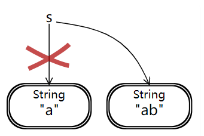
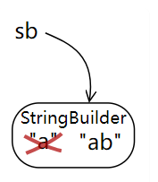
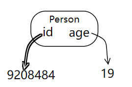
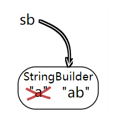
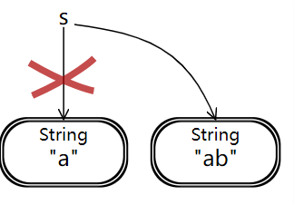
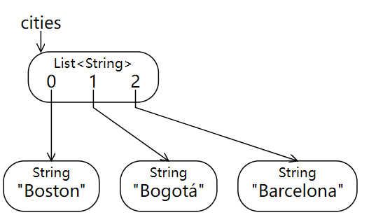
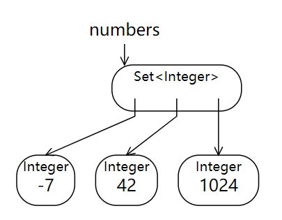

# [Java 基础](https://web.mit.edu/6.031/www/sp21/classes/02-basic-java/)

## 快照图（Snapshot diagrams）

快照图用于表示程序内部的状态——程序的堆（当前存在的对象）和栈（进程（progress ）中的方法和局部变量）等。

最简单的快照图——变量名和指向变量值的箭头以及变量值 ：

```java
int n = 1;
double x = 3.5;
```


若变量值是对象类型，则用一个圆形方框围住它：

```java
BigInteger val = new BigInteger("1234567890");
```


快照图的语法很灵活，不必总是画出所有的细节。可简化快照图，专注于想讨论的程序状态的特定方面：

```java
String s = "hello";
```


这三个快照图都是演示一个 String 变量的合法方式。若关心 s 的值，可用第一个快照图。若想强调 s 是一个 String 对象值，可用第二和第三个。

当想给出对象值的更多信息时，可在圆框内写下字段的名称，并画出指向字段值的箭头和字段值：

```java
Point pt = new Point(5, -3);
```


若想更加具体，则可给出变量的类型，如 `x:int` 或者 `int x`。

---

## 可变值（Mutating values） vs 可重赋值变量（reassigning variables）

快照图提供了一种可视化的方法来区分修改值和修改变量之间的差异：

- 当对变量或字段赋值时，修改的是变量的箭头指向。
- 当修改可变对象的内容时，比如说是数组或列表对象，修改的是值中的引用。

### 重新赋值（Reassignment）和不可变值（immutable values）

比如将一个 String 变量 s 的值从 a 重新赋值成 ab：

```java
String s = "a";
s = s + "b";
```



String 是不可变类型的一个例子，其值创建后就再也不可更改。

> 在快照图中，当想要强调一个对象（比如说 String）的不可变性时，我们用一个双重圆框将它包围起来：

---

### 可变值（Mutable values）

与 `String` 不同，`StringBuilder` 是一个表示字符串的可变对象，其有修改值的方法：

```java
StirngBuilder sb = new StringBuilder("a");
sb.append("b");
```



> 可变性和不可变性之间的差异在让代码更加 Safe from bugs 时将会发挥重要的作用。

---

### 不可重赋值引用（Unreassignable references）

Java 也有不可变引用：只能够被赋值一次的变量。用 `final` 关键字来声明变量即可得到一个不可重新赋值的引用：`final int n = 5;`

如果 Java 编译器不相信 final 变量运行时只会被赋值一次，就会产生一个静态错误，所以 final 关键字能够提供对不可重赋值引用的静态检查。

在快照图中，若想强调可重赋值性（reassignability），可用双重箭头表示不可重新赋值引用（unreassignable references）



该快照图表明该对象的 id 永远不会改变，而 age 则可能会改变。

注意到可让不可变引用指向一个可变值。也就是说，值是可变的，即使指向的是同一对象。

```java
final StringBuilder sb = new StringBuilder("a");
sb.append("b");
```



也可以让一个可重新赋值的引用指向一个不可变值，此处变量的值是可以改变的，因为可将变量重新指向一个不同的对象：

```java
String s = "a";
s = "ab";
```



双重箭头用于强调快照图的不可变部分。当可变性或者可重赋值性是明显的，或者与讨论无关，为了保持快照图的简洁，可以仅使用单重箭头和对象方框。

---

## == vs. equals()

Java 有两种方法来比较值的相等性，具体用哪种方法取决于值是原始类型还是对象类型：

- `==` 运算符比较原始类型值的相等性。例如 `5 == 5` 返回真，`'a' == 'a'` 同理。
- `.equals()` 比较对象值的相等性。例如 `"abc".equals("abc")` 返回真。

注意比较时不要混淆这两种方法。很容易发现到用 `equals()` 比较原始类型值的错误，因为这会产生一个静态错误，Java 并不允许在原始类型上调用任何方法。但却不那么容易发现用 `==` 比较对象类型值的错误，因为 Java 中重载了 `==`，当 `==` 应用于对象类型时，其会测试两个表达式是否引用了内存中的同一对象。用快照图的话语来说， 两个引用是 `==` 的，如果它们的箭头指向了同一对象方框。

所以若程序的状态如下图所示：


- `x.equals(y)`：返回 true，因为 x 和 y 指向的对象有相同的值。

- `x == y`：返回 true，因为 x 和 y 指向同一对象

- `x.equals(z)`：返回 true，因为 x 和 y 指向的对象有相同的值
- `x == z`：返回 false，因为 x 和 z 指向不同对象

总结：

- 用 `==` 比较原始值，如 int、char、double。
- 用 `equals()` 比较对象值，如 list、array、string 及其它对象

> 记住：在 Java 中，`char` 是原始类型，表示一个字符，用单引号包围；`String` 是对象值，表示一系列字符，用双引号包围。

---

## Java Collections

Read the Collections section of **[From Python to Java](http://kennethalambert.com/pythontojava//)** (6 short pages).

### Lists, Sets, and Maps

`List` 是包含零个或多个对象的有序集，同一对象可能会出现多次。可从 List 中增加或删除元素，List 会扩大或缩小以容纳它的内容。

List 的一些操作：

- `int count = lst.size()`：计算元素数量
- `lst.add(e)`：末尾追加元素
- `if (lst.isEmpty())` ：测试 list 是否为空
- `lst.contains(e)`：测试某元素是否在 list 中

快照图如何表示 list？




Map 支持的操作：

- `map.put(key, val)`：添加映射 `key -> val`
- `map.get(key)`：获取 key 对应的 value
- `map.containsKey(key)`：测试 map 是否存在 key
- `map.remove(key)`：删除映射

在快照图中，用一个包含键值对的对象来表示 Map：


Set 是一个包含零个或多个唯一对象的无序集。对象不能在 Set 中出现多次。

Set 的一些操作：

- `s1.contains(e)`：测试 set 是否包含一个元素
- `s1.containsAll(s2)`：测试 s2 是否是 s1 的子集
- `s2.removeAll(s2)`：从 s1 中移除 s2

在快照图中，用一个含有匿名字段的对象来表示 `Set`：



用 List.of 从参数中创建一个 List：

```java
List.of("a", "b", "c");
```

用 List.of 创建的 list 是不可变的，创建后不能增加、删除、替换元素。

还可用 Set.of、Map.of 创建不可变的 Set 和 Map。

```java
Set.of("a", "b", "c");
Map.of("apple", 5, "banana", 7);
```

### 泛型（Generics）：声明 List、Set 和 Map 变量

可对 Java 集合（Collection）容纳的元素类型进行限制。当添加元素时，编译器可对其进行静态检查以确保所添加元素具有正确的类型。之后弹出元素时，就可保证元素的类型是我们预期的。

```java
List<String> cities;        // a List of Strings
Set<Integer> numbers;       // a Set of Integers
Map<String,Turtle> turtles; // a Map with String keys and Turtle values
```

由于泛型的工作方式，无法创建一个原始类型元素的集合。例如 `Set<int>` 是无效的，要使用 int 对应的包装器 `Integer`，即 `Set<Integer>`。

Java 会在原始类型及其包装器类型之间进行一些自动转换，所以如下代码是有效的：

```java
sequence.add(5);              // wrap 5 as an Integer object, and append it to the sequence
int second = sequence.get(1); // get the second Integer element, and unwrap it into an int
```

**A [Java `List`](http://docs.oracle.com/en/java/javase/15/docs/api/java.base/java/util/List.html) is similar to a [Python list](https://docs.python.org/3/library/stdtypes.html#sequence-types-list-tuple-range).** A `List` contains an ordered collection of zero or more objects, where the same object might appear multiple times. We can add and remove items to and from the `List`, which will grow and shrink to accomodate its contents.

Example `List` operations:

| Java                      | description                       | Python             |
| :------------------------ | :-------------------------------- | :----------------- |
| `int count = lst.size();` | count the number of elements      | `count = len(lst)` |
| `lst.add(e);`             | append an element to the end      | `lst.append(e)`    |
| `if (lst.isEmpty()) ...`  | test if the list is empty         | `if not lst: ...`  |
| `lst.contains(e)`         | test if an element is in the list | `e in lst`         |

In a snapshot diagram, we represent a `List` as an object with indices drawn as fields:


This list of `cities` might represent a trip from Boston to Bogotá to Barcelona.

**A [`Map`](http://docs.oracle.com/en/java/javase/15/docs/api/java.base/java/util/Map.html) is similar to a [Python dictionary](https://docs.python.org/3/library/stdtypes.html#mapping-types-dict).** In Python, the **keys** of a map must be [hashable](https://docs.python.org/3/glossary.html#term-hashable). Java has a similar requirement that we’ll discuss when we confront how equality works between Java objects.

Example `Map` operations:

| Java                   | description                    | Python           |
| :--------------------- | :----------------------------- | :--------------- |
| `map.put(key, val)`    | add the mapping *key → val*    | `map[key] = val` |
| `map.get(key)`         | get the value for a key        | `map[key]`       |
| `map.containsKey(key)` | test whether the map has a key | `key in map`     |
| `map.remove(key)`      | delete a mapping               | `del map[key]`   |

In a snapshot diagram, we represent a `Map` as an object that contains key/value pairs:


This `turtles` map contains `Turtle` objects assigned to `String` keys: Bob, Buckminster, and Buster.

**A [`Set`](http://docs.oracle.com/en/java/javase/15/docs/api/java.base/java/util/Set.html) is an unordered collection of zero or more unique objects.** Like a mathematical *set* or a [Python set](https://docs.python.org/3/library/stdtypes.html#set-types-set-frozenset) – and unlike a `List` – an object cannot appear in a set multiple times. Either it’s in or it’s out. Like the keys of a map, the objects in a Python set must be [hashable](https://docs.python.org/3/glossary.html#term-hashable), and Java has a similar requirement.

Example `Set` operations:

| Java                 | description                         | Python                                |
| :------------------- | :---------------------------------- | :------------------------------------ |
| `s1.contains(e)`     | test if the set contains an element | `e in s1`                             |
| `s1.containsAll(s2)` | test whether *s1 ⊇ s2*              | `s1.issuperset(s2)` `s1 >= s2`        |
| `s1.removeAll(s2)`   | remove *s2* from *s1*               | `s1.difference_update(s2)` `s1 -= s2` |

In a snapshot diagram, we represent a `Set` as an object with no-name fields:


Here we have a set of integers, in no particular order: 42, 1024, and -7.

### Literals

Python provides convenient syntax for creating lists:

```python
lst = [ "a", "b", "c" ]
```

And maps:

```python
map = { "apple": 5, "banana": 7 }
```

**Java does not.** It does provide a literal syntax for arrays:

```java
String[] arr = { "a", "b", "c" };
```

But this creates an *array*, not a `List`. We can use [the utility function `List.of`](http://docs.oracle.com/en/java/javase/15/docs/api/java.base/java/util/List.html) to create a `List` from arguments:

```java
List.of("a", "b", "c");
```

A `List` created with `List.of` comes with an important restriction: it is immutable! So we can’t add, remove, or replace elements once the list has been created.

Java also provides [`Set.of`](http://docs.oracle.com/en/java/javase/15/docs/api/java.base/java/util/Set.html) for creating immutable sets and [`Map.of`](http://docs.oracle.com/en/java/javase/15/docs/api/java.base/java/util/Map.html) for creating immutable maps:

```java
Set.of("a", "b", "c");
Map.of("apple", 5, "banana", 7);
```

### Generics: declaring List, Set, and Map variables

Unlike Python collection types, with Java collections we can restrict the type of objects contained in the collection. When we add an item, the compiler can perform *static checking* to ensure we only add items of the appropriate type. Then, when we pull out an item, we are guaranteed that its type will be what we expect.

Here’s the syntax for declaring some variables to hold collections:

```java
List<String> cities;        // a List of Strings
Set<Integer> numbers;       // a Set of Integers
Map<String,Turtle> turtles; // a Map with String keys and Turtle values
```

Because of the way generics work, we cannot create a collection of primitive types. For example, `Set<int>` does *not* work. However, as we [saw earlier](https://web.mit.edu/6.031/www/sp21/classes/01-static-checking/#Integer_int), `int`s have an `Integer` wrapper we can use (e.g. `Set<Integer> numbers`).

In order to make it easier to use collections of these wrapper types, Java does some automatic conversion. If we have declared `List<Integer> sequence`, this code works:

```java
sequence.add(5);              // wrap 5 as an Integer object, and append it to the sequence
int second = sequence.get(1); // get the second Integer element, and unwrap it into an int
```

### ArrayLists and LinkedLists: creating Lists

As we’ll see soon enough, Java helps us distinguish between the *specification* of a type – what does it do? – and the *implementation* – what is the code?

`List`, `Set`, and `Map` are all *interfaces*: they define how these respective types work, but they don’t provide implementation code. There are several advantages, but one potential advantage is that we, the users of these types, get to choose different implementations in different situations.

Here’s how to create some actual `List`s:

```java
List<String> firstNames = new ArrayList<String>();
List<String> lastNames = new LinkedList<String>();
```

If the generic type parameters are the same on the left and right, Java can infer what’s going on and save us some typing:

```java
List<String> firstNames = new ArrayList<>();
List<String> lastNames = new LinkedList<>();
```

[`ArrayList`](http://docs.oracle.com/en/java/javase/15/docs/api/java.base/java/util/ArrayList.html) and [`LinkedList`](http://docs.oracle.com/en/java/javase/15/docs/api/java.base/java/util/LinkedList.html) are two implementations of `List`. Both provide all the operations of `List`, and those operations must work as described in the documentation for `List`. In this example, `firstNames` and `lastNames` will behave the same way; if we swapped which one used `ArrayList` vs. `LinkedList`, our code will not break.

Unfortunately, this ability to choose is also a burden: we didn’t care how Python lists worked, why should we care whether our Java lists are `ArrayLists` or `LinkedLists`? Since the only difference is performance, for 6.031 *we don’t*.

When in doubt, use `ArrayList`.

If you want to initialize an `ArrayList` or `LinkedList`, you can give it another collection as an argument:

```java
List<String> firstNames = new ArrayList<>(List.of("Huey", "Dewey", "Louie"));
List<String> lastNames = new ArrayList<>(Set.of("Duck"));
```

A key difference between `List.of` and `ArrayList` is mutability. Where `List.of("Huey", "Dewey", "Louie")` produces an immutable list of three strings, `new ArrayList<>(List.of("Huey", "Dewey", "Louie"))` produces a mutable list initialized with those strings. If you need an initialized mutable list, this is simpler than making multiple calls to `add()`.

### HashSets and HashMaps: creating Sets and Maps

[`HashSet`](http://docs.oracle.com/en/java/javase/15/docs/api/java.base/java/util/HashSet.html) is our default choice for `Set`s:

```java
Set<Integer> numbers = new HashSet<>();
```

Java also provides [sorted sets](http://docs.oracle.com/en/java/javase/15/docs/api/java.base/java/util/SortedSet.html) with the [`TreeSet`](http://docs.oracle.com/en/java/javase/15/docs/api/java.base/java/util/TreeSet.html) implementation.

And for a `Map` the default choice is [`HashMap`](http://docs.oracle.com/en/java/javase/15/docs/api/java.base/java/util/HashMap.html):

```java
Map<String,Turtle> turtles = new HashMap<>();
```

### Iteration

So maybe we have:

```java
List<String> cities        = new ArrayList<>();
Set<Integer> numbers       = new HashSet<>();
Map<String,Turtle> turtles = new HashMap<>();
```

A very common task is iterating through our cities/numbers/turtles/etc.

In Python:

```python
for city in cities:
    print(city)

for num in numbers:
    print(num)

for key in turtles:
    print("%s: %s" % (key, turtles[key]))
```

Java provides a similar syntax for iterating over the items in `List`s and `Set`s.

Here’s the Java:

```java
for (String city : cities) {
    System.out.println(city);
}

for (int num : numbers) { 
    System.out.println(num);
}
```

Note in the second example above that we declare `int num` rather than `Integer num`, even though `numbers` is a `List<Integer>`. This is because Java automatically converts between `int` and `Integer` anyway, and using the simpler primitive `int` type is preferable to the `Integer` object wrapper wherever possible. For example, `int` equality is simpler and less error-prone, as discussed in [== vs. equals](https://web.mit.edu/6.031/www/sp21/classes/02-basic-java/#_vs_equals) above.

We can’t iterate over `Map`s themselves this way, but we can iterate over the keys as we did in Python:

```java
for (String key : turtles.keySet()) {
    System.out.println(key + ": " + turtles.get(key));
}
```

Under the hood this kind of `for` loop uses an [`Iterator`](http://docs.oracle.com/en/java/javase/15/docs/api/java.base/java/util/Iterator.html), a design pattern we’ll see later in the class.

**Warning**: be careful not to mutate a collection while you’re iterating over it. Adding, removing, or replacing elements disrupts the iteration and can even cause your program to crash. We’ll discuss the reason in more detail in a future class. Note that this warning applies to Python as well. The code below does not do what you might expect:

```python
numbers = [100,200,300]
for num in numbers:
    numbers.remove(num) # danger!!! mutates the list we're iterating over
print(numbers) # list should be empty here -- is it?
```

#### Iterating with indices

If you want to, Java provides different `for` loops that we can use to iterate through a list using its indices:

```java
for (int ii = 0; ii < cities.size(); ii++) {
    System.out.println(cities.get(ii));
}
```

Unless we actually need the index value `ii`, this code is verbose and has more places for bugs to hide (starting at 1 instead of 0, using `<=` instead of `<`, using the wrong variable name for one of the occurrences of `ii`, …) Avoid it if you can.

---

## Enumerations

Sometimes a type has a small, finite set of immutable values, such as:

- months of the year: January, February, …, November, December
- days of the week: Monday, Tuesday, …, Saturday, Sunday
- compass points: north, south, east, west
- available colors: black, gray, red, …

When the set of values is small and finite, it makes sense to define all the values as named constants, which Java calls an **enumeration** and expresses with the `enum` construct.

```java
public enum Month { 
    JANUARY, FEBRUARY, MARCH, APRIL, 
    MAY, JUNE, JULY, AUGUST, 
    SEPTEMBER, OCTOBER, NOVEMBER, DECEMBER;
}

public enum PenColor { 
    BLACK, GRAY, RED, PINK, ORANGE, 
    YELLOW, GREEN, CYAN, BLUE, MAGENTA;
}
```

You can use an enumeration type name like `PenColor` in a variable or method declaration:

```java
PenColor drawingColor;
```

Refer to the values of the enumeration as if they were named static constants:

```java
drawingColor = PenColor.RED;
```

Note that an enumeration is a distinct new type. Older languages, like Python 2 and early versions of Java, tend to use numeric constants or string literals to represent a finite set of values like this. But an enumeration is more typesafe, because it can catch mistakes like type mismatches:

```java
int month = TUESDAY;  //  no error if integers are used
Month month = DayOfWeek.TUESDAY; // static error if enumerations are used 
```

or misspellings:

```java
String color = "REd";        // no error, misspelling isn't caught
PenColor drawingColor = PenColor.REd; // static error when enumeration value is misspelled
```

[Python 3 has enumerations](https://docs.python.org/3.4/library/enum.html), similar to Java’s, though not statically type-checked.

---

## Java API documentation

Previous sections in this reading have a number of links to documentation for classes that are part of the [Java platform API](https://docs.oracle.com/en/java/javase/15/docs/api/).

API stands for *application programming interface*. If you want to program an app that talks to Facebook, Facebook publishes an API (more than one, in fact, for different languages and frameworks) you can program against. The Java API is a large set of generally useful tools for programming pretty much anything.

- [**`java.lang.String`**](http://docs.oracle.com/en/java/javase/15/docs/api/java.base/java/lang/String.html) is the full name for `String`. We can create objects of type `String` just by using `"double quotes"`.
- [**`java.lang.Integer`**](http://docs.oracle.com/en/java/javase/15/docs/api/java.base/java/lang/Integer.html) and the other primitive wrapper classes. Java automagically converts between primitive and wrapped (or “boxed”) types in most situations.
- [**`java.util.List`**](http://docs.oracle.com/en/java/javase/15/docs/api/java.base/java/util/List.html) is like a Python list, but in Python, lists are part of the language. In Java, `List`s are implemented in… Java!
- [**`java.util.Map`**](http://docs.oracle.com/en/java/javase/15/docs/api/java.base/java/util/Map.html) is like a Python dictionary.
- [**`java.io.File`**](http://docs.oracle.com/en/java/javase/15/docs/api/java.base/java/io/File.html) represents a file on disk. Take a look at the methods provided by `File`: we can test whether the file is readable, delete the file, see when it was last modified…
- [**`java.io.FileReader`**](http://docs.oracle.com/en/java/javase/15/docs/api/java.base/java/io/FileReader.html) lets us read text files.
- [**`java.io.BufferedReader`**](http://docs.oracle.com/en/java/javase/15/docs/api/java.base/java/io/BufferedReader.html) lets us read in text efficiently, and it also provides a very useful feature: reading an entire line at a time.

Let’s take a closer look at the documentation for [`BufferedReader`](http://docs.oracle.com/en/java/javase/15/docs/api/java.base/java/io/BufferedReader.html). There are many things here that relate to features of Java we haven’t discussed! Keep your head, and focus on the **things in bold** below.


At the top right corner is the **search box**. You can use it to jump to a class or interface, or straight to a particular method.

Under the *Class BufferedReader* heading is the *class hierarchy* for `BufferedReader` and a list of *implemented interfaces*. A `BufferedReader` object has all of the methods of all those types (plus its own methods) available to use.

Next we see *direct subclasses*, and for an interface, *implementing classes*. This can help us find, for example, that [`HashMap`](http://docs.oracle.com/en/java/javase/15/docs/api/java.base/java/util/HashMap.html) is an implementation of [`Map`](http://docs.oracle.com/en/java/javase/15/docs/api/java.base/java/util/Map.html).

Next up: **a description of the class**. Sometimes these descriptions are a little obtuse, but **this is the first place you should go** to understand a class.


If you want to make a new `BufferedReader` the **constructor summary** is the first place to look. Constructors aren’t the only way to get a new object in Java, but they are the most common.


Next: **the method summary lists all the methods we can call** on a `BufferedReader` object.

Below the summary are detailed descriptions of each method and constructor. **Click a constructor or method to see the detailed description.** This is the first place you should go to understand what a method does.

Each detailed description includes:

- The **method signature**: we see the return type, the method name, and the parameters. We also see *exceptions*. For now, those usually mean errors the method can run into.
- The full **description**.
- **Parameters**: descriptions of the method arguments.
- And a description of what the method **returns**.

### Specifications

These detailed descriptions are **specifications**. They allow us to use tools like `String`, `Map`, or `BufferedReader` *without* having to read or understand the code that implements them.

Reading, writing, understanding, and analyzing specifications will be one of our first major undertakings in 6.031, starting in a few classes.

---

 

 

 

 

 

 

 

 

 

**✓**Numbers & Strings2/2

 

 

 

 

 

 

 

 

 

 

 

 

 

 

## More practice
