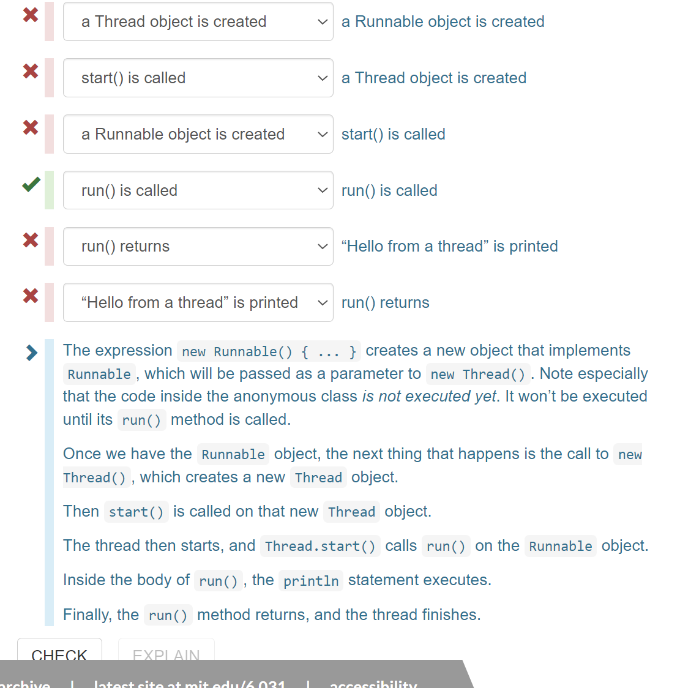
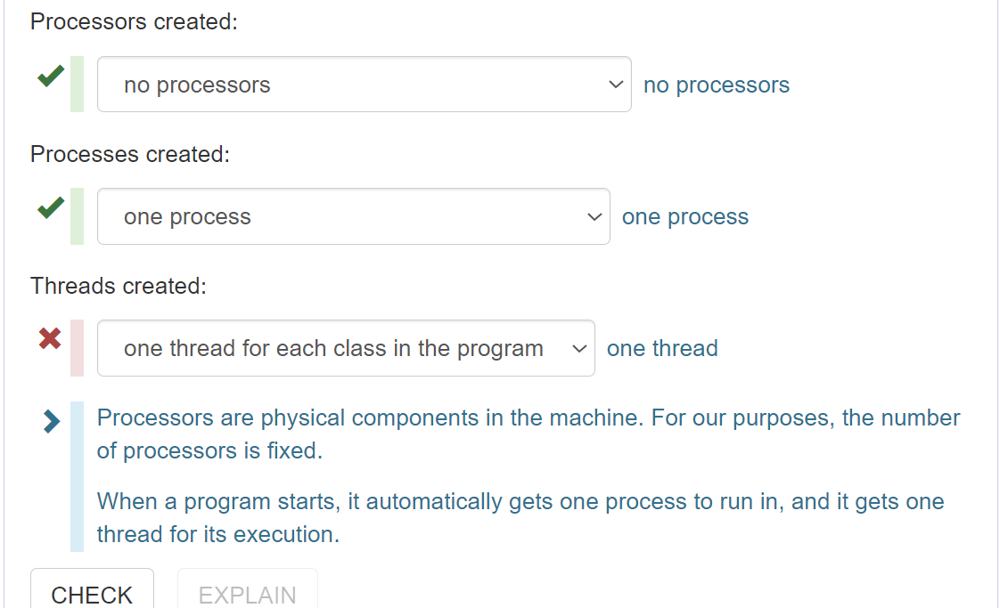
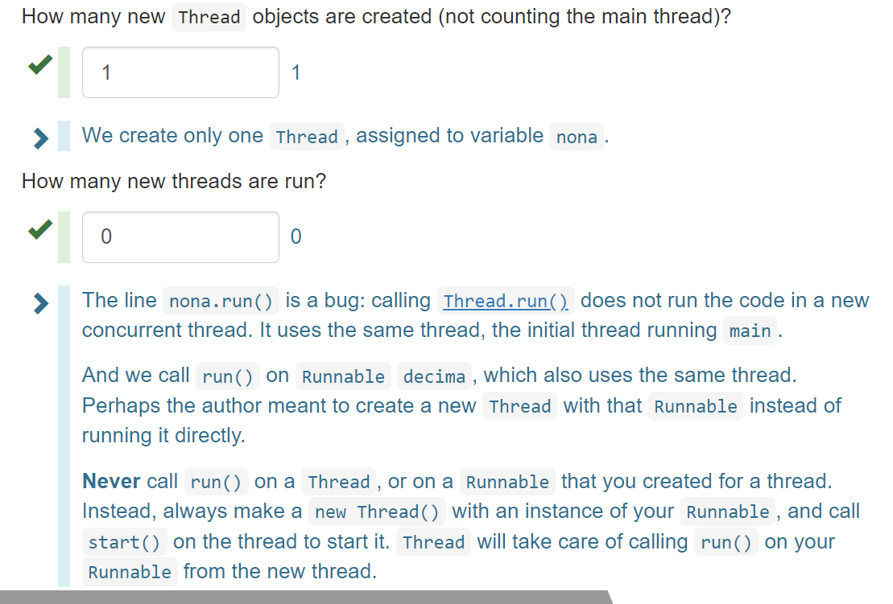

# Reading 20: Concurrency（并发性）

## 学习目标

* 理解消息传递和共享内存这两种并发模型
* 理解进程、线程和时间分片
* 理解条件竞争的危险性

---

## 并发

**并发**指的是多个计算同时发生，其在现代程序设计中几乎无处不在，具体表现在：

* 多计算机网络
* 多应用程序计算机
* 多处理器计算机（如今多个处理器通常位于一块芯片上）

并发对于现代程序设计来说很重要，具体的应用场景有：

* 网站必须要处理同时到达的多个用户
* Mobile apps need to do some of their processing on servers ("in the cloud").
* Graphical user interfaces almost always require background work that does not interrupt the user. For example, Eclipse compiles your Java code while you're still editing it.

---

在未来并发编程依旧会很重要，因为如今单个处理器的时钟速度已经不再增加，每代新芯片增加的是内核的数量。为了得到更快的运行速度，必须将一个计算分成并发的几个部分。

---

## 并发编程的两种模型

并发编程有两种常见的模型：**共享内存**和**消息传递**。

---

**共享内存并发模型**指并发模块之间通过读写内存中的共享对象来进行交互。下图A、B是两个并发模块，它们共享橙色的内存空间（这两个模块都有一个到该空间的引用），而蓝色的内存空间是A和B各自私有的。


---

共享内存模型的例子包括：

* A和B也许是同一计算机上的两个处理器，它们共享相同的物理内存。
* A和B也许是同一计算机上的两个程序，它们共享相同的文件系统，可对其中的文件进行读写。
* A和B也许是同一Java程序中的两个线程，它们共享相同的Java对象。

---

**消息传递。** 在消息传递模型中，并发模块之间是通过在某种信道上互相发送消息来交互的，到达模块的消息排成队列以待处理。该模型的例子包括：


---

* A、B可能是网络中的两台计算机，通过网络连接进行通信。
* A、B可能是web浏览器和web服务器。A打开一个到B的连接并向B请求一个页面，然后B将页面的数据返回给A。
* A、B可能是即时消息的客户端和服务端
* A、B可能是同一计算机上的两个程序，其中A的输出通过管道连接着B的输入，比如 `ls | grep`。

---

思考与总结：无论是共享内存还是消息传递，本质上都是在描述并发模块之间的通信方式。采用共享内存模型，并发模块之间并不直接通信，所以这种模型的速度会比消息传递要慢吗？

---

## 进程、线程、时间分片

消息传递和共享内存模型都是关乎并发模块之间如何进行通信的。但是并发模块本身可以分为两类：进程和线程。

---

**进程。** 进程是运行着的程序的一个实例，其和同一台机器上的其它进程是**独立**的。特别地，进程拥有自己私有的机器内存区域。

---

进程抽象是一台虚拟的计算机，其使得进程感觉自身好像拥有整台机器，就像创建了一台全新的计算机一样，利用全新的内存来运行程序。

进程作为一种并发模块，采用的是什么并发模型呢？由于进程一般是用标准输入和输出创建的（比如 Java 中所用的 `System.out` 和 `System.in`），所以其天生就准备好了采用消息传递模型。尽管在大部分操作系统的进程之间采用共享内存模型是有可能的，但是这需要付出额外的开销。

每当我们启动一个 Java 程序甚至是启动任意程序，程序都会启动一个全新的进程来容纳运行着的程序。

---

**线程。** 线程是运行着的程序内部的一个控制中心。线程抽象表示的是一个虚拟的处理器，这个新的虚拟处理器和进程中的其它线程运行同一个程序并共享相同的内存空间，所以线程天然地准备好采用共享内存模型，因为线程之间共享进程的所有内存。在线程之间采用消息传递模型同样也需要付出额外的开销。

每当运行一个 Java 程序，它首先都会启动一个线程并调用 main() 方法，故这个线程称为 **main** 线程。

**时间分片。** 如果计算机上只有1个或2个处理器，怎样才能拥有多个并发的线程呢？当线程的数量超过处理器的数量时，可以通过**时间分片**来模拟线程并发。时间分片意味着处理器会在线程间切换，所以一个线程在执行的时候可能会暂停，直到其下一个时间分片的时候再由相同的或是另一个处理器来执行。

时间分片在大部分系统上是不可预测的、不确定的，所以线程可能会在任意时间继续或暂停。

## 在 Java 中启动一个线程

在 Java 中启动一个新线程的步骤如下：

1. 编写一个 `Runnable` 接口的实现类，在其中实现 `run()` 方法
2. 以该实现类的实例为参数调用 `Thread` 类的构造函数得到一个 Thread 类对象
3. 调用该对象的 `start()` 方法

新建的线程会自动调用实现的 `run()` 方法。

```java
// ... in the main method:
new Thread(new HelloRunnable()).start();

// elsewhere in the code
public class HelloRunnable implements Runnable {
    public void run() {
        System.out.println("Hello from a thread!");
    }
}
```

更简便地写法是用一个匿名的 `Runnable` 类：

```java
new Thread(new Runnable() {
    public void run() {
        System.out.println("Hello from a thread!");
    }
}).start();
```

## Anonymous classes

Usually when we implement an interface, we do so by declaring a class. For example, given the interface [`Comparator`](http://docs.oracle.com/en/java/javase/15/docs/api/java.base/java/util/Comparator.html) in the Java API:

```java
`/** A comparison function that imposes a total ordering on some objects.
 *  ... */
public interface Comparator<T> {
    /** Compares its two arguments for order.
     *  ...
     *  @return a negative integer, zero, or a positive integer if the first
     *          argument is less than, equal to, or greater than the second */
    public int compare(T o1, T o2);
}`
```

We might declare:

```java
`/** Orders Strings by length (shorter first) and then lexicographically. */
public class StringLengthComparator implements Comparator<String> {
    @Override public int compare(String s1, String s2) {
        if (s1.length() == s2.length()) {
            return s1.compareTo(s2);
        }
        return s1.length() - s2.length();
    }
}`
```

One purpose of `Comparator` is for sorting. A [`SortedSet`](http://docs.oracle.com/en/java/javase/15/docs/api/java.base/java/util/SortedSet.html) keeps its items in a total order.

Without a `Comparator`, the `SortedSet` implementation uses the `compareTo` method provided by the class of objects in the set:

```java
SortedSet<String> strings = new TreeSet<>();
strings.addAll(List.of("yolanda", "zach", "alice", "bob"));
// strings is { "alice", "bob", "yolanda", "zach" }`
```

With a `Comparator`:

```java
// uses StringLengthComparator declared above
Comparator<String> compareByLength = new StringLengthComparator();
SortedSet<String> strings = new TreeSet<>(compareByLength);
strings.addAll(List.of("yolanda", "zach", "alice", "bob"));
// strings is { "bob", "zach", "alice", "yolanda" }`
```

If we only intend to use this comparator in this one place, we already know how to eliminate the variable:

```java
// uses StringLengthComparator declared above
SortedSet<String> strings = new TreeSet<>(new StringLengthComparator());
strings.addAll(List.of("yolanda", "zach", "alice", "bob"));
// strings is { "bob", "zach", "alice", "yolanda" }`
```

An [**anonymous class**](https://docs.oracle.com/javase/tutorial/java/javaOO/anonymousclasses.html) declares an unnamed class that implements an interface and immediately creates the one and only instance of that class. Compare to the code above:

```java
// no StringLengthComparator class!
SortedSet<String> strings = new TreeSet<>(new Comparator<String>() {
    @Override public int compare(String s1, String s2) {
        if (s1.length() == s2.length()) {
            return s1.compareTo(s2);
        }
        return s1.length() - s2.length();
    }
});
strings.addAll(List.of("yolanda", "zach", "alice", "bob"));
// strings is { "bob", "zach", "alice", "yolanda" }`
```

Advantages of anonymous class over named class:

* If we're only using the comparator in this one piece of code, we've reduced its scope by using an anonymous class. With a named class, any other code could start using and depending on `StringLengthComparator`.
* A reader no longer has to search elsewhere for the details of the comparator. Everything is right here.

Disadvantages:

* If we need the same comparator more than once, we might be tempted to copy-and-paste the anonymous class. A named class is more DRY.
* If the implementation of the anonymous class is long, it interrupts the surrounding code, making it harder to understand. A named class is separated out as a modular piece.

So anonymous classes are good for short one-off（一次性的） implementations of a method.

***

### READING EXERCISES

#### Comparator

Here’s the code with a different anonymous `Comparator`:

```java
SortedSet<String> strings = new TreeSet<>(new Comparator<String>() {
    @Override public int compare(String s1, String s2) {
        return s1.substring(1).compareTo(s2.substring(1));
    }
});
strings.addAll(List.of("yolanda", "zach", "alice", "bob"));
```

How are the names sorted in `strings`?

> 注意：弄清楚 substring(1) 是什么意思。

***

## Using an anonymous `Runnable` to start a thread

The `Runnables` we use to create new threads are almost always short, one-off implementations, so they are ideal candidates for anonymous classes.

Here's the example we used above:

```java
new Thread(new Runnable() {
    public void run() {
        System.out.println("Hello from a thread!");
    }
}).start();
```

Rather than (1) declare a class that implements `Runnable` where the `run` method calls `System.out.println`, (2) create an instance of that class, and (3) pass that instance to the `Thread` constructor, we do all three steps in one go with an anonymous `Runnable`.

If you're feeling clever, you can go one step further with Java's [lambda expressions](https://docs.oracle.com/javase/tutorial/java/javaOO/lambdaexpressions.html):

```java
new Thread(() -> System.out.println("Hello from a thread!")).start();
```

Whether that's more or less _easy to understand_ is up for debate. `Runnable` and `run` never appear at all, so you certainly have to do more research to understand this construction the first time you come across it.

### READING EXERCISES

#### Thread lifecycle

For this code that starts a thread:

```java
new Thread(new Runnable() {
    public void run() {
        System.out.println("Hello from a thread!");
    }
}).start();
```

Put the following events in the order that they occur.



#### Processes and threads 1

When you run a Java program (for example, using the Run button in Eclipse), how many processors, processes, and threads are created at first?



***

#### Processes and threads 2

Suppose we run `main` in this program, which contains bugs:

```java
public class Moirai {
    public static void main(String[] args) {
        Thread clotho = new Thread(new Runnable() {
            public void run() { System.out.println("spinning"); }
        });
        clotho.start();
        new Thread(new Runnable() {
            public void run() { System.out.println("measuring"); }
        }).start();
        new Thread(new Runnable() {
            public void run() { System.out.println("cutting"); }
        });
    }
}
```


***

#### Processes and threads 3

Suppose we run `main` in this program, which demonstrates two common bugs:

```java
public class Parcae {
    public static void main(String[] args) {
        Thread nona = new Thread(new Runnable() {
            public void run() { System.out.println("spinning"); }
        });
        nona.run();
        Runnable decima = new Runnable() {
            public void run() { System.out.println("measuring"); }
        };
        decima.run();
        // ...
    }
}
```



***

#### Threads and exceptions

Suppose we run this JUnit test:

```java
@Test public void testOops() {
    throw new Error("oops");
}
```

TODO

***

## Shared memory example

Let's look at an example of a shared memory system. The point of this example is to show that concurrent programming is hard, because it can have subtle bugs.


Imagine that a bank has cash machines that use a shared memory model, so all the cash machines can read and write the same account objects in memory.

To illustrate what can go wrong, let's simplify the bank down to a single account, with a dollar balance stored in the `balance` variable, and two operations `deposit` and `withdraw` that simply add or remove a dollar:

```
`// suppose all the cash machines share a single bank account
private static int balance = 0;

private static void deposit() {
    balance = balance + 1;
}
private static void withdraw() {
    balance = balance - 1;
}`
```

Customers use the cash machines to do transactions like this:

```
`deposit(); // put a dollar in
withdraw(); // take it back out`
```

Each transaction is just a one dollar deposit followed by a one-dollar withdrawal, so it should leave the balance in the account unchanged. Throughout the day, each cash machine in our network is processing a sequence of deposit/withdraw transactions:

```
`// each ATM does a bunch of transactions that
// modify balance, but leave it unchanged afterward
public static void cashMachine() {
    new Thread(new Runnable() {
        public void run() {
            for (int i = 0; i < TRANSACTIONS_PER_MACHINE; ++i) {
                deposit(); // put a dollar in
                withdraw(); // take it back out
            }
        }
    }).start();
}`
```

At the end of the day, regardless of how many cash machines were running, or how many transactions we processed, we should expect the account balance to still be 0.

But if we run this code, we discover frequently that the balance at the end of the day is _not_ 0. If more than one thread created by `cashMachine()` is running at the same time -- say, on separate processors in the same computer -- then `balance` may not be zero at the end of the day. Why not?

## Interleaving

Here's one thing that can happen. Suppose two cash machine threads, A and B, are both working on a deposit at the same time. Here's how the `deposit()` step typically breaks down into low-level processor instructions:

| get balance (balance=0)           |
| --------------------------------- |
| add 1                             |
| write back the result (balance=1) |

When A and B are running concurrently, these low-level instructions can _interleave_ with each other, meaning that the actual sequence of execution can intersperse A's operations and B's operations arbitrarily. (Some operations might even be simultaneous in some sense, but let's just worry about interleaving for now.) Here is one possible interleaving:

| A                                   | B                                   |
| ----------------------------------- | ----------------------------------- |
| A get balance (balance=0)           |                                     |
| ---                                 | ---                                 |
| A add 1                             |                                     |
| A write back the result (balance=1) |                                     |
|                                     | B get balance (balance=1)           |
|                                     | B add 1                             |
|                                     | B write back the result (balance=2) |

This interleaving is fine -- we end up with balance 2, so both A and B successfully put in a dollar. But what if the interleaving looked like this:

| A                                   | B                                   |
| ----------------------------------- | ----------------------------------- |
| A get balance (balance=0)           |                                     |
| ---                                 | ---                                 |
|                                     | B get balance (balance=0)           |
| A add 1                             |                                     |
|                                     | B add 1                             |
| A write back the result (balance=1) |                                     |
|                                     | B write back the result (balance=1) |

The balance is now 1 -- A's dollar was lost! A and B both read the balance at the same time, computed separate final balances, and then raced to store back the new balance -- which failed to take the other's deposit into account.

## Race condition

This is an example of a race condition. A **race condition** means that the correctness of the program (the satisfaction of postconditions and invariants) depends on the relative timing of events in concurrent computations A and B. When this happens, we say "A is in a race with B."

Some interleavings of events may be OK, in the sense that they are consistent with what a single, nonconcurrent process would produce, but other interleavings produce wrong answers -- violating postconditions or invariants.

## Tweaking the code won't help

All these versions of the bank-account code exhibit the same race condition:

```
`// version 1
private static void deposit()  { balance = balance + 1; }
private static void withdraw() { balance = balance - 1; }

// version 2
private static void deposit()  { balance += 1; }
private static void withdraw() { balance -= 1; }

// version 3
private static void deposit()  { ++balance; }
private static void withdraw() { --balance; }`
```

You can't tell just from looking at Java code how the processor is going to execute it. You can't tell what the atomic operations (the indivisible steps of the computation) will be. It isn't atomic just because it's one line of Java. It doesn't touch `balance` only once just because the `balance` identifier occurs only once in the line. The Java compiler, and in fact the processor itself, makes no commitments about what low-level operations it will generate from your code. In fact, a typical modern Java compiler produces exactly the same code for all three of these versions!

The key lesson is that you can't tell by looking at an expression whether it will be safe from race conditions.

Read: [**Thread Interference**](http://docs.oracle.com/javase/tutorial/essential/concurrency/interfere.html) (just 1 page)

## Reordering

It's even worse than that, in fact. The race condition on the bank account balance can be explained in terms of different interleavings of sequential operations on different processors. But in fact, when you're using multiple variables and multiple processors, you can't even count on changes to those variables appearing in the same order.

Here's an example. Note that it uses a loop that continuously checks for a concurrent condition; this is called [busy waiting](https://en.wikipedia.org/wiki/Busy\_waiting) and it is not a good pattern. In this case, the code is also broken:

```
`private boolean ready = false;
private int answer = 0;

// computeAnswer runs in one thread
private void computeAnswer() {
    // ... calculate for a long time ...
    answer = 42;
    ready = true;
}

// useAnswer runs in a different thread
private void useAnswer() {
    // busy-wait for computeAnswer to say it's done
    while (!ready) {
        Thread.yield();
    }
    if (answer == 0) throw new RuntimeException("answer wasn't ready!");
}`
```

We have two methods that are being run in different threads. `computeAnswer` does a long calculation, finally coming up with the answer 42, which it puts in the `answer` variable. Then it sets the `ready` variable to true, in order to signal to the method running in the other thread, `useAnswer`, that the answer is ready for it to use. Looking at the code, `answer` is set before `ready` is set, so once `useAnswer` sees `ready` as true, then it seems reasonable that it can assume that the `answer` will be 42, right? Not so.

The problem is that modern compilers and processors do a lot of things to make the code fast. One of those things is making temporary copies of variables like `answer` and `ready` in faster storage (processor registers, or processor caches), and working with them temporarily before eventually storing them back to their official location in memory. The storeback may occur in a different order than the variables were manipulated in your code. Here's what might be going on under the covers (but expressed in Java syntax to make it clear). The processor is effectively creating two temporary variables, `tmpr` and `tmpa`, to manipulate the fields `ready` and `answer`:

```
`private void computeAnswer() {
    // ... calculate for a long time ...

    boolean tmpr = ready;
    int tmpa = answer;

    tmpa = 42;
    tmpr = true;

    ready = tmpr;
                   // <-- what happens if useAnswer() interleaves here?
                   // ready is set, but answer isn't.
    answer = tmpa;
}`
```

#### READING EXERCISES

Interleaving 1

Interleaving 2

Threads and termination

Race conditions 1

Race conditions 2

## Message passing example


Now let's look at the message-passing approach to our bank account example.

Now not only is each cash machine a module, but each account is a module, too. Modules interact by sending messages to each other. Incoming requests are placed in a queue to be handled one at a time. The sender doesn't stop working while waiting for an answer to its request. It handles more requests from its own queue. The reply to its request eventually comes back as another message.


Unfortunately, message passing doesn't eliminate the possibility of race conditions. Suppose each account supports `get-balance` and `withdraw` operations, with corresponding messages. Two users, at cash machines A and B, are both trying to withdraw a dollar from the same account. They check the balance first to make sure they never withdraw more than the account holds, because overdrafts trigger big bank penalties:

```
`get-balance
if balance >= 1 then withdraw 1`
```

The problem is again interleaving, but this time interleaving of the _messages_ sent to the bank account, rather than the _instructions_ executed by A and B. If the account starts with one dollar in it, then what interleaving of messages will fool A and B into thinking they can both withdraw a dollar, thereby overdrawing the account?

One lesson here is that you need to carefully choose the operations of a message-passing model. `withdraw-if-sufficient-funds` would be a better operation than just `withdraw`.

## Concurrency is hard to test and debug

If we haven't persuaded you that concurrency is tricky, here's the worst of it. It's very hard to discover race conditions using testing. And even once a test has found a bug, it may be very hard to localize it to the part of the program causing it.

Concurrency bugs exhibit very poor reproducibility. It's hard to make them happen the same way twice. Interleaving of instructions or messages depends on the relative timing of events that are strongly influenced by the environment. Delays can be caused by other running programs, other network traffic, operating system scheduling decisions, variations in processor clock speed, etc. Each time you run a program containing a race condition, you may get different behavior.

These kinds of bugs are [_heisenbugs_](https://en.wikipedia.org/wiki/Heisenbug), which are nondeterministic and hard to reproduce, as opposed to a _bohrbug_, which shows up repeatedly whenever you look at it. Almost all bugs in sequential programming are bohrbugs.

A heisenbug may even disappear when you try to look at it with `println` or a debugger! The reason is that printing and debugging are so much slower than other operations, often 100-1000x slower, that they dramatically change the timing of operations, and the interleaving. So inserting a simple print statement into the `cashMachine()`:

```
`public static void cashMachine() {
    new Thread(new Runnable() {
        public void run() {
            for (int i = 0; i < TRANSACTIONS_PER_MACHINE; ++i) {
                deposit(); // put a dollar in
                withdraw(); // take it back out
                System.out.println(balance); // makes the bug disappear!
            }
        }
    }).start();
}`
```

...and suddenly the balance is always 0, as desired, and the bug appears to disappear. But it's only masked, not truly fixed. A change in timing somewhere else in the program may suddenly make the bug come back.

Concurrency is hard to get right. Part of the point of this reading is to scare you a bit. Over the next several readings, we'll see principled ways to design concurrent programs so that they are safer from these kinds of bugs.

#### READING EXERCISES

Testing concurrency

## Summary

* Concurrency: multiple computations running simultaneously
* Shared-memory & message-passing paradigms
* Processes & threads
  * Process is like a virtual computer; thread is like a virtual processor
* Race conditions
  * When correctness of result (postconditions and invariants) depends on the relative timing of events

These ideas connect to our three key properties of good software mostly in bad ways. Concurrency is necessary but it causes serious problems for correctness. We'll work on fixing those problems in the next few readings.

* **Safe from bugs.** Concurrency bugs are some of the hardest bugs to find and fix, and require careful design to avoid.
* **Easy to understand.** Predicting how concurrent code might interleave with other concurrent code is very hard for programmers to do. It's best to design your code in such a way that programmers don't have to think about interleaving at all.
* **Ready for change.** Not particularly relevant here.

## More practice

If you would like to get more practice with the concepts covered in this reading, you can visit the [question bank](https://qable.mit.edu:8001/practice.html#Concurrency). The questions in this bank were written in previous semesters by students and staff, and are provided for review purposes only -- doing them will not affect your classwork grades.

Collaboratively authored with contributions from: Saman Amarasinghe, Adam Chlipala, Srini Devadas, Michael Ernst, Max Goldman, John Guttag, Daniel Jackson, Rob Miller, Martin Rinard, and Armando Solar-Lezama. This work is licensed under [CC BY-SA 4.0](http://creativecommons.org/licenses/by-sa/4.0/).

MIT EECS

  spring 2021 course site archive  |  latest site at [mit.edu/6.031](http://web.mit.edu/6.031/)  |  [accessibility](http://accessibility.mit.edu/)
