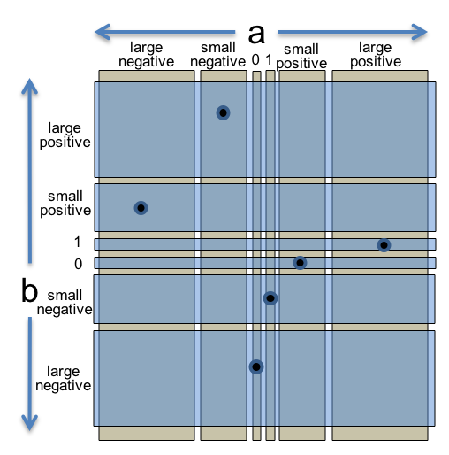

Reading 3: Testing
=============================

#### Software in 6.031

| Safe from bugs 没有错误 | Easy to understand 易于理解 | Ready for change 可随时更改 |
| --- |  --- |  --- |
| Correct today and correct in the unknown future.今天正确，在未知的未来也正确。 | Communicating clearly with future programmers, including future you.与未来的程序员（包括未来的你）进行清晰的沟通。 | Designed to accommodate change without rewriting.旨在适应变化，而无需重写。 |

#### Objectives 目标

After today's class, you should:
在今天的课程之后，你应该：

-   understand the value of testing, and know the process of test-first programming;
    理解测试的价值，并了解测试优先编程的流程；
-   be able to judge a test suite for correctness, thoroughness, and size;
    能够判断测试套件的正确性、全面性和大小；
-   be able to design a test suite for a method by partitioning its input space and choosing good test cases;
    能够通过划分输入空间并从中选择好的测试用例来为一个方法设计测试套件；
-   be able to judge a test suite by measuring its code coverage; and
    能够通过测量测试套件的代码覆盖率来判断其好坏；以及
-   understand and know when to use black box vs. glass box testing, unit tests vs. integration tests, and automated regression testing.
    理解并知道何时使用黑盒测试与白盒测试、单元测试与集成测试以及自动回归测试。

---

Validation 验证
-------------

Testing is an example of a more general process called **validation**. The purpose of validation is to uncover problems in a program and thereby increase your confidence in the program's correctness. Validation includes:
测试是**验证**这个更加通用的过程的一个示例。验证的目的是发现程序中的问题，从而增加您对程序正确性的信心。验证包括：

-   **Formal reasoning** about a program, usually called *verification*. Verification constructs a formal proof that a program is correct. Verification is tedious to do by hand, and automated tool support for verification is still an active area of research. Nevertheless, small, crucial pieces of a program may be formally verified, such as the scheduler in an operating system, or the bytecode interpreter in a virtual machine, or [the filesystem in an operating system](http://www.csail.mit.edu/crash_tolerant_data_storage).
    对程序进行形式化推理，通常称为验证。验证构建了程序是正确的形式化的证明。手动进行验证很繁琐，而支持自动验证的工具仍然是一个活跃的研究领域。尽管如此，程序中一些小的、关键的部分可能会得到形式化验证，例如操作系统中的调度程序，或者虚拟机中的字节码解释器，或者操作系统中的文件系统。
-   **Code review.** Having somebody else carefully read your code, and reason informally about it, can be a good way to uncover bugs. It's much like having somebody else proofread an essay you have written. We discuss [code review in another reading](https://web.mit.edu/6.031/www/sp21/classes/04-code-review/).
    代码审查。让其他人仔细阅读您的代码，并对其进行非正式推理，这可能是发现错误的好方法。这很像让其他人校对您撰写的一篇论文。
-   **Testing**. Running the program on carefully selected inputs and checking the results.
    测试。在精心挑选的输入上运行程序并检查结果。

Even with the best validation, it's very hard to achieve perfect quality in software. Here are some typical *residual defect rates* (bugs left over after the software has shipped) per kloc (one thousand lines of source code):
即使经过最佳的验证，也很难在软件中实现完美的质量。以下是每千行源代码 (kloc) 的一些典型残余缺陷率（软件发布后遗留的错误）：

-   1 - 10 defects/kloc: Typical industry software.
    1 - 10 个缺陷/kloc：典型的行业软件。
-   0.1 - 1 defects/kloc: High-quality validation. The Java libraries might achieve this level of correctness.
    0.1 - 1 个缺陷/kloc：高质量验证。Java 库也许能够到达这种级别的正确性。
-   0.01 - 0.1 defects/kloc: The very best, safety-critical validation. NASA and companies like Praxis can achieve this level.
    0.01 - 0.1 个缺陷/kloc：最好的安全关键型验证。NASA 和 Praxis 等公司可以达到此级别。

This can be discouraging for large systems. For example, if you have shipped a million lines of typical industry source code (1 defect/kloc), it means you missed 1000 bugs!
对于大型系统而言，这可能会令人沮丧。例如，如果您发布了百万行典型的行业源代码（1 个缺陷/kloc），这意味着您错过了 1000 个错误！

---

Why software testing is hard 为什么软件测试很难
--------------------------------------

有些在现实世界中很有效的测试方法却不幸在软件世界中行不通，具体包括：

1. 穷举测试：穷举测试在软件世界中是行不通的，这通常是因为可能的测试用例空间过大导致的；比如 32 位的浮点数乘法就有 $2^{64}$ 个测试用例。
2. 随意测试（随便输入一个测试用例查看结果是否有效）：随意测试同样也行不通，这不太可能发现程序中的错误，除非程序中到处都是 bug；并且随意测试也不会增加我们对程序正确性的信心。
3. 随机/统计测试：该测试方法在软件世界中也行不通。其它工程学科可以通过测试随机样本的缺陷率来推断整个生产批次的缺陷率。此外，物理系统还可以使用许多技巧来加快测试时间，例如为了模拟 10 年 内打开冰箱的次数，可以在 24 小时内连续打开冰箱 1000 次。这些技巧能够给出已知的缺陷率，但它们假设缺陷空间是连续的或均匀的，这对于物理系统来说是成立的，但对于软件系统来说是不成立的。


Here are some approaches that unfortunately don't work well in the world of software.

**Exhaustive testing** is infeasible. The space of possible test cases is generally too big to cover exhaustively. Imagine exhaustively testing a 32-bit floating-point multiply operation, `a*b`. There are 2^64^ test cases!

**Haphazard testing** ("just try it and see if it works") is less likely to find bugs, unless the program is so buggy that an arbitrarily-chosen input is more likely to fail than to succeed. It also doesn't increase our confidence in program correctness.

**Random or statistical testing** doesn't work well for software. Other engineering disciplines can test small random samples (e.g. 1% of hard drives manufactured) and infer the defect rate for the whole production lot. Physical systems can use many tricks to speed up time, like opening a refrigerator 1000 times in 24 hours instead of 10 years. These tricks give known failure rates (e.g. mean lifetime of a hard drive), but they assume continuity or uniformity across the space of defects. This is true for physical artifacts.

But it's not true for software. Software behavior varies discontinuously and discretely across the space of possible inputs. The system may seem to work fine across a broad range of inputs, and then abruptly fail at a single boundary point. The [famous Pentium division bug](http://www.willamette.edu/~mjaneba/pentprob.html) affected approximately 1 in 9 billion divisions. Stack overflows, out of memory errors, and numeric overflow bugs tend to happen abruptly, and always in the same way, not with probabilistic variation. That's different from physical systems, where there is often visible evidence that the system is approaching a failure point (cracks in a bridge) or failures are distributed probabilistically near the failure point (so that statistical testing will observe some failures even before the point is reached).
但对于软件来说并非如此。软件行为在可能的输入空间中不连续且离散地变化。系统可能在广泛的输入范围内看起来运行良好，然后在单个边界点突然失败。著名的奔腾除法错误影响了大约 90 亿次除法中的 1 次。堆栈溢出、内存溢出错误和数字溢出错误往往会突然发生，并且总是以相同的方式发生，而不是以概率变化。这不同于物理系统，在物理系统中，通常有明显的证据表明系统正在接近故障点（桥梁中的裂缝）或故障以概率分布在故障点附近（因此统计测试甚至在达到该点之前就会观察到一些故障）。

Instead, test cases must be chosen carefully and systematically. Techniques for systematic testing are the primary focus of this reading.
相反，必须仔细且系统地选择测试用例。系统测试技术是本次阅读的主要重点。

#### READING EXERCISES 阅读练习

---

Test-first programming 测试优先编程
-----------------------------

Before we dive in, we need to define some terms:
在深入探讨之前，我们需要定义一些术语：

-   A *module* is a part of a software system that can be designed, implemented, tested, and reasoned about separately from the rest of the system. In this reading, we'll focus on modules that are functions, represented by Java methods. In future readings we'll broaden our view to think about larger modules, like a class with multiple interacting methods.
    模块是软件系统的一部分，可以独立于系统其余部分进行设计、实现、测试和推理。在本课中，我们将重点关注作为函数的模块，这些函数由 Java 方法表示。在未来的课程中，我们将拓宽视野，考虑更大的模块，例如具有多个交互方法的类。

-   A *specification* (or spec) describes the behavior of a module. For a function, the specification gives the types of the parameters and any additional constraints on them (e.g. `sqrt`'s parameter must be nonnegative). It also gives the type of the return value and how the return value relates to the inputs. In Java code, the specification consists of the method signature and the comment above it that describes what it does.
    规范（或规格）描述模块的行为。对于函数，规范给出参数的类型以及对它们的任何附加约束（例如， `sqrt` 的参数必须是非负的）。它还给出返回值的类型以及返回值与输入的关系。在 Java 代码中，规范由方法签名和描述其作用的注释组成。

-   A module has an *implementation* that provides its behavior, and *clients* that use the module. For a function, the implementation is the body of the method, and the clients are other code that calls the method. The specification of the module constrains both the client and the implementation. We'll have much more to say about specifications, implementations, and clients a few classes from now.
    模块具有提供其行为的实现，以及使用该模块的客户端。对于函数，实现是方法的主体，客户端是调用该方法的其他代码。模块的规范约束了客户端和实现。我们将在几节课后详细讨论规范、实现和客户端。

-   A *test case* is a particular choice of inputs, along with the expected output behavior required by the specification.
    测试用例是输入的特定选择，以及规范要求的预期输出行为。

-   A *test suite* is a set of test cases for a module.
    测试套件是模块的一组测试用例。

You've already seen and used these concepts on problem set 0. You were given some specifications for Java methods and asked to write an implementation for each one. You were also given a test suite for each method that you could run to see if your implementation obeyed the spec.
您已经在问题集 0 中看到并使用了这些概念。您获得了一些 Java 方法的规范，并被要求为每个方法编写一个实现。您还获得了每个方法的测试套件，您可以运行该套件以查看您的实现是否遵守规范。

It turns out that this is a good pattern to follow when designing a program from scratch. In *test-first programming*, you write the spec and the tests before you even write any code. The development of a single function proceeds in this order:
事实证明，在从头开始设计程序时，这是一个很好的模式。在测试优先编程中，您在编写任何代码之前就编写了规范和测试。单个函数的开发按以下顺序进行：

1.  **Spec**: Write a specification for the function.
    规范：为函数编写规范。
2.  **Test**: Write tests that exercise the specification.
    测试：编写测试以演练规范。
3.  **Implement**: Write the implementation.
    实现：编写实现。

Once your implementation passes the tests you wrote, you're done.
一旦您的实现通过了您编写的测试，您就完成了。

The biggest benefit of test-first programming is safety from bugs. Don't leave testing until the end of development, when you have a big pile of unvalidated code. Leaving testing until the end only makes debugging longer and more painful, because bugs may be anywhere in your code. It's far more pleasant to test your code as you develop it.
测试优先编程的最大好处是避免了错误。不要等到开发结束时才进行测试，那时您将有一大堆未经验证的代码。将测试留到最后只会使调试变得更长且更痛苦，因为错误可能存在于代码的任何位置。在开发代码时对其进行测试要愉快得多。

#### READING EXERCISES 阅读练习

Test-first programming 测试优先编程

Systematic testing 系统测试
-----------------------

Rather than exhaustive, haphazard, or randomized testing, we want to test *systematically*. Systematic testing means that we are choosing test cases in a principled way, with the goal of designing a test suite with three desirable properties:
我们希望进行系统测试，而不是穷举测试、随意测试或随机测试。系统测试意味着我们以一种原则性的方式选择测试用例，目的是设计一个具有三个理想特性的测试套件：

-   **Correct**. A correct test suite is a legal client of the specification, and it accepts all legal implementations of the spec without complaint. This gives us the freedom to change how the module is implemented internally without necessarily having to change the test suite.
    正确。正确的测试套件是规范的合法客户端，它接受规范的所有合法实现，而不会抱怨。这让我们可以自由地更改模块的内部实现方式，而无需更改测试套件。

-   **Thorough**. A thorough test suite finds actual bugs in the implementation, caused by mistakes that programmers are likely to make.
    全面。全面的测试套件会发现实现中的实际错误，这些错误是由程序员可能犯的错误引起的。

-   **Small**. A small test suite, with few test cases, is faster to write in the first place, and easier to update if the specification evolves. Small test suites are also faster to run. You will be able to run your tests more frequently if your test suites are small and fast.
    小。小的测试套件，测试用例少，一开始就更容易编写，如果规范发生变化，也更容易更新。小的测试套件运行起来也更快。如果您的测试套件小而快，您将能够更频繁地运行测试。

By these criteria, exhaustive testing is thorough but infeasibly large. Haphazard testing tends to be small but not thorough. Randomized testing can achieve thoroughness only at the cost of large size.
根据这些标准，穷举测试很全面，但不可行。随机测试往往很小，但不全面。随机测试只能以规模大的代价来实现全面性。

Designing a test suite for both thoroughness and small size requires having the right attitude. Normally when you're coding, your goal is to make the program work. But as a test suite designer, you want to *make it fail*. That's a subtle but important difference. A good tester intentionally pokes at all the places the program might be vulnerable, so that those vulnerabilities can be eliminated.
设计一个既全面又小巧的测试套件需要正确的态度。通常，在您进行编码时，您的目标是使程序正常工作。但作为测试套件设计者，您希望它失败。这是一个微妙但重要的区别。一个好的测试人员会故意攻击程序可能存在漏洞的所有地方，以便消除这些漏洞。

The need to adopt a testing attitude is another argument for test-first programming. It is all too tempting to treat code you've already written as a precious thing, a fragile eggshell, and test it very lightly just to see it work. For *thorough* testing, though, you have to be brutal. Test-first programming allows you to put on your testing hat, and adopt that brutal perspective, before you've even written any code.
采用测试态度的必要性是测试优先编程的另一个论据。将您已经编写的代码视为珍贵的东西、易碎的蛋壳，并且只是为了看到它起作用而对其进行非常轻微的测试，这是非常诱人的。然而，对于彻底的测试，您必须残忍。测试优先编程允许您戴上测试帽，并在编写任何代码之前采用这种残忍的视角。

#### READING EXERCISES 阅读练习

Correctness and thoroughness
正确性和彻底性

Choosing test cases by partitioning
通过分区选择测试用例
----------------------------------------------

Creating a good test suite is a challenging and interesting design problem. We want to pick a set of test cases that is small enough to be easy to write and maintain and quick to run, yet thorough enough to find bugs in the program.
创建好的测试套件是一个具有挑战性和趣味性的设计问题。我们希望选择一组测试用例，该组用例足够小，便于编写和维护，并且运行速度快，但又足够彻底，能够找到程序中的错误。


To do this, we divide the input space into **subdomains**, each consisting of a set of inputs. (The name **subdomain** comes from the fact that it is a subset of the *domain*, the input space of a mathematical function.) Taken together, the subdomains form a *partition*: a collection of disjoint sets that completely covers the input space, so that every input lies in exactly one subdomain. Then we choose one test case from each subdomain, and that's our test suite.
为此，我们将输入空间划分为子域，每个子域都包含一组输入。（子域的名称源于它是域的子集，域是一个数学函数的输入空间。）所有的子域形成了一个分区：一个完全覆盖输入空间的不相交集合所构成的集合，以便每个输入都恰好位于一个子域中。然后，我们从每个子域中选择一个测试用例，将它们组合起来就构成了我们的测试套件。

The idea behind subdomains is to divide the input space into sets of similar inputs on which the program has similar behavior. Then we use one representative of each set. This approach makes the best use of limited testing resources by choosing dissimilar test cases, and forcing the testing to explore areas of the input space that random testing might not reach.
子域背后的思想是将输入空间划分为多个集合，每个集合中的输入都是相似的，使得程序的输出具有相似的行为。然后，我们从每个集合中选出一个代表元素（即测试用例），将这些代表元素组合起来就是我们的测试套件。这种方法通过选择相异的测试用例并使得测试能够探索随机测试可能无法达到的输入空间区域，从而充分地利用了有限的测试资源。

---

#### Example: `abs()` 示例： `abs()`

Let's start with a simple example from the Java library: the integer [`abs()`](http://docs.oracle.com/en/java/javase/15/docs/api/java.base/java/lang/Math.html#abs(int)) function, found in the [`Math`](http://docs.oracle.com/en/java/javase/15/docs/api/java.base/java/lang/Math.html) class:
让我们从 Java 库中的一个简单示例开始：整数 `abs()` 函数，位于 `Math` 类中：

```java
`/**
 * ...
 * @param a  the argument whose absolute value is to be determined
 * @return the absolute value of the argument.
 */
public static int abs(int a)`
```

(This is not the complete specification of `abs`, so we'll come back to this later. But it will do for a start.)
（这不是 `abs` 的完整规范，所以我们稍后会再回来讨论。但它可以作为开始。）

Mathematically, this method is a function of the following type:
从数学上讲，此方法是以下类型的函数：

**abs : int → int**


The function has a one-dimensional input space, consisting of all the possible values of *a*. Thinking about how the absolute value function behaves, we might start by partitioning the input space into these two subdomains: { *a* | *a* ≥ 0 } and { *a* | *a* < 0 }. On the first subdomain, `abs` should return *a* unchanged. On the second subdomain, `abs` should negate it.
该函数具有一个一维的输入空间，由 a 所有可能的值组成。考虑这个绝对值函数的行为方式，我们也许首先会将输入空间划分为这两个子域：{ a | a ≥ 0 } 和 { a | a < 0 }。在第一个子域上， `abs` 应将 a 原样返回；在第二个子域上， `abs` 应返回 a 的相反数。

To write a partition compactly, we omit the { *a* | ... } frame of each set description, and simply write a list of predicates like so:
为了简洁地编写分区，我们省略每个集合描述的 { a | ... } 框架，并简单地编写一个谓词列表，如下所示：

```java
`// partition: a >= 0; a < 0`
```

To choose test cases for our test suite, we pick an arbitrary value *a* from each subdomain of the partition, for example:
为了给我们的测试套件选择测试用例，我们从分区的每个子域中挑选一个任意值 a，例如：

-   *a* \= 17 to cover the subdomain *a* ≥ 0
    a = 17 覆盖子域 a ≥ 0
-   *a* \= -3 to cover the subdomain *a* < 0
    a = -3 覆盖子域 a < 0

---

#### Example: `max()` 示例： `max()`

Now let's look at another example from the Java library: the integer [`max()`](http://docs.oracle.com/en/java/javase/15/docs/api/java.base/java/lang/Math.html#max(int,int)) function, also found in [`Math`](http://docs.oracle.com/en/java/javase/15/docs/api/java.base/java/lang/Math.html).
现在让我们来看 Java 库中的另一个示例：整数 `max()` 函数，也存在于 `Math` 中。

```java
`/**
 * ...
 * @param a  an argument
 * @param b  another argument
 * @return the larger of a and b.
 */
public static int max(int a, int b)`
```

Mathematically, this method is a function of two arguments:
在数学上，此方法是两个参数的函数：

**max : int × int → int**


So we have a two-dimensional input space, consisting of all the pairs of integers (*a*,*b*). Now let's partition it. From the specification, it makes sense to choose the subdomains { (*a*,*b*) | *a* < *b* } and { (*a*,*b*) | *a* \> *b* }, because the spec calls for different behavior on each one. But we can't stop there, because these subdomains are not yet a *partition* of the input space. A partition must completely cover the set of possible inputs. So we need to add { (*a*,*b*) | *a* \= *b* }. Expressed compactly, the partition looks like this:
因此我们有一个二维的输入空间，由所有整数对 (a,b) 组成。现在让我们对其进行分区。从规范来看，选择子域 { (a,b) | a < b } 和 { (a,b) | a > b } 是合理的，因为规范在这两个子域上具有不同的行为。但我们不能就此止步，因为这些子域还不是输入空间的分区。分区必须完全覆盖可能的输入集。因此我们需要添加 { (a,b) | a = b }。分区具体如下：

```java
`// partition: a < b; a > b; a = b`
```

Our test suite might then be:
我们的测试套件可能是：

-   (*a*,*b*) = (1, 2) to cover *a* < *b*
    （a，b）=（1，2）覆盖 a < b
-   (*a*,*b*) = (10, -8) to cover *a* \> *b*
    （a，b）=（10，-8）覆盖 a > b
-   (*a*,*b*) = (9, 9) to cover *a* \= *b*
    （a，b）=（9，9）覆盖 a = b

#### READING EXERCISES 阅读练习

Square root 平方根

The greatest of all common divisors
所有公约数中最大的一个

---

### Include boundaries in the partition 在分区中包含边界值
Bugs often occur at *boundaries* between subdomains. Some examples:
Bugs 通常发生在子域之间的边界处。一些示例：

-   0 is a boundary between positive numbers and negative numbers
    0 是正数和负数之间的边界
-   the maximum and minimum values of numeric types, like `int` or `double`
    数值类型的最大值和最小值，如 `int` 或 `double`
-   emptiness for collection types, like the empty string, empty list, or empty set
    集合类型的空值，如空字符串、空列表或空集合
-   the first and last element of a sequence, like a string or list
    序列的第一个和最后一个元素，例如字符串或列表

Why do bugs often happen at boundaries? One reason is that programmers often make **off-by-one mistakes**, like writing `<=` instead of `<`, or initializing a counter to 0 instead of 1. Another is that some boundaries may need to be handled as special cases in the code. Another is that boundaries may be places of discontinuity in the code's behavior. When an `int` variable grows beyond its maximum positive value, for example, it abruptly becomes a negative number.
为什么错误经常发生在边界处？一个原因是程序员经常犯减一错误，比如写成 `<=` 而不是 `<` ，或者将计数器初始化为 0 而不是 1。另一个原因是某些边界可能需要在代码中作为特殊情况处理。再一个原因是边界可能是代码行为中的不连续处。例如，当 `int` 变量增长超过其最大正值时，它会突然变成负数。

It turns out that the [`abs()`](http://docs.oracle.com/en/java/javase/15/docs/api/java.base/java/lang/Math.html#abs(int)) function in Java behaves in a very unexpected way on one of these boundaries, which the spec describes as follows:
事实证明，Java 中的 `abs()` 函数在其中一个边界上的行为非常出乎意料，规范将其描述如下：

```java
`/**
 * ...
 * Note that if the argument is equal to the value of Integer.MIN_VALUE,
 * the most negative representable int value, the result is that same value,
 * which is negative.
 * ...
 */`
```

So it's possible for `abs` to return a negative integer! This is a feature of [two's-complement binary representation](https://en.wikipedia.org/wiki/Two%27s_complement#Most_negative_number). A simple way to understand it is that [`Integer.MIN_VALUE`](http://docs.oracle.com/en/java/javase/15/docs/api/java.base/java/lang/Integer.html#MIN_VALUE) is -2^31^ but [`Integer.MAX_VALUE`](http://docs.oracle.com/en/java/javase/15/docs/api/java.base/java/lang/Integer.html#MAX_VALUE) is 2^31^\-1, so the negation of `Integer.MIN_VALUE` is just outside the range of `int`. We should certainly include these boundary values in our testing.
因此 `abs` 有可能返回负整数！这是二进制补码表示的一个特性。理解它的一个简单方法是 `Integer.MIN_VALUE` 是 -2 ^31^ 但 `Integer.MAX_VALUE` 是 2 ^31^ \-1，因此 `Integer.MIN_VALUE` 的相反数恰好超出了 `int` 的范围。我们当然应该在测试中包含这些边界值。

We incorporate boundaries as single-element subdomains in the partition, so that the test suite will necessarily include the boundary value as a test case. For `abs`, we would add subdomains for each of the relevant boundaries:
我们将这些边界值划分成分区的一个单元子域，这样测试套件就可以从这些子域中选择一个边界值作为测试用例。对于 `abs` ，我们将为每个相关边界添加子域：

-   *a* \= 0, because `abs` behaves differently on positive and negative numbers
    a = 0，因为 `abs` 在正数和负数上的行为不同
-   *a* \= `Integer.MIN_VALUE`, the most negative possible `int` value, because the spec calls out some unusual behavior there
    a = `Integer.MIN_VALUE` ，最小的可能 `int` 值，因为规范在那里指出了某些异常行为
-   *a* \= `Integer.MAX_VALUE`, the largest positive `int` value, for symmetry and completeness
    a = `Integer.MAX_VALUE` ，最大的正 `int` 值，为了对称和完整

Our original two subdomains would then shrink to exclude the boundary values: { *a* | 0 < *a* < `Integer.MAX_VALUE` } and { *a* | `Integer.MIN_VALUE` < *a* < 0 }.
然后，我们的两个原始子域将缩小以排除边界值：{ a | 0 < a < `Integer.MAX_VALUE` } 和 { a | `Integer.MIN_VALUE` < a < 0 }。

This is a now a partition of the input space of `abs`: the five subdomains are disjoint and completely cover the space. One way to write it compactly looks like this:
以下是 `abs` 输入空间的一个分区：五个子域是不相交的，并且完全覆盖了输入空间，具体如下：

```java
`// partition:
//     a = Integer.MIN_VALUE
//     Integer.MIN_VALUE < a < 0
//     a = 0
//     0 < a < Integer.MAX_VALUE
//     a = Integer.MAX_VALUE`
```

Our test suite might then be:
我们的测试套件可能是：

-   *a* \= 0
-   *a* \= `Integer.MIN_VALUE`
-   *a* \= `Integer.MAX_VALUE`
-   *a* \= 17 to cover the subdomain 0 < *a* < `Integer.MAX_VALUE`
    a = 17 覆盖子域 0 < a < `Integer.MAX_VALUE`
-   *a* \= -3 to cover the subdomain `Integer.MIN_VALUE` < *a* < 0
    a = -3 以覆盖子域 `Integer.MIN_VALUE` < a < 0

---

#### READING EXERCISES 阅读练习

Boundaries 边界

---

#### Example: `BigInteger.multiply()` 示例： `BigInteger.multiply()`

Let's look at a slightly more complicated example. [`BigInteger`](http://docs.oracle.com/en/java/javase/15/docs/api/java.base/java/math/BigInteger.html) is a class built into the Java library that can represent integers of any size, unlike the primitive types `int` and `long` that have only limited ranges. BigInteger has a method [`multiply`](http://docs.oracle.com/en/java/javase/15/docs/api/java.base/java/math/BigInteger.html#multiply(java.math.BigInteger)) that multiplies two BigInteger values together:
我们来看一个稍微复杂的示例。 `BigInteger` 是一个 Java 库中的内置类，它可以表示任何大小的整数，这与只有有限范围的原始类型 `int` 和 `long` 不同。 BigInteger 有一个方法 `multiply` ，它将两个 BigInteger 值相乘：

```java
/**
 * @param val another BigInteger
 * @return a BigInteger whose value is (this * val).
 */
public BigInteger multiply(BigInteger val)`
```

For example, here's how it might be used:
例如，以下是如何使用它的：

```java
BigInteger a = new BigInteger("9500000000"); // 9.5 billion
BigInteger b = new BigInteger("2");
BigInteger ab = a.multiply(b); // should be 19 billion`
```

This example shows that even though only one parameter is explicitly shown in the method's declaration, `multiply` is actually a function of *two* arguments: the object you're calling the method on (`a` in the example above), and the parameter that you're passing in the parentheses (`b` in this example). In Python, the object receiving the method call would be explicitly named as a parameter called `self` in the method declaration. In Java, you don't mention the receiving object in the parameters, and it's called `this` instead of `self`.
此示例表明，尽管方法声明中只显示了一个参数， 但 `multiply` 实际上是一个拥有两个参数的函数：一个是该方法所属的对象（上面的示例中的 `a` ）一个是在括号中传递的参数（示例中的 `b` ）。在 Python 中，接收方法调用的对象将被明确地命名为方法声明中的一个名为 `self` 的参数。但在 Java 中，不会显式地在参数中提及接收对象，并且其名为 `this` 而不是 `self` 。

So we should think of `multiply` as a function taking two inputs, each of type `BigInteger`, and producing one output of type `BigInteger`:
因此，我们应该将 `multiply` 视为一个接受两个输入的函数，并且这两个输入的类型都为 `BigInteger` ，并产生一个类型为 `BigInteger` 的输出：

**multiply : BigInteger × BigInteger → BigInteger**

We again have a two-dimensional input space, consisting of all the pairs of integers (*a*,*b*). Thinking about how sign rules work with multiplication, we might start with these subdomains:
我们再次拥有一个二维输入空间，由所有整数对 (a,b) 组成。考虑乘法中的符号规则如何起作用，我们可以从这些子域开始：

-   *a* and *b* are both positive
    a 和 b 都是正数
-   *a* and *b* are both negative
    a 和 b 都是负数
-   *a* is positive, *b* is negative
    a 为正数，b 为负数
-   *a* is negative, *b* is positive
    a 为负数，b 为正数

There are also some boundary values for multiplication that we should check:
还有一些乘法的边界值需要检查：

-   *a* or *b* is 0, because the result is always 0
    a 或 b 为 0，因为结果始终为 0
-   *a* or *b* is 1, the identity value for multiplication
    a 或 b 为 1，即乘法的单位元

Finally, because the purpose of `BigInteger` is to represent arbitrarily-large integers, we should make sure to try integers that are very big, at least bigger than the biggest `long`, which is roughly 2^63^, a 19-digit decimal integer.
最后，由于 `BigInteger` 的目的是表示任意大的整数，我们应该确保尝试非常大的整数，至少大于最大的 `long` 。（大约 2 ^63^ ，一个 19 位十进制整数）

-   *a* or *b* is small or large in magnitude (i.e., small enough to represent in a `long` value, or too large for a `long`)
    a 或 b 很小或很大（小到可以用 `long` 值表示，或大到无法用 `long` 表示）

Let's bring all these observations together into a single partition of the whole (*a*,*b*) space. We'll choose *a* and *b* independently from:

根据上述分析，可以得到一个针对 (a,b) 输入空间的分区，具体如下（独立地选择a、b）：

-   0
-   1
-   small positive integer (≤ `Long.MAX_VALUE` and > 1)
    小的正整数（≤ `Long.MAX_VALUE` 且 > 1）
-   small negative integer (≥ `Long.MIN_VALUE` and < 0)
    小的负整数（≥ `Long.MIN_VALUE` 且 < 0）
-   large positive integer (> `Long.MAX_VALUE`)
    大的正整数（> `Long.MAX_VALUE` ）
-   large negative integer (< `Long.MIN_VALUE`)
    大的负整数（< `Long.MIN_VALUE` ）

So this would produce 6 × 6 = 36 subdomains that partition the space of pairs of integers.
因此，这将产生 6 × 6 = 36 个子域，对整数对 (a,b) 的输入空间进行分区。

To produce the test suite from this partition, we would pick an arbitrary pair (*a*,*b*) from each square of the grid, for example:
要从此分区生成测试套件，我们将从网格的每个方格中任选一对 (a,b)，例如：

-   (*a*,*b*) = (0, 0) to cover (0, 0)
    （a，b）=（0，0）覆盖（0，0）
-   (*a*,*b*) = (0, 1) to cover (0, 1)
    （a，b）=（0，1）覆盖（0，1）
-   (*a*,*b*) = (0, 8392) to cover (0, small positive integer)
    （a，b）=（0，8392）覆盖（0，小正整数）
-   (*a*,*b*) = (0, -7) to cover (0, small negative integer)
    （a，b）=（0，-7）覆盖（0，小负整数）
-   ...
-   (*a*,*b*) = (-10^60^, -10^810^) to cover (large negative, large negative)
    （a，b）=（-10 ^60^ ，-10 ^810^ ）覆盖（大负数，大负数）

The figure at the right shows how the two-dimensional (a,b) space is divided by this partition, and the points are test cases that we might choose to completely cover the partition.
下图显示了二维（a，b）空间如何通过此分区划分，并且这些点是我们可能选择用来完全覆盖分区的测试用例。


---

### Using multiple partitions 使用多个分区
The examples so far used only one partition -- one collection of disjoint subdomains -- across the entire input space. For functions with multiple parameters, this can become costly. Each parameter may have interesting behavior variation and several boundary values, so forming a single partition of the input space from the *Cartesian product* of the behavior on each parameter leads to a combinatorial explosion in the size of the resulting test suite. We saw this already with `multiply`, in which the Cartesian product partition already had 6 × 6 = 36 subdomains, requiring 36 test cases to cover. For a function with *n* parameters, the Cartesian-product approach produces a test suite of size exponential in *n*, which quickly becomes infeasible for manual test authoring.
到目前为止的示例只使用了一个分区------一个由输入空间中多个不相交子域所构成的集合。对于具有多个参数的函数来说，其子域的数量可能十分庞大。每个参数可能都会有有趣的行为变化以及多个边界值，因此从参数行为的笛卡尔积构成输入空间的单个分区可能会导致生成的测试套件过大。我们已经通过 `multiply` 看到了这一点，其中笛卡尔积分区已经具有 6 × 6 = 36 个子域，需要 36 个测试用例来覆盖。对于具有 n 个参数的函数，笛卡尔积方法会生成大小呈 n 的指数增长的测试套件，这很快会变得不适合人工测试编写。

An alternative approach is to treat the features of each input *a* and *b* as two separate partitions of the input space. One partition only considers the value of *a*:
另一种方法是将每个输入 a 和 b 的特征视为输入空间的两个单独分区。一个分区仅考虑 a 的值：

-   (*a*,*b*) such that *a* \= 0, 1, small positive, small negative, large positive, large negative
     a = 0、1、小正数、小负数、大正数、大负数的整数对 (a,b)

And the other partition only considers the value of *b*:
另一个分区仅考虑 b 的值：

-   (*a*,*b*) such that *b* \= 0, 1, small positive, small negative, large positive, large negative
     b = 0、1、小正数、小负数、大正数、大负数的整数对 (a,b)

These two partitions are illustrated at the right. Every input pair (*a*,*b*) belongs to exactly one subdomain from each partition.
下图是该分区的说明，其中每个输入对 (a,b) 恰好属于每个分区的一个子域。



We might write the two partitions compactly as follows:
我们可以紧凑地写出这两个分区，如下所示：

```java
`// partition on a:
//   a = 0
//   a = 1
//   a is small integer > 1
//   a is small integer < 0
//   a is large positive integer
//   a is large negative integer
//      (where "small" fits in long, and "large" doesn't)
// partition on b:
//   b = 0
//   b = 1
//   b is small integer > 1
//   b is small integer < 0
//   b is large positive integer
//   b is large negative integer`
```

We still want to cover every subdomain with a test case, but now a single test case can cover multiple subdomains from different partitions, making the test suite more efficient. We can cover both partitions completely with just 6 test cases, as shown on the right.

我们仍然希望用一个测试用例覆盖一个子域，但现在一个测试用例可以覆盖来自不同分区的多个子域，从而使测试套件更加高效。我们仅用 6 个测试用例即可完全覆盖这两个分区，如右侧所示。

---

Partitioning *a* and *b* independently raises the risk that you're no longer testing the interaction between them. For example, sign handling in multiplication is a possible source of bugs, and the sign of the result depends on the signs of both *a* and *b*. But we can add an additional partition that captures this interaction:

单独地对 a、b 进行分区产生了一个风险：我们没有测试 a、b之间的交互。例如，乘法中的符号处理是一个可能的 bug 来源，结果的符号取决于 a 和 b 的符号。但我们可以添加一个额外的分区来捕获此交互：

```java
`// partition on signs of a and b:
//    a and b are both positive
//    a and b are both negative
//    a positive and b negative
//    a negative and b positive
//    one or both are 0`
```

Now we have three partitions, with 6, 6, and 5 subdomains each, but we don't need the Cartesian product of 6 × 6 × 5 test cases to cover them. A test suite with 6 carefully-chosen test cases can cover the subdomains of all three partitions.
现在我们有三个分区，每个分区分别有 6、6 、5 个子域，但我们不需要 6 × 6 × 5 个测试用例的笛卡尔积来覆盖它们。一个由 6 个精心挑选的测试用例组成的测试套件可以覆盖这三个分区的所有子域。

We can continue to add partitions this way, as we think more about the spec and observe other behavioral variations that might lead to bugs. With careful test case selection, additional partitions should require few (if any) additional test cases.
随着我们对规范理解的加深并观察到了可能导致 bug 的其他行为变化，我们可以继续以这种方式添加分区。通过仔细选择测试用例，新增的分区应该仅需要补充一小部分（如果需要的话）额外的测试用例。

Sometimes we may want to use the Cartesian product approach on multiple partitions, to produce a more thorough test suite. But even in those cases, the Cartesian product may be smaller than we expect. When subdomains from different partitions turn out to be mutually exclusive, the Cartesian product won't include a subdomain for that particular combination of subdomains. We'll see an example of that in one of the exercises below.

有时我们可能希望对多个分区使用笛卡尔积方法，以生成更全面的测试套件。但即使在这些情况下，笛卡尔积也可能比我们预期的要小。当来自不同分区的子域最终相互排斥时，笛卡尔积不会包含该特定子域组合的子域。我们将在下面的一个练习中看到一个示例。

---

As a starting point for test-first programming, however, a small test suite that covers each subdomain of several thoughtfully-chosen partitions strikes a good balance between size and thoroughness. The test suite may then grow further with glass box testing, code coverage measurement, and regression testing, which we'll see later in this reading.
然而，作为测试优先编程的起点，一个涵盖几个经过深思熟虑选择的划分的每个子域的小型测试套件在规模和彻底性之间取得了良好的平衡。然后，测试套件可能会通过玻璃盒测试、代码覆盖率测量和回归测试进一步增长，我们将在后面的阅读中看到这一点。

---

#### READING EXERCISES 阅读练习

One partition vs. multiple partitions
一个分区与多个分区

Covering every subdomain vs. covering Cartesian product
覆盖每个子域与覆盖笛卡尔积

Partitions expressed on outputs
输出上表达的分区

Partitioning 分区

Automated unit testing with JUnit
使用 JUnit 进行自动单元测试
---------------------------------------------------

A well-tested program will have tests for every individual module that it contains. A test that tests an individual module, in isolation if possible, is called a **unit test**.
经过充分测试的程序将针对其包含的每个单独模块进行测试。如果可能，单独测试单个模块的测试称为单元测试。

[JUnit](http://junit.org/junit5/) is a widely-adopted Java unit testing library, and we will use it heavily in 6.031. A JUnit unit test is written as a method preceded by the annotation `@Test`. A unit test method typically contains one or more calls to the module being tested, and then checks the results using assertion methods like `assertEquals`, `assertTrue`, and `assertFalse`.
JUnit 是一个广泛采用的 Java 单元测试库，我们将在 6.031 中大量使用它。JUnit 单元测试被写成一个方法，该方法之前带有注释 `@Test` 。单元测试方法通常包含一个或多个对正在测试的模块的调用，然后使用断言方法（如 `assertEquals` 、 `assertTrue` 和 `assertFalse` ）检查结果。

For example, the tests we chose for `max` above might look like this when implemented for JUnit:
例如，我们为上面的 `max` 选择的测试在针对 JUnit 实现时可能如下所示：

```
`public class MaxTest {
  ...

  @Test
  public void testALessThanB() {
      assertEquals(2, Math.max(1, 2));
  }

  @Test
  public void testBothEqual() {
      assertEquals(9, Math.max(9, 9));
  }

  @Test
  public void testAGreaterThanB() {
      assertEquals(10, Math.max(10, -9));
  }
}`
```

Note that the order of the parameters to `assertEquals` is important. The first parameter should be the *expected* result, usually a constant, that the test wants to see. The second parameter is the *actual* result, what the code actually does. If you switch them around, then JUnit will produce a confusing error message when the test fails. [All JUnit assertions that compare values](https://junit.org/junit5/docs/current/api/org.junit.jupiter.api/org/junit/jupiter/api/Assertions.html#method.summary) follow this order consistently: expected first, actual second. An assertion can also take an optional message string as the last argument, which you can use to make the test failure clearer.
请注意， `assertEquals` 参数的顺序很重要。第一个参数应该是预期的结果，通常是测试想要看到的常量。第二个参数是实际结果，即代码实际执行的操作。如果您将它们互换，那么当测试失败时，JUnit 将生成一个令人困惑的错误消息。所有比较值的 JUnit 断言都始终遵循此顺序：预期值在前，实际值在后。断言还可以将可选的消息字符串作为最后一个参数，您可以使用它使测试失败更加清晰。

If an assertion in a test method fails, then that test method returns immediately, and JUnit records a failure for that test. A test class can contain any number of `@Test` methods, which are run independently when you run the test class with JUnit. Even if one test method fails, the others will still be run.
如果测试方法中的断言失败，那么该测试方法会立即返回，JUnit 会记录该测试的失败。一个测试类可以包含任意数量的 `@Test` 方法，当使用 JUnit 运行测试类时，这些方法会独立运行。即使一个测试方法失败，其他方法仍会运行。

#### READING EXERCISES 阅读练习

assertEquals

assertTrue

Documenting your testing strategy
记录您的测试策略
------------------------------------------

It's a good idea to write down the testing strategy you used to create a test suite: the partitions, their subdomains, and which subdomains each test case was chosen to cover. Writing down the strategy makes the thoroughness of your test suite much more visible to the reader.

写下您用来创建测试套件的测试策略是一种好的想法：分区、分区的子域以及每个被选择的测试用例涵盖了那个子域。写下该策略会让读者更清楚地看到您的测试套件的全面性。

---

Document the partitions and subdomains in a comment at the top of the JUnit test class. For example, to document our strategy for testing `max`, we would write this in `MaxTest.java`:

在 JUnit 测试类的顶部注释中记录分区和子域。例如，要记录我们测试 `max` 的策略，我们会在 `MaxTest.java` 中写下以下内容：

---

```java
`public class MaxTest {
  /*
   * Testing strategy
   *
   * partition:
   *    a < b
   *    a > b
   *    a = b
   */`
```

Each test case should have a comment above it saying which subdomain(s) it covers, e.g.:

每个测试用例上方应有注释说明它涵盖的子域，例如：

---

```
`  // covers a < b
  @Test
  public void testALessThanB() {
      assertEquals(2, Math.max(1, 2));
  }`
```

Most test suites will have more than one partition, and most test cases will cover multiple subdomains. For example, here's a strategy for `multiply`, using seven partitions:
大多数测试套件将有多个分区，并且大多数测试用例将涵盖多个子域。例如，以下是对 `multiply` 的策略，使用七个分区：

```
`public class Multiply {
  /*
   * Testing strategy
   *
   * cover the cartesian product of these partitions:
   *   partition on a: positive, negative, 0
   *   partition on b: positive, negative, 0
   *   partition on a: 1, !=1
   *   partition on b: 1, !=1
   *   partition on a: small (fits in a long value), or large (doesn't fit)
   *   partition on b: small, large
   *
   * cover the subdomains of these partitions:
   *   partition on signs of a and b:
   *      both positive
   *      both negative
   *      different signs
   *      one or both are 0
   */`
```

Then every test case has a comment identifying the subdomains that it was chosen to cover, e.g.:
然后每个测试用例都有一个注释，标识它被选来涵盖的子域，例如：

```
`  // covers a is positive, b is negative,
  //        a fits in long value, b fits in long value,
  //        a and b have different signs
  @Test
  public void testDifferentSigns() {
      assertEquals(BigInteger.valueOf(-146), BigInteger.valueOf(73).multiply(BigInteger.valueOf(-2)));
  }

  // covers a = 1, b != 1, a and b have same sign
  @Test
  public void testIdentity() {
      assertEquals(BigInteger.valueOf(33), BigInteger.valueOf(1).multiply(BigInteger.valueOf(33)));
  }`
```

#### READING EXERCISES 阅读练习

Put that there 把它放在那里

Black box and glass box testing
黑盒测试和白盒测试
-----------------------------------------

Recall from above that the *specification* is the description of the function's behavior --- the types of parameters, type of return value, and constraints and relationships between them.
回想一下上面提到的内容，规范是函数行为的描述------参数类型、返回值类型以及它们之间的约束和关系。

**Black box testing** means choosing test cases only from the specification, not the implementation of the function. That's what we've been doing in our examples so far. We partitioned and looked for boundaries in `abs`, `max`, and `multiply` without looking at the actual code for these functions. In fact, following the test-first programming approach, we hadn't even *written* the code for these functions yet.
黑盒测试意味着仅从规范中选择测试用例，而不是从函数的实现中选择。到目前为止，这就是我们在示例中所做的。我们对 `abs` 、 `max` 和 `multiply` 进行了划分并寻找边界，而没有查看这些函数的实际代码。事实上，按照测试优先的编程方法，我们甚至还没有编写这些函数的代码。

**Glass box testing** means choosing test cases with knowledge of how the function is actually implemented. For example, if the implementation selects different algorithms depending on the input, then you should partition around the points where different algorithms are chosen. If the implementation keeps an internal cache that remembers the answers to previous inputs, then you should test repeated inputs.
玻璃盒测试意味着在了解函数实际实现方式的情况下选择测试用例。例如，如果实现根据输入选择不同的算法，那么您应该围绕选择不同算法的点进行划分。如果实现保留一个记住先前输入答案的内部缓存，那么您应该测试重复的输入。

For the case of `BigInteger.multiply`, when we finally implemented it, we may have decided to represent small integers with `int` values and large integers with a list of decimal digits. This decision introduces new boundary values, presumably at `Integer.MAX_VALUE` and `Integer.MIN_VALUE`, and a new partition around them.
对于 `BigInteger.multiply` 的情况，当我们最终实现它时，我们可能决定用 `int` 值表示小整数，用十进制数字列表表示大整数。此决定引入了新的边界值，大概在 `Integer.MAX_VALUE` 和 `Integer.MIN_VALUE` 处，以及它们周围的新分区。

When doing glass box testing, you must take care that your test cases don't *require* specific implementation behavior that isn't specifically called for by the spec. For example, if the spec says "throws an exception if the input is poorly formatted," then your test shouldn't check *specifically* for a `NullPointerException` just because that's what the current implementation does. The specification in this case allows *any* exception to be thrown, so your test case should likewise be general in order to be correct, and preserve the implementor's freedom. We'll have much more to say about this in the class on specs.
在进行玻璃盒测试时，您必须注意，您的测试用例不要求规范中未明确要求的特定实现行为。例如，如果规范中写道"如果输入格式不正确，则抛出异常"，那么您的测试不应专门检查 `NullPointerException` ，仅仅因为这是当前实现所做的。在这种情况下，规范允许抛出任何异常，因此您的测试用例也应该是一般的，以便正确无误，并保留实现者的自由。我们将在规范课程中对此进行更多讨论。

#### READING EXERCISES 阅读练习

Black box and glass box testing
黑盒和玻璃盒测试

Coverage 覆盖率
------------

One way to judge a test suite is to ask how thoroughly it exercises the program. This notion is called *coverage*. Here are three common kinds of coverage:
判断测试套件的一种方法是询问它对程序的执行程度。这个概念称为覆盖率。以下是三种常见的覆盖率类型：

-   **Statement coverage**: is every statement run by some test case?
    语句覆盖率：每个语句是否由某个测试用例运行？
-   **Branch coverage**: for every `if` or `while` statement in the program, are both the true and the false direction taken by some test case?
    分支覆盖率：对于程序中的每个 `if` 或 `while` 语句，某个测试用例是否采用了真和假两个方向？
-   **Path coverage**: is every possible combination of branches --- every path through the program --- taken by some test case?
    路径覆盖率：某个测试用例是否采用了所有可能的分支组合（程序中的每条路径）？

[](https://web.mit.edu/6.031/www/sp21/classes/03-testing/figures/eclemma.png)

Branch coverage is stronger (requires more tests to achieve) than statement coverage, and path coverage is stronger than branch coverage. In industry, 100% statement coverage is a common goal, but even that is rarely achieved due to unreachable defensive code (like "should never get here" assertions). 100% branch coverage is highly desirable, and safety critical industry code has even more arduous criteria (e.g., [MC/DC](https://en.wikipedia.org/wiki/Modified_condition/decision_coverage), modified condition/decision coverage). Unfortunately 100% path coverage is infeasible, requiring exponential-size test suites to achieve.
分支覆盖率比语句覆盖率更强（需要更多测试才能实现），路径覆盖率比分支覆盖率更强。在业界，100% 语句覆盖率是一个常见目标，但由于无法到达的防御性代码（例如"永远不应该到达这里"的断言），即使这样也很少实现。100% 分支覆盖率是非常理想的，而安全关键型行业代码具有更加严格的标准（例如，MC/DC，修改条件/决策覆盖率）。不幸的是，100% 路径覆盖率是不可行的，需要指数级大小的测试套件才能实现。

A standard approach to testing is to add tests until the test suite achieves adequate statement coverage: i.e., so that every reachable statement in the program is executed by at least one test case. In practice, statement coverage is usually measured by a code coverage tool, which counts the number of times each statement is run by your test suite. With such a tool, glass box testing is easy; you just measure the coverage of your black box tests, and add more test cases until all important statements are logged as executed.
一种标准的测试方法是添加测试，直到测试套件达到足够的语句覆盖率：即程序中每个可达到的语句至少由一个测试用例执行。在实践中，语句覆盖率通常由代码覆盖率工具测量，该工具计算测试套件运行每个语句的次数。使用此类工具，玻璃盒测试很容易；您只需测量黑盒测试的覆盖率，并添加更多测试用例，直到所有重要语句都记录为已执行。

A good code coverage tool for Eclipse is [EclEmma](http://www.eclemma.org/), shown on the right. In EclEmma, a line that has been executed by the test suite is colored green, and a line not yet covered is red. A line containing a branch that has been executed in only one direction -- always true but never false, or vice versa -- is colored yellow. If you saw the result on the right from your coverage tool, your next step would be to come up with a test case that causes the `if` test to be true at least once, and add it to your test suite so that the yellow and red lines become green.
Eclipse 的一个好的代码覆盖率工具是 EclEmma，如图所示。在 EclEmma 中，测试套件执行过的行以绿色显示，尚未覆盖的行以红色显示。包含仅在一个方向执行的分支的行（始终为真，但从不为假，反之亦然）以黄色显示。如果您从覆盖率工具中看到了右侧的结果，您的下一步将是提出一个测试用例，使 `if` 测试至少一次为真，并将其添加到您的测试套件中，以便黄色和红色行变为绿色。

When EclEmma is installed (as it is in the 6.031 Eclipse installation), you can get code coverage highlighting using Run → Coverage As.
当安装了 EclEmma（如 6.031 Eclipse 安装中所示），您可以使用"运行 → 覆盖率"获取代码覆盖率突出显示。

#### READING EXERCISES 阅读练习

Using a coverage tool 使用覆盖率工具

Unit and integration testing
单元和集成测试
------------------------------------

We've so far been talking about **unit tests** that test a single module in isolation. Testing modules in isolation leads to much easier debugging. When a unit test for a module fails, you can be more confident that the bug is found in that module, rather than anywhere in the program.
到目前为止，我们一直在讨论测试单个模块的单元测试。隔离测试模块可以更轻松地进行调试。当模块的单元测试失败时，您可以更确信错误就在该模块中，而不是程序中的任何地方。

In contrast to a unit test, an **integration test** tests a combination of modules, or even the entire program. If all you have are integration tests, then when a test fails, you have to hunt for the bug. It might be anywhere in the program. Integration tests are still important, because a program can fail at the connections between modules. For example, one module may be expecting different inputs than it's actually getting from another module. But if you have a thorough set of unit tests that give you confidence in the correctness of individual modules, then you'll have much less searching to do to find the bug.
与单元测试相反，集成测试测试模块的组合，甚至整个程序。如果您只有集成测试，那么当测试失败时，您必须查找错误。它可能在程序的任何地方。集成测试仍然很重要，因为程序可能会在模块之间的连接处失败。例如，一个模块可能期望获得与从另一个模块实际获得的不同的输入。但是，如果您有一组全面的单元测试，让您对各个模块的正确性充满信心，那么您将只需很少的搜索即可找到错误。

Suppose you're building a document search engine. Two of your modules might be `load()`, which loads a file, and `extract()`, which splits a document into its component words:
假设您正在构建文档搜索引擎。您的两个模块可能是 `load()` ，它加载文件，以及 `extract()` ，它将文档拆分为其组成单词：

```
`/**
 * @return the contents of the file
 */
public static String load(File file) { ... }

/**
 * @return the words in string s, in the order they appear,
 *         where a word is a contiguous sequence of
 *         non-whitespace and non-punctuation characters
 */
public static List<String> extract(String s) { ... }`
```

These methods might be used by another module `index()` to make the search engine's index:
这些方法可能被另一个模块 `index()` 用于构建搜索引擎的索引：

```
`/**
 * @return an index mapping a word to the set of files
 *         containing that word, for all files in the input set
 */
public static Map<String, Set<File>> index(Set<File> files) {
    ...
    for (File file : files) {
        String doc = load(file);
        List<String> words = extract(doc);
        ...
    }
    ...
} `
```

In our test suite, we would want:
在我们的测试套件中，我们希望：

-   unit tests just for `load` that test it on various files
    仅针对 `load` 的单元测试，用于在各种文件中对其进行测试
-   unit tests just for `extract` that test it on various strings
    仅针对 `extract` 的单元测试，用于在各种字符串上对其进行测试
-   unit tests for `index` that test it on various sets of files
    针对 `index` 的单元测试，用于在各种文件集中对其进行测试

One mistake that programmers sometimes make is writing test cases for `extract` in such a way that the test cases depend on `load` to be correct. For example, a test case might use `load` to load a file, and then pass its result as input to `extract`. But this is *not* a unit test of `extract`. If the test case fails, then we don't know if the failure is due to a bug in `load` or `extract`.
程序员有时会犯的一个错误是，以依赖于 `load` 正确性的方式编写 `extract` 的测试用例。例如，测试用例可能会使用 `load` 加载文件，然后将其结果作为输入传递给 `extract` 。但这并不是 `extract` 的单元测试。如果测试用例失败，那么我们不知道是 `load` 还是 `extract` 中的错误导致了失败。

It's better to think about and test `extract` in isolation. Using test partitions that involve realistic file content might be reasonable, because that's how `extract` is actually used in the program. But don't actually call `load` from the test case, because `load` may be buggy! Instead, store file content as a literal string, and pass it directly to `extract`. That way you're writing an isolated unit test, and if it fails, you can be more confident that the bug is in the module it's actually testing.
最好单独考虑和测试 `extract` 。使用涉及真实文件内容的测试分区可能是合理的，因为这就是程序中实际使用 `extract` 的方式。但不要实际从测试用例中调用 `load` ，因为 `load` 可能存在错误！相反，将文件内容存储为一个字符串常量，并直接将其传递给 `extract` 。这样，您就可以编写一个独立的单元测试，如果它失败，您可以更确信错误在于它实际正在测试的模块中。

Note that the unit tests for `index` can't easily be isolated in this way. When a test case calls `index`, it is testing the correctness of not only the code inside `index`, but also all the methods called by `index`. If the test fails, the bug might be in any of those methods. That's why we want separate tests for `load` and `extract`, to increase our confidence in those modules individually and localize the problem to the `index` code that connects them together.
请注意， `index` 的单元测试无法以这种方式轻松地隔离。当测试用例调用 `index` 时，它不仅测试 `index` 内部的代码的正确性，还测试 `index` 调用的所有方法的正确性。如果测试失败，错误可能出现在任何这些方法中。这就是我们希望对 `load` 和 `extract` 进行单独测试的原因，以分别提高我们对这些模块的信心，并将问题定位到将它们连接在一起的 `index` 代码中。

Isolating a higher-level module like `index` is possible if we write **stub** versions of the modules that it calls. For example, a stub for `load` wouldn't access the filesystem at all, but instead would return mock file content no matter what `File` was passed to it. A stub for a class is often called a [**mock object**](http://en.wikipedia.org/wiki/Mock_object). Stubs are an important technique when building large systems, but we will generally not use them in 6.031.
如果我们编写它所调用的模块的存根版本，则可以隔离像 `index` 这样的更高级别的模块。例如， `load` 的存根根本不会访问文件系统，而是无论向 `File` 传递什么，都会返回模拟文件内容。类的存根通常称为模拟对象。存根是构建大型系统时的一项重要技术，但我们通常不会在 6.031 中使用它们。

#### READING EXERCISES 阅读练习

Pizza pizza 披萨披萨

Automated regression testing
自动回归测试
-----------------------------------

Nothing makes tests easier to run, and more likely to be run, than complete automation. **Automated testing** means running the tests and checking their results automatically.
没有什么比完全自动化更能使测试更容易运行，也更可能运行。自动测试意味着自动运行测试并检查其结果。

The code that runs tests on a module is a *test driver* (also known as a test harness or test runner). A test driver should not be an interactive program that prompts you for inputs and prints out results for you to manually check. Instead, a test driver should invoke the module itself on fixed test cases and automatically check that the results are correct. The result of the test driver should be either "all tests OK" or "these tests failed: ..." A good testing framework, like JUnit, allows you to build and run this kind of test driver, with a suite of automated tests.
运行模块上测试的代码是测试驱动程序（也称为测试工具或测试运行程序）。测试驱动程序不应是一个交互式程序，它会提示您输入并打印出结果供您手动检查。相反，测试驱动程序应在固定的测试用例上调用模块本身，并自动检查结果是否正确。测试驱动程序的结果应该是"所有测试均通过"或"这些测试失败：..."。像 JUnit 这样的良好测试框架允许您构建和运行这种测试驱动程序，并附带一套自动测试。

Note that automated testing frameworks like JUnit make it easy to run the tests, but you still have to come up with good test cases yourself. *Automatic test generation* is a hard problem, still a subject of active computer science research.
请注意，像 JUnit 这样的自动测试框架使运行测试变得容易，但您仍然必须自己想出好的测试用例。自动测试生成是一个难题，仍然是计算机科学研究的活跃课题。

Once you have test automation, it's very important to rerun your tests when you modify your code. Software engineers know from painful experience that *any* change to a large or complex program is dangerous. Whether you're fixing another bug, adding a new feature, or optimizing the code to make it faster, an automated test suite that preserves a baseline of correct behavior -- even if it's only a few tests -- will save your bacon. Running the tests frequently while you're changing the code prevents your program from *regressing* --- introducing other bugs when you fix new bugs or add new features. Running all your tests after every change is called **regression testing**.
一旦您拥有测试自动化，在修改代码时重新运行测试非常重要。软件工程师从痛苦的经验中知道，对大型或复杂程序的任何更改都是危险的。无论您是修复另一个错误、添加新功能还是优化代码以使其更快，一个保留正确行为基准的自动化测试套件------即使它只有几个测试------都会为您节省时间。在更改代码时频繁运行测试可防止您的程序退化------在修复新错误或添加新功能时引入其他错误。每次更改后运行所有测试称为回归测试。

Whenever you find and fix a bug, take the input that elicited the bug and add it to your automated test suite as a test case. This kind of test case is called a *regression test*. This helps to populate your test suite with good test cases. Remember that a test is good if it elicits a bug --- and every regression test did in one version of your code! Saving regression tests also protects against reversions that reintroduce the bug. The bug may be an easy error to make, since it happened once already.
每当您发现并修复错误时，请获取引发错误的输入，并将其作为测试用例添加到您的自动化测试套件中。这种测试用例称为回归测试。这有助于用良好的测试用例填充您的测试套件。请记住，如果测试引发错误，则测试是好的------并且每个回归测试都在您的代码的一个版本中执行！保存回归测试还可以防止重新引入错误的回归。该错误可能很容易犯，因为它已经发生过一次了。

This idea also leads to *test-first debugging*. When a bug arises, immediately write a test case for it that elicits it, and immediately add it to your test suite. Once you find and fix the bug, all your test cases will be passing, and you'll be done with debugging and have a regression test for that bug.
这个想法也导致了测试优先调试。当出现错误时，立即为其编写一个引发它的测试用例，并立即将其添加到测试套件中。一旦您找到并修复了错误，您的所有测试用例都将通过，您将完成调试并对该错误进行回归测试。

In practice, these two ideas, automated testing and regression testing, are almost always used in combination. Regression testing is only practical if the tests can be run often, automatically. Conversely, if you already have automated testing in place for your project, then you might as well use it to prevent regressions. So **automated regression testing** is a best-practice of modern software engineering.
在实践中，这两个想法（自动化测试和回归测试）几乎总是结合使用。只有当测试可以经常自动运行时，回归测试才具有实用性。相反，如果您已经为项目设置了自动化测试，那么您不妨用它来防止回归。因此，自动化回归测试是现代软件工程的最佳实践。

#### READING EXERCISES 阅读练习

Regression testing 回归测试

Running automated tests 运行自动化测试

Iterative test-first programming
迭代式测试优先编程
------------------------------------------

Let's revisit the test-first programming idea that we introduced at the start of this reading, and refine it. Effective software engineering does not follow a linear process. Practice **iterative** test-first programming, in which you are prepared to go back and revise your work in previous steps:
让我们重新审视我们在本文开头介绍的测试优先编程思想，并对其进行改进。有效的软件工程并不遵循线性过程。实践迭代式测试优先编程，您需要做好准备，以便回过头来修改您在先前步骤中的工作：

1.  Write a specification for the function.
    为函数编写规范。
2.  Write tests that exercise the spec. As you find problems, **iterate** on the spec and the tests.
    编写测试来演练规范。在您发现问题时，迭代规范和测试。
3.  Write an implementation. As you find problems, **iterate** on the spec, the tests, and the implementation.
    编写实现。在您发现问题时，迭代规范、测试和实现。

Each step helps to validate the previous steps. Writing tests is a good way to understand the specification. The specification can be incorrect, incomplete, ambiguous, or missing corner cases. Trying to write tests can uncover these problems early, before you've wasted time working on an implementation of a buggy spec. Similarly, writing the implementation may help you discover missing or incorrect tests, or prompt you to revisit and revise the specification.
每一步都有助于验证前几步。编写测试是理解规范的好方法。规范可能不正确、不完整、模棱两可或缺少边界情况。尝试编写测试可以尽早发现这些问题，以免在实现错误的规范上浪费时间。同样，编写实现可能有助于您发现缺失或不正确的测试，或提示您重新审视和修改规范。

Since it may be necessary to iterate on previous steps, it doesn't make sense to devote enormous amounts of time making one step perfect before moving on to the next step. **Plan for iteration:**
由于可能需要迭代前面的步骤，因此在继续执行下一步之前，没有必要花费大量时间使某一步变得完美。计划迭代：

-   For a large specification, start by writing only one part of the spec, proceed to test and implement that part, then iterate with a more complete spec.
    对于大型规范，首先只编写规范的一部分，然后测试并实现该部分，然后使用更完整的规范进行迭代。

-   For a complex test suite, start by choosing a few important partitions, and create a small test suite for them. Proceed with a simple implementation that passes those tests, and then iterate on the test suite with more partitions.
    对于复杂的测试套件，首先选择几个重要的分区，并为它们创建一个小的测试套件。继续进行通过这些测试的简单实现，然后使用更多分区迭代测试套件。

-   For a tricky implementation, first write a simple brute-force implementation that tests your spec and validates your test suite. Then move on to the harder implementation with confidence that your spec is good and your tests are correct.
    对于一个棘手的实现，首先编写一个简单的暴力实现来测试你的规范并验证你的测试套件。然后，确信你的规范很好且你的测试是正确的，再继续进行更难的实现。

Iteration is a feature of every modern software engineering process (such as [Agile](https://en.wikipedia.org/wiki/Agile_software_development) and [Scrum](https://en.wikipedia.org/wiki/Scrum_(software_development))), with good empirical support for its effectiveness. Iteration requires a different mindset than you may be used to as a student solving homework and exam problems. Instead of trying to solve a problem perfectly from start to finish, iteration means reaching a rough solution as soon as possible, and then steadily refining and improving it, so that you have time to discard and rework if necessary. Iteration makes the best use of your time when a problem is difficult and the solution space is unknown.
迭代是每个现代软件工程过程（例如敏捷和 Scrum）的一个特性，有良好的经验支持其有效性。迭代需要一种不同的思维方式，这可能与你作为一名学生解决家庭作业和考试问题时所习惯的不同。迭代不是试图从头到尾完美地解决一个问题，而是尽快找到一个粗略的解决方案，然后稳步地对其进行优化和改进，以便在必要时有时间放弃并返工。当问题很困难且解决方案空间未知时，迭代可以最好地利用你的时间。

#### READING EXERCISES 阅读练习

Testing techniques 测试技术

Iterating 迭代

Summary 总结
----------

In this reading, we saw these ideas:
在这次阅读中，我们看到了这些想法：

-   Test-first programming. Write tests before you write code.
    测试优先编程。在编写代码之前编写测试。
-   Systematic testing with partitioning and boundary values, to design a test suite that is correct, thorough, and small.
    使用分区和边界值进行系统测试，以设计一个正确、全面且小的测试套件。
-   Glass box testing and statement coverage for filling out a test suite.
    玻璃盒测试和语句覆盖以填充测试套件。
-   Unit-testing each module, in isolation as much as possible.
    尽可能地独立地对每个模块进行单元测试。
-   Automated regression testing to keep bugs from coming back.
    自动回归测试，防止错误再次出现。
-   Iterative development. Plan to redo some work.
    迭代开发。计划返工。

The topics of today's reading connect to our three key properties of good software as follows:
今天的阅读主题与我们好的软件的三个关键属性相关，如下所示：

-   **Safe from bugs.** Testing is about finding bugs in your code, and test-first programming is about finding them as early as possible, right after you introduce them.
    没有错误。测试就是找出代码中的错误，而测试优先编程就是尽早找出错误，即在引入错误后立即找出错误。

-   **Easy to understand.** Systematic testing with a documented testing strategy makes it easier to understand how test cases were chosen and how thorough a test suite is.
    易于理解。采用有据可查的测试策略进行系统测试，可以更轻松地理解如何选择测试用例以及测试套件的覆盖率。

-   **Ready for change.** Correct test suites only depend on behavior in the spec, which allows the implementation to change within the confines of the spec. We also talked about automated regression testing, which helps keep bugs from coming back when changes are made to code.
    随时可以更改。正确的测试套件仅取决于规范中的行为，这允许在规范的范围内更改实现。我们还讨论了自动回归测试，这有助于在对代码进行更改时防止错误再次出现。

* * * *

### An exercise for the reader
读者练习

At this point you should have completed all the reading exercises above.
此时，您应该已经完成上述所有阅读练习。

Completing the reading exercises prepares you for the *nanoquiz* at the beginning of each class meeting, and submitting the exercises is required by 10:00pm US Eastern time the evening before class.
完成阅读练习可以帮助您为每次课堂开始时的纳米测验做好准备，并且必须在课堂前一天晚上美国东部时间晚上 10:00 之前提交练习。

At this point you should have also completed these levels of the Java Tutor:
此时，您还应完成 Java Tutor 的以下级别：

 ✓Equality1/1

 ✓Lists & Arrays1/1

 ✓Methods1/1

More practice 更多练习
------------------

If you would like to get more practice with the concepts covered in this reading, you can visit the [question bank](https://qable.mit.edu:8001/practice.html#Testing). The questions in this bank were written in previous semesters by students and staff, and are provided for review purposes only -- doing them will not affect your classwork grades.
如果您想对本文中介绍的概念进行更多练习，可以访问题库。题库中的问题由学生和教职员工在之前的学期中编写，仅供复习之用 - 做这些问题不会影响您的课堂作业成绩。

Collaboratively authored with contributions from: Saman Amarasinghe, Adam Chlipala, Srini Devadas, Michael Ernst, Max Goldman, John Guttag, Daniel Jackson, Rob Miller, Martin Rinard, and Armando Solar-Lezama. This work is licensed under [CC BY-SA 4.0](http://creativecommons.org/licenses/by-sa/4.0/).
由以下人员合作撰写并提供贡献：Saman Amarasinghe、Adam Chlipala、Srini Devadas、Michael Ernst、Max Goldman、John Guttag、Daniel Jackson、Rob Miller、Martin Rinard 和 Armando Solar-Lezama。此作品获得 CC BY-SA 4.0 许可。

MIT EECS 麻省理工学院电子工程与计算机科学系

  spring 2021 course site archive  |  latest site at [mit.edu/6.031](http://web.mit.edu/6.031/)  |  [accessibility](http://accessibility.mit.edu/)
2021 年春季课程网站存档 | 最新网站在 mit.edu/6.031 | 无障碍