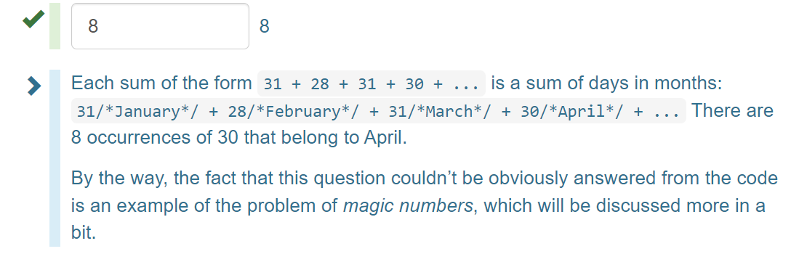
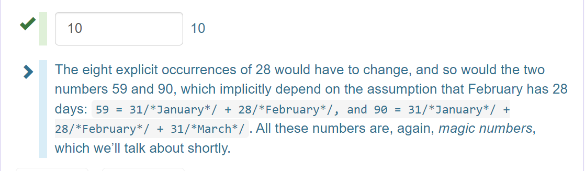
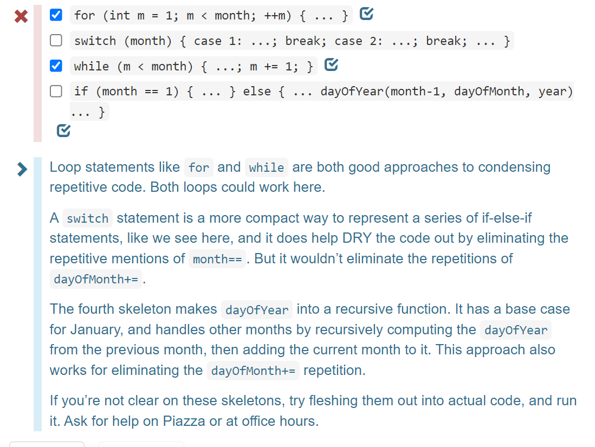
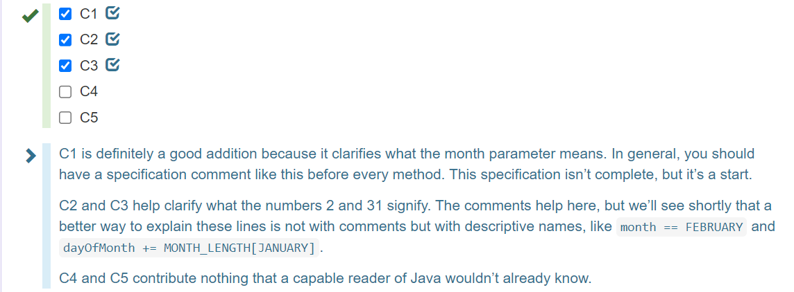
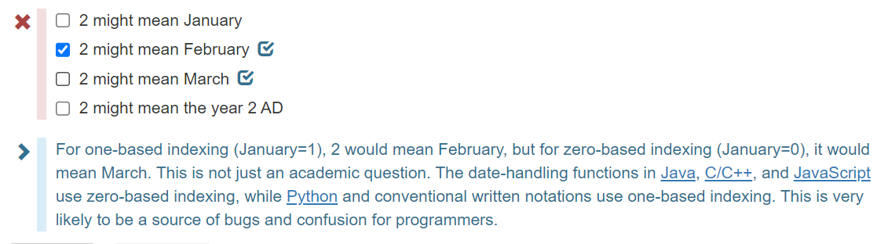
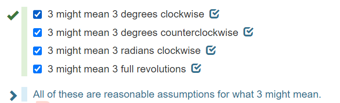
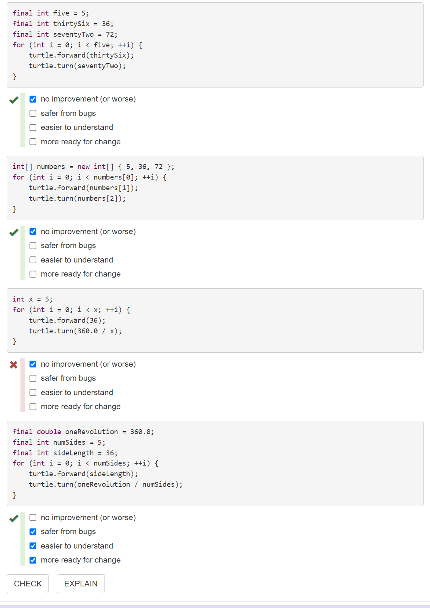
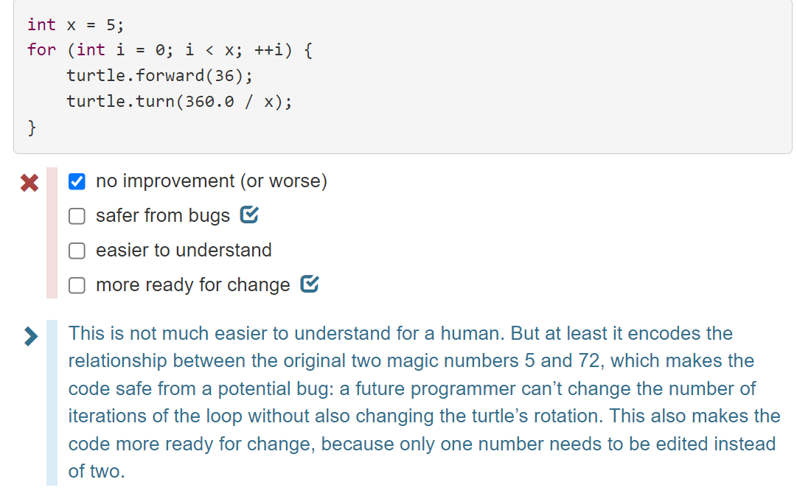
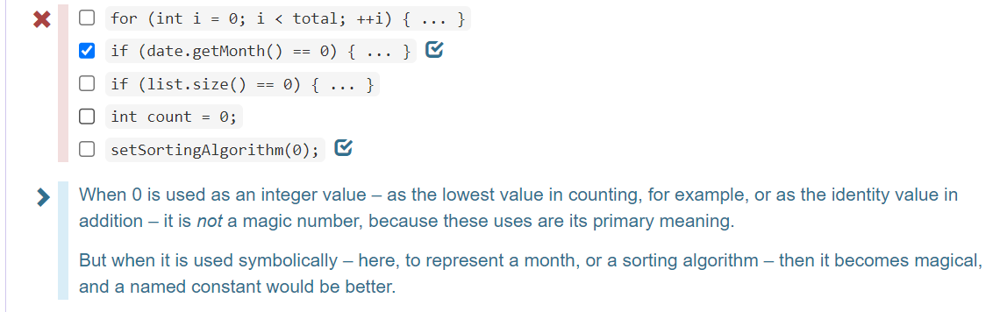

# [Reading 4: Code Review](https://web.mit.edu/6.031/www/sp21/classes/04-code-review/)

**Software in 6.031**

| Safe from bugs                                   | Easy to understand                                           | Ready for change                                  |
| :----------------------------------------------- | :----------------------------------------------------------- | :------------------------------------------------ |
| Correct today and correct in the unknown future. | Communicating clearly with future programmers, including future you. | Designed to accommodate change without rewriting. |

**Objectives**

In today’s class, we will practice:

- code review: reading and discussing code written by somebody else
- general principles of good coding: things you can look for in every code review, regardless of programming language or program purpose

---

## Code review（代码审查）

Code review is careful, systematic study of source code by people who are not the original author of the code. It’s analogous to proofreading（校对） a paper.

Code review really has two purposes:

- **Improving the code.** Finding bugs, anticipating possible bugs, checking the clarity（清晰度） of the code, and checking for consistency with the project’s style standards.
- **Improving the programmer.** Code review is an important way that programmers learn and teach each other, about new language features, changes in the design of the project or its coding standards, and new techniques. In open source projects, particularly, much conversation happens in the context of code reviews.

Code review is widely practiced in open source projects like Apache and [Mozilla](http://blog.humphd.org/vocamus-1569/?p=1569). Code review is also widely practiced in industry. In [Google’s code review process](https://google.github.io/eng-practices/review/), for example, you can’t push any code into the main repository until another engineer has signed off on it in a code review.

Why is code review widely used? There are many ideas out there for software development processes (some with buzzwords like Agile and Scrum). But code review is a practice with good evidence that it actually works. [Hillel Wayne](https://twitter.com/hillelogram/status/1120495752969641986) has collected some of the research highlights（研究亮点）, among them that code review can find 70-90% of software defects, and that overwhelming numbers of software engineers at Google and Microsoft find it valuable and worth doing.

In 6.031, we’ll do code review on problem sets, as described in the [Code Reviewing document](https://web.mit.edu/6.031/www/sp21/general/code-review.html) on the course website.

---

### Style standards

Most companies and large projects have coding style standards（编码风格标准）. These can get pretty detailed, even to the point of specifying whitespace (how deep to indent) and where curly braces and parentheses should go. These kinds of questions often lead to [holy wars](http://www.outpost9.com/reference/jargon/jargon_23.html#TAG897) since they end up being a matter of taste（品味） and style（风格）.

In 6.031, we have no official style guide. If you are new to Java and want a recommendation, [Google Java Style](http://google.github.io/styleguide/javaguide.html) is widely used and appealing for its readability, particularly rules like these:

```java
if (isOdd(n)) {
    n = 3*n + 1;
}
```

- space after keyword (`if`), but not after function name (`isOdd`)
- `{` at the end of a line, `}` on a line by itself
- `{`…`}` around all blocks, even empty or one-statement blocks

Eclipse has an autoformatter (*Source* → *Format*) whose default rules are similar to Google style.

But we won’t dictate where to put your curly braces in this class. That’s a personal decision that each programmer should make. It’s important to be self-consistent（首尾一致的）, however, and it’s *very* important to follow the conventions of the project you’re working on. If you’re the programmer who reformats every module you touch to match your personal style, your teammates will hate you, and rightly so. Be a team player.

But there are some rules that are quite sensible（合理的） and target our big three properties, in a stronger way than placing curly braces. The rest of this reading talks about some of these rules, at least the ones that are relevant at this point in the course, where we’re mostly talking about writing basic Java. These are some things you should start to look for when you’re code reviewing other students, and when you’re looking at your own code for improvement. Don’t consider it an exhaustive list of code style guidelines, however. Over the course of the semester, we’ll talk about a lot more things — specifications, abstract data types with representation invariants, concurrency and thread safety — which will then become fodder for code review.

---

### Smelly example #1

Programmers often describe bad code as having a “bad smell” that needs to be removed. "Code hygiene"（代码卫生） is another word for this. Let’s start with some smelly code.

```java
public static int dayOfYear(int month, int dayOfMonth, int year) {
    if (month == 2) {
        dayOfMonth += 31;
    } else if (month == 3) {
        dayOfMonth += 59;
    } else if (month == 4) {
        dayOfMonth += 90;
    } else if (month == 5) {
        dayOfMonth += 31 + 28 + 31 + 30;
    } else if (month == 6) {
        dayOfMonth += 31 + 28 + 31 + 30 + 31;
    } else if (month == 7) {
        dayOfMonth += 31 + 28 + 31 + 30 + 31 + 30;
    } else if (month == 8) {
        dayOfMonth += 31 + 28 + 31 + 30 + 31 + 30 + 31;
    } else if (month == 9) {
        dayOfMonth += 31 + 28 + 31 + 30 + 31 + 30 + 31 + 31;
    } else if (month == 10) {
        dayOfMonth += 31 + 28 + 31 + 30 + 31 + 30 + 31 + 31 + 30;
    } else if (month == 11) {
        dayOfMonth += 31 + 28 + 31 + 30 + 31 + 30 + 31 + 31 + 30 + 31;
    } else if (month == 12) {
        dayOfMonth += 31 + 28 + 31 + 30 + 31 + 30 + 31 + 31 + 30 + 31 + 31;
    }
    return dayOfMonth;
}
```

The next few sections and exercises will pick out the particular smells in this code example.

---

### Don’t repeat yourself (DRY)

Duplicated code is a risk to safety. If you have identical or very similar code in two places, then the fundamental risk is that there’s a bug in both copies, and some maintainer fixes the bug in one place but not the other.

Avoid duplication like you’d avoid crossing the street without looking. Copy-and-paste is an enormously tempting（诱人的） programming tool, and you should feel a frisson of danger run down your spine（危险的颤栗顺着你的脊椎流过） every time you use it. The longer the block you’re copying, the riskier it is.

[Don’t Repeat Yourself](http://en.wikipedia.org/wiki/Don't_repeat_yourself), or DRY for short, has become a programmer’s mantra（口头禅）.

The `dayOfYear` example is full of identical code. How would you DRY it out?

#### 阅读练习

##### Don't repeat yourself

some of the repetition in `dayOfYear()` is repeated valueds. How many times is the number of days in April written in `dayOfYear()`?



##### Don't repeat yourself

One reason why repeated code is bad is because a problem in the repeated code has to be fixed in many places, not just one. Suppose our calendar changed so that February really has 30 days instead of 28. How many numbers in this code have to be changed?



##### Don't repeat yourself

Another kind of repetition in the code is `dayOfMonth+=`. Assume you have an array:
`int[] monthLengths = new int[] { 31, 28, 31, 30, ..., 31 };`
Which of the following code skeletons（代码框架） could be used to DRY the code out enough so that `dayOfMonth+=` appears only once?



---

### Comments where needed

Good software developers write comments in their code, and do it judiciously（明智而审慎地）. Good comments should make the code easier to understand, safer from bugs (because important assumptions have been documented), and readier for change.

One kind of crucial comment is a specification, which appears above a method or above a class and documents the behavior of the method or class. In Java, this is conventionally written as a Javadoc comment, meaning that it starts with `/**` and includes `@`-syntax, like `@param` and `@return` for methods. Here’s an example of a spec:

```java
/**
 * Compute the hailstone sequence.
 * See http://en.wikipedia.org/wiki/Collatz_conjecture#Statement_of_the_problem
 * @param n starting number of sequence; requires n > 0.
 * @return the hailstone sequence starting at n and ending with 1.
 *         For example, hailstone(3)=[3,10,5,16,8,4,2,1].
 */
public static List<Integer> hailstoneSequence(int n) {
    ...
}
```

Specifications document assumptions. We’ve already mentioned specs a few times, and there will be much more to say about them in a future reading.

Another crucial comment is one that specifies the provenance（出处） or source of a piece of code that was copied or adapted from elsewhere. This is vitally important for practicing software developers, and is required by the [6.031 collaboration policy](https://web.mit.edu/6.031/www/sp21/general/collaboration.html) when you adapt code you found on the web. Here is an example:

```java
// read a web page into a string
// see http://stackoverflow.com/questions/4328711/read-url-to-string-in-few-lines-of-java-code
String mitHomepage = new Scanner(new URL("http://www.mit.edu").openStream(), "UTF-8").useDelimiter("\\A").next();
```

One reason for documenting sources is to avoid violations of copyright. Small snippets of code on Stack Overflow are typically in the public domain, but code copied from other sources may be proprietary（私有的） or covered by other kinds of open source licenses, which are more restrictive. Another reason for documenting sources is that the code can fall out of date; the [Stack Overflow answer](http://stackoverflow.com/questions/4328711/read-url-to-string-in-few-lines-of-java-code) from which this code came has evolved significantly in the years since it was first answered.

Some comments are bad and unnecessary. Direct transliterations of code into English, for example, do nothing to improve understanding, because you should assume that your reader at least knows Java:

```java
while (n != 1) { // test whether n is 1   (don't write comments like this!)
   ++i; // increment i
   l.add(n); // add n to l
}
```

But obscure（晦涩的） code should get a comment:

```java
int sum = n*(n+1)/2;  // Gauss's formula for the sum of 1...n

// here we're using the sin x ~= x approximation, which works for very small x
double moonDiameterInMeters = moonDistanceInMeters * apparentAngleInRadians;
```

[The `dayOfYear` code](https://web.mit.edu/6.031/www/sp21/classes/04-code-review/#dayOfYear) needs some comments — where would you put them? For example, where would you document whether `month` runs from 0 to 11 or from 1 to 12?

#### 阅读练习

##### Comments where needed

Which comments are useful additions to the code? Consider each comment independently, as if the other comments weren’t there.

```java
/**
 * @param month month of the year, where January=1 and December=12  [C1]
 */
public static int dayOfYear(int month, int dayOfMonth, int year) {
    if (month == 2) {      // we're in February  [C2]
        dayOfMonth += 31;  // add in the days of January that already passed  [C3]
    } else if (month == 3) {
        dayOfMonth += 59;  // month is 3 here  [C4]
    } else if (month == 4) {
        dayOfMonth += 90;
    }
    ...
    } else if (month == 12) {
        dayOfMonth += 31 + 28 + 31 + 30 + 31 + 30 + 31 + 31 + 30 + 31 + 31;
    }
    return dayOfMonth; // the answer  [C5]
}
```



---

### Fail fast（快速失败）

*Failing fast* means that code should reveal its bugs as early as possible. The earlier a problem is observed (the closer to its cause), the easier it is to find and fix. As we saw in the [first reading](https://web.mit.edu/6.031/www/sp21/classes/01-static-checking/#static_checking_dynamic_checking_no_checking), static checking fails faster than dynamic checking, and dynamic checking fails faster than producing a wrong answer that may corrupt subsequent computation.

The `dayOfYear` function doesn’t fail fast — if you pass it the arguments in the wrong order, it will quietly return the wrong answer. In fact, the way `dayOfYear` is designed, it’s highly likely that a non-American will pass the arguments in the wrong order! It needs more checking — either static checking or dynamic checking.

#### 阅读练习

****

##### Fail Fast

```java
public static int dayOfYear(int month, int dayOfMonth, int year) {
    if (month == 2) {
        dayOfMonth += 31;
    } else if (month == 3) {
        dayOfMonth += 59;
    } else if (month == 4) {
        dayOfMonth += 90;
    } else if (month == 5) {
        dayOfMonth += 31 + 28 + 31 + 30;
    } else if (month == 6) {
        dayOfMonth += 31 + 28 + 31 + 30 + 31;
    } else if (month == 7) {
        dayOfMonth += 31 + 28 + 31 + 30 + 31 + 30;
    } else if (month == 8) {
        dayOfMonth += 31 + 28 + 31 + 30 + 31 + 30 + 31;
    } else if (month == 9) {
        dayOfMonth += 31 + 28 + 31 + 30 + 31 + 30 + 31 + 31;
    } else if (month == 10) {
        dayOfMonth += 31 + 28 + 31 + 30 + 31 + 30 + 31 + 31 + 30;
    } else if (month == 11) {
        dayOfMonth += 31 + 28 + 31 + 30 + 31 + 30 + 31 + 31 + 30 + 31;
    } else if (month == 12) {
        dayOfMonth += 31 + 28 + 31 + 30 + 31 + 30 + 31 + 31 + 30 + 31 + 31;
    }
    return dayOfMonth;
}
```

Suppose the date is February 9, 2019. The correct `dayOfYear()` result for this date is 40, since it’s the fortieth day of the year.

People write dates in various ways, and date libraries can represent dates in various ways. A programmer’s prior experience can easily lead them to make wrong assumptions about the arguments of `dayOfYear()`.

Here are some ways that a programmer might try to call `dayOfYear()` for February 9, 2019. Which ones are buggy, and does the bug lead to a static error, dynamic error, or wrong answer?

```java
dayOfYear(2, 9, 2019)
```

---

##### Fail faster

Which of the following design changes (considered separately) would make the code fail faster if it were called with arguments in the wrong order?

```java
public static int dayOfYear(String month, int dayOfMonth, int year) {
    ...
}
```

doesn’t fail faster,fails faster – static error,fails faster – dynamic error

```java
public static int dayOfYear(int month, int dayOfMonth, int year) {
    if (month < 1 || month > 12) {
        return -1;
    }
    ...
}
```

doesn’t fail faster,fails faster – static error,fails faster – dynamic error

```java
public static int dayOfYear(int month, int dayOfMonth, int year) {
    if (month < 1 || month > 12) {
        throw new IllegalArgumentException();
    }
    ...
}
```

doesn’t fail faster,fails faster – static error,fails faster – dynamic error

```java
public enum Month { JANUARY, FEBRUARY, MARCH, ..., DECEMBER };
public static int dayOfYear(Month month, int dayOfMonth, int year) {
    ...
}
```

doesn’t fail faster,fails faster – static error,fails faster – dynamic error

```java
public static int dayOfYear(int month, int dayOfMonth, int year) {
    if (month == 1) {
        ...
    } else if (month == 2) {
        ...
    }
    ...
    } else if (month == 12) {
        ...
    } else {
        throw new IllegalArgumentException("month out of range");
    }
}
```

### Avoid magic numbers

There’s a computer science joke that the only numbers that computer scientists understand are 0, 1, and sometimes 2.

All other constants are called [magic](https://en.wikipedia.org/wiki/Magic_number_(programming)#Unnamed_numerical_constants) because they appear as if out of thin air with no explanation.（因为它们似乎是凭空出现的，没有任何解释。）

One way to explain a number is with a comment, but a far better way is to declare the number as a named constant with a good, clear name.

`dayOfYear` is full of magic numbers, which illustrate some of the reasons they should be avoided:

- **A number is less readable than a name.** In `dayOfYear`, the month values 2, …, 12 would be far more readable as `FEBRUARY`, …, `DECEMBER`.
- **Constants may need to change in the future.** Using a named constant, instead of repeating the literal number in various places, is more ready for change.
- **Constants may be dependent on other constants.** In `dayOfYear`, the mysterious numbers 59 and 90 are particularly pernicious（有害的） examples. Not only are they uncommented and undocumented, they are actually the result of a *computation done by hand* by the programmer – summing the lengths of certain months. This is less easy to understand, less ready for change, and definitely less safe from bugs. Don’t hardcode numbers that you’ve computed by hand. Use a named constant that visibly computes the relationship in terms of other named constants.

What about constants that seem constant and eternal, like π, or the total angle of a triangle, or the gravitational constant（引力常数） `G`? Is it necessary to give names to fundamental constants of mathematics and physics that don’t depend on other constants? First, the number itself may be complex to express, so repeating it multiple times is not safe from bugs. Is it easy to tell which is right: `3.14159265358979323846` or `3.1415926538979323846`? Second, even these numbers encode design decisions that might change in the future, such as the number of digits of precision, or the units of measurement. A named constant is more ready for change when those design decisions change.

If you have a profusion（大量） of magic numbers in your code, it can be a sign that you need to take a step back and treat those numbers *as data* rather than named constants, and put them into a data structure that allows for simpler code. In `dayOfYear`, the lengths of the months (30, 31, 28, etc.) would be more readable, and far more DRY, if they were instead stored in a data structure like an array, list, or map, e.g. `MONTH_LENGTH[month]`.

#### READING EXERCISES

##### Avoid magic numbers

In the code:

```java
if (month == 2) { ... }
```

what might a reasonable programmer plausibly assume about the meaning of the magic number 2?



##### What happens when you assume

Suppose you’re reading some code that uses a turtle graphics library that you don’t know well, and you see the code:

```java
turtle.rotate(3);
```

Just from reading this line (not consulting the documentation), which of the following are likely assumptions you might make about the meaning of the number 3?



##### Names instead of numbers

Consider this code, which is intended to draw a regular pentagon:

```java
for (int i = 0; i < 5; ++i) {
    turtle.forward(36);
    turtle.turn(72);
}
```

The magic numbers in this code cause it to fail all three of our measures of code quality: it’s not safe from bugs (SFB), not easy to understand (ETU) and not ready for change (RFC).

For each of the following rewrites, judge whether it improves SFB, ETU, and/or RFC, or none of the above.





---

##### Now you see it, now you don't

In which of the following lines of code is `0` a magic number?



---

### One purpose for each variable

In the `dayOfYear` example, the parameter `dayOfMonth` is reused to compute a very different value — the return value of the function, which is not the day of the month.

Don’t reuse parameters, and don’t reuse variables. Variables are not a scarce（稀有的） resource in programming. Introduce them freely, give them good names, and just stop using them when you stop needing them. You will confuse your reader if a variable that used to mean one thing suddenly starts meaning something different a few lines down.

Not only is this an ease-of-understanding question（易理解性问题）, but it’s also a safety-from-bugs and ready-for-change question.

Method parameters, in particular, should generally be left unmodified. (This is important for being ready-for-change — in the future, some other part of the method may want to know what the original parameters of the method were, so you shouldn’t blow them away while you’re computing.) It’s a good idea to use `final` for method parameters, and as many other variables as you can. The `final` keyword says that the variable should never be reassigned, and the Java compiler will check it statically. For example:

```java
public static int dayOfYear(final int month, final int dayOfMonth, final int year) {
    ...
}
```

---

### Smelly example #2

There was a **latent**（隐藏的） bug in `dayOfYear`. It didn’t handle **leap years**（闰年） at all. As part of fixing that, suppose we write a leap-year method.

```java
public static boolean leap(int y) {
    String tmp = String.valueOf(y);
    if (tmp.charAt(2) == '1' || tmp.charAt(2) == '3' || tmp.charAt(2) == 5 || tmp.charAt(2) == '7' || tmp.charAt(2) == '9') {
        if (tmp.charAt(3)=='2'||tmp.charAt(3)=='6') return true; /*R1*/
        else
            return false; /*R2*/
    }else{
        if (tmp.charAt(2) == '0' && tmp.charAt(3) == '0') {
            return false; /*R3*/
        }
        if (tmp.charAt(3)=='0'||tmp.charAt(3)=='4'||tmp.charAt(3)=='8')return true; /*R4*/
    }
    return false; /*R5*/
}
```

What are the bugs hidden in this code? And what style problems that we’ve already talked about?

#### 阅读练习

##### Mental execution 2016

What happens when you call:

```java
leap(2016)
```

1. returns true on line R1
2. returns false on line R2
3. returns false on line R3
4. returns true on line R4
5. returns false on line R5
6. error before program starts
7. error while program is running

---

##### Mental execution 2017

What happens when you call:

```
leap(2017)
```

1. returns true on line R1
2. returns false on line R2
3. returns false on line R3
4. returns true on line R4
5. returns false on line R5
6. error before program starts
7. error while program is running

---

##### Mental execution 2050

What happens when you call:

```
leap(2050)
```

1. returns true on line R1
2. returns false on line R2
3. returns false on line R3
4. returns true on line R4 !
5. returns false on line R5
6. error before program starts
7. error while program is running

> Note that `leap()` is returning the wrong answer in this case, because 2050 is *not* a leap year.
>
> The reason this happens is a subtle bug in the program: the expression `tmp.charAt(2) == 5`, which should be `tmp.charAt(2) == '5'`. Instead of testing the third character in 2050 against `'5'` and finding a match, it tests the character against the *integer* `5`. Since the character’s value is actually equivalent to the integer 53 (the Unicode value of the character `'5'`), the test fails, and the code goes on to a different part that produces the wrong answer.
>
> You might ask why Java even allows a character to be compared against an integer – why isn’t it a static type error? Indeed, it should be. If you tried to compare a `String` with an integer, Java would indeed produce a type error. But for historical reasons, coming from its legacy in the C and C++ programming languages, characters in Java are numeric types, just like `int` and `long`, and automatically convert to integers when they need to. Static typing didn’t save us here, because Java’s type system is very weak in places, like this automatic numeric type conversion.
>
> We can also attribute this failure to the code’s lack of DRYness. It contains twelve different character comparisons (`charAt(k)=='c'` for some `k` and `c`), and all that repetitive code means that each one is a potential place for a bug. Just because the code works for 2016 doesn’t give us much confidence that it will work for 2050, because there are so many different paths through this function.

---

##### Mental execution 10016

What happens when you call:

```
leap(10016)
```

1. returns true on line R1
2. returns false on line R2
3. returns false on line R3
4. returns true on line R4
5. returns false on line R5
6. error before program starts
7. error while program is running

> This code is failing because it only really works on 4-digit years. It treats 10016 like the year 1001. Notice that this code doesn’t fail fast – when given unexpected input, it simply produces the wrong answer.

---

##### Mental execution 916

What happens when you call:

```
leap(916)
```

1. returns true on line R1
2. returns false on line R2
3. returns false on line R3
4. returns true on line R4
5. returns false on line R5
6. error before program starts
7. error while program is running

> This code is making the assumption that the year has exactly 4 digits. When it has fewer than 4 digits, then `tmp.charAt(3)`, which tries to look at the fourth digit in the string will fail with a dynamic error, in the same way that indexing beyond the end of a Python string would fail with an error.

---

##### Magic numbers

How many magic numbers are in this code? Count every occurrence if some appear more than once.

24

> Every expression of the form `tmp.charAt(k) == 'n'` has two magic numbers in it, `k` and `n`. There are twelve such expressions, so that makes 24 magic numbers.
>
> Some of these numbers actually have type `char` instead of type `int`, but the type of the constant doesn’t particularly matter to the notion of a magic number. Character and string constants can be magical too, for the same reasons that numeric constants are magical: when their origin is obscure, or when their purpose in the computation is obscure, or when they have hidden dependencies on other constants.

---

##### DRYing out

Suppose you wrote the helper function:

```
public static boolean isDivisibleBy(int number, int factor) { return number % factor == 0; }
```

If `leap()` were rewritten to use `isDivisibleBy(year, ...)`, and to correctly follow the [**leap year algorithm**](http://en.wikipedia.org/wiki/Leap_year#Algorithm), how many magic numbers would be in the code?

3

> The three remaining magic numbers would be 4, 100, and 400. The rewritten method might look like:
>
> ```java
> public static boolean isLeapYear(int year) {
>     if (isDivisibleBy(year, 400)) return true;
>     else if (isDivisibleBy(year, 100)) return false;
>     else return isDivisibleBy(year, 4);
> }
> ```
>
> In a sense（从某种意义上说） these numbers truly are **irreducible**（不能削减的） magic. They are arbitrary corrections, originally based on the ratio of the solar year（太阳年） to the solar day（太阳日）, so it’s hard to give meaningful names to the values 4, 100, and 400. The three numbers are not easy to compute from first principles, either, because they were determined by a standards body, not by an algorithm. As long as these three magic numbers are localized within `isLeapYear`, and not repeated anywhere else in the program, a software engineer would probably tolerate them.

---

### Use good names

Good method and variable names are long and self-descriptive. Comments can often be avoided entirely by making the code itself more readable, with better names that describe the methods and variables.

For example, you can rewrite

```java
int tmp = 86400;  // tmp is the number of seconds in a day (don't do this!)
```

as:

```java
final int secondsPerDay = 86400;
```

In general, variable names like `tmp`, `temp`, and `data` are awful, symptoms（症状） of extreme programmer laziness. Every local variable is temporary, and every variable is data, so those names are generally meaningless（无意义的）. Better to use a longer, more descriptive name, so that your code reads clearly all by itself.

Follow the lexical（词汇的） naming conventions of the language. In both Python and Java, classes typically start with a capital letter, and variable names and method names start with a lowercase letter. But the two languages differ in how multi-word phrases（词组） are rendered into a method or variable name. Python uses snake_case (underscores separating the words of the phrase), while Java uses camelCase (capitalizing each word after the first, as in `startsWith` or `getFirstName`).

Java also uses **capitalization**（用大写） to distinguish global constants (`public static final`) from variables and local constants. `ALL_CAPS_WITH_UNDERSCORES` is used for `static final` constants. But the local variables declared inside a method, including local constants like `secondsPerDay` above, use camelCaseNames.

In any language, method names are usually **verb phrases**（动词短语）, like `getDate` or `isUpperCase`, while variable and class names are usually noun phrases（名词短语）. Choose short words, and be concise, but avoid abbreviations（缩写）. For example, `message` is clearer than `msg`, and `word` is so much better than `wd`. Keep in mind that many of your teammates in class and in the real world will not be native English speakers, and abbreviations can be even harder for non-native speakers.

Avoid single-character variable names entirely except where they are easily understood by convention. For example, `x` and `y` make sense for Cartesian coordinates, and `i` and `j` as integer variables in `for` loops. But if your code is full of variables like `e`, `f`, `g`, and `h`, because you’re just picking them from the alphabet, then it will be **incredibly**（非常地） hard to read.

[Effectively Naming Software Thingies](https://medium.com/@rabinovichsagi/effectively-naming-software-thingies-fcea9d78a699) has some excellent advice about naming. Robert Martin’s [*Clean Code*](https://lib.mit.edu/record/cat00916a/mit.001511591) (chapter 2) is also highly recommended.

The `leap` method has bad names: the method name itself, and the local variable name. What would you call them instead?

#### READING EXERCISES

##### Better method names

```java
public static boolean leap(int y) {
    String tmp = String.valueOf(y);
    if (tmp.charAt(2) == '1' || tmp.charAt(2) == '3' || tmp.charAt(2) == 5 || tmp.charAt(2) == '7' || tmp.charAt(2) == '9') {
        if (tmp.charAt(3)=='2'||tmp.charAt(3)=='6') return true;
        else
            return false;
    }else{
        if (tmp.charAt(2) == '0' && tmp.charAt(3) == '0') {
            return false;
        }
        if (tmp.charAt(3)=='0'||tmp.charAt(3)=='4'||tmp.charAt(3)=='8')return true;
    }
    return false;
}
```

Which of the following are good names for the `leap()` method?

1. leap
2. isLeapYear
3. IsLeapYear
4. is_divisible_by_4

> `IsLeapYear` might be a fine name in another programming language, but in Java convention, only classes are Capitalized.
>
> `is_divisible_by_4` not only violates the Java convention (camelCase), but is also too low-level, and in fact inaccurate, since leap year computation is more complicated than divisibility by 4.

##### Better variable names

Which of the following are good names for the `tmp` variable inside `leap()`?

1. leapYearString
2. yearString
3. temp
4. secondsPerDay
5. s

> Out of these choices, `yearString` is the best.
>
> `leapYearString` is inaccurate, because the year may not be a leap year after all. It’s premature to call it one.
>
> `temp` is just as bad as tmp.
>
> `secondsPerDay` is completely inaccurate. Copy-and-pasting code can often produce out-of-context names like this, which is another reason to avoid copy and paste.
>
> `s` is a popular name for a string variable when it really is generic, any string, with no more specific meaning than that. It’s a poor choice here because this string is related to the year variable, so it’s more specific and deserves a specific name.

##### Skip the comment

Rename this variable so that the comment can be deleted entirely:

```java
int a = 18;  // this variable stores the age when you can first vote
```

Rename `a` to:

`minimumVotingAge`, `ageCanVote`, `votingAge`, ...

> `age` would not have all the information in the comment. `storesTheAgeWhenYouCanFirstVote` is definitely wordier than it needs to be.

##### Types

Good names imply something about their type – what kinds of values they can represent. Which of these names say something to the reader about their type?

1. b
2. **bookTitle**
3. **date**
4. **getAge()**
5. previous
6. tmp
7. **widthInPixels**

> `b` and `previous` say nothing outside of context, and `tmp` is a notable offender of this guideline. The others constrain possible values even though they may not say specifically whether, say, `widthInPixels` is an `int` or `float`.
>
> Using names that suggest their types can be particularly good for the readability of dynamically-typed languages like Python and JavaScript, because they don’t have static types in variable declarations.
>
> A programming practice that takes this idea to an extreme is [Hungarian notation](https://en.wikipedia.org/wiki/Hungarian_notation). Hungarian notation encodes the type into a highly-abbreviated prefix, such as `arru8NumberList` for an array of 8-bit unsigned ints, so there is a serious cost in readability.

### Use whitespace to help the reader

Use consistent indentation. The [`leap`](https://web.mit.edu/6.031/www/sp21/classes/04-code-review/#leap) example is bad at this. The [`dayOfYear`](https://web.mit.edu/6.031/www/sp21/classes/04-code-review/#dayOfYear) example is much better. In fact, `dayOfYear` nicely lines up all the numbers into columns, making them easy for a human reader to compare and check. That’s a great use of whitespace.

Put spaces within code lines to make them easy to read. The leap example has some lines that are packed together — put in some spaces.

Never use tab characters for indentation, only space characters. Note that we say *characters*, not keys. We’re not saying you should never press the Tab key, only that your editor should never put a tab character into your source file in response to your pressing the Tab key. The reason for this rule is that different tools treat tab characters differently — sometimes expanding them to 4 spaces, sometimes to 2 spaces, sometimes to 8. If you run “git diff” on the command line, or if you view your source code in a different editor, then the indentation may be completely screwed up. Just use spaces. Always set your programming editor to insert space characters when you press the Tab key. The 6.031 Eclipse installation has already been set up this way.

### Smelly example #3

Here’s a third example of smelly code that will illustrate the remaining points of this reading.

```java
public static int LONG_WORD_LENGTH = 5;
public static String longestWord;

public static void countLongWords(String text) {
    String[] words = text.split(' ');
    if (words.length == 0) {
        System.out.println("0");
        return;
    }
    int n = 0;
    longestWord = "";
    for (String word: words) {
        if (word.length() > LONG_WORD_LENGTH) ++n;
        if (word.length() > longestWord.length()) longestWord = word;
    }
    System.out.println(n);
}
```

### Don’t use global variables

Avoid global variables. Let’s break down what we mean by *global variable*. A global variable is:

- a *variable*, a name whose value can be changed
- that is *global*, accessible and changeable from anywhere in the program.

[Global Variables Are Bad](http://c2.com/cgi/wiki?GlobalVariablesAreBad) has a good list of the dangers of global variables.

In Java, a global variable is declared `public static`. The `public` modifier makes it accessible anywhere, and `static` means there is a single instance of the variable.

However, with one additional modifier, `public static final`, and if furthermore the variable’s type is immutable, then the name becomes a global *constant*. A global constant can be read anywhere in the program but never reassigned or mutated, so the risks go away. Global constants are common and useful.

In general, convert global variables into parameters and return values, or put them inside objects that you’re calling methods on. We’ll see many techniques for doing that in future readings.

---

#### READING EXERCISES

---

### Kinds of variables in snapshot diagrams

When we’re drawing snapshot diagrams, it’s important to distinguish between different kinds of variables:

- a *local variable* inside a method
- an instance variable inside an instance of an object
  - an instance variable may also be called a *field* (particularly in Java), a *property* (TypeScript/JavaScript), a *member variable* (C++), or an *attribute* (Python).
- a *static variable* associated with a class

A local variable comes into existence when a method is called, and then disappears when the method returns. If multiple calls to the same method are in progress (for example because of recursion), then each call will have its own independent local variables.

An instance variable comes into existence when an object is created with `new`, and then disappears when the object is no longer accessible and becomes garbage-collected. Each object instance has its own instance variables.

A static variable comes into existence when the program starts (or more precisely when the class containing the variable is first loaded, since that might be delayed), and exists for the rest of the life of the program.

Here is a simple piece of code that uses all three kinds of variables:

```java
class Payment {
    public double value;
    public static double taxRate = 0.05;
    public static void main(String[] args) {
        Payment p = new Payment();
        p.value = 100;
        taxRate = 0.05;
        System.out.println(p.value * (1 + taxRate));
    }
}
```

In the next two exercises, you will construct a snapshot diagram that shows the state of this program.

---

#### READING EXERCISES

---

### Methods should return results, not print them

`countLongWords` isn’t ready for change. It sends some of its result to the console, `System.out`. That means that if you want to use it in another context — where the number is needed for some other purpose, like computation rather than human eyes — it would have to be rewritten.

In general, only the highest-level parts of a program should interact with the human user or the console. Lower-level parts should take their input as parameters and return their output as results. The sole exception here is debugging output, which can of course be printed to the console. But that kind of output shouldn’t be a part of your design, only a part of how you debug your design.

---

#### READING EXERCISES

##### Returning results

If you were going to change `countLongWords` to return the result that it currently prints to the console, which of the following method signatures would be *capable* of returning that value? Which would be the *best* choice among the given options?

Capable of returning the result:

```
public static void countLongWords(String text)
public static int countLongWords(String text)
public static double countLongWords(String text)
public static String countLongWords(String text)
public static List<Integer> countLongWords(String text)
```

Best choice for returning the result:

```
public static void countLongWords(String text)
public static int countLongWords(String text)
public static double countLongWords(String text)
public static String countLongWords(String text)
public static List<Integer> countLongWords(String text)
```

> The result printed to the console is a nonnegative integer (`n`), which could be returned as `int`, as `double`, as `String`, or as a 1-element integer list.
>
> The best choice would be `int`, because it most closely matches the set of values that the method can return. The other types allow for too many illegal possible return values, which is less safe from bugs.

---

##### Returning two results

The `countLongWords` method actually has two results – the `n` currently printed to the console, and `longestWord` currently stored in a global variable. Which of the following method signatures would be capable of returning both results, without printing to the console or using a global variable? Which would be the best choice among the given options?

Capable of returning both results:

```
public static void countLongWords(String text)
public static int countLongWords(String text)
public static String countLongWords(String text)
public static List<String> countLongWords(String text)
public static Pair<Integer,String> countLongWords(String text)
```

Best choice for returning both results:

```
public static void countLongWords(String text)
public static int countLongWords(String text)
public static String countLongWords(String text)
public static List<String> countLongWords(String text)
public static Pair<Integer,String> countLongWords(String text)
```

> A `String` return value could conceivably be used for this, e.g. by returning `n + "," + longestWord`. But this is a bad choice, because it doesn’t benefit from static checking. A caller of the method could accidentally use the return value as if it were just `longestWord` (without first splitting off and removing the `n` value), and the Java compiler wouldn’t tell the caller they were doing something wrong.
>
> A two-element `List<String>` is slightly better, with one element as `n` (converted to a `String`) and the other as `longestWord`. But this still has weak static checking, because a caller could confuse which order they are in, with no error from the Java compiler.
>
> The `Pair<Integer,String>` idea would be the best choice for static checking. The two parts of the return value are clearly separated and clearly typed, one as an integer and the other as a string. Java unfortunately does not have a built-in `Pair` type, but [some third-party libraries](https://commons.apache.org/proper/commons-lang/apidocs/org/apache/commons/lang3/tuple/Pair.html) do, and it’s also very easy to write one when you need it.

---

### Avoid special-case code

Programmers are often tempted to write special code to deal with what seem like special cases – parameters that are 0, for example, or empty lists, or empty strings. The `countLongWords` example falls into this trap by handling an empty `words` list specially:

```java
    if (words.size() == 0) {
        System.out.println(0);
        return;
    }
    int n = 0;
    longestWord = "";
    for (String word: words) {
        if (word.length() > LONG_WORD_LENGTH) ++n;
        if (word.length() > longestWord.length()) longestWord = word;
    }
    System.out.println(n);
}
```

The starting `if` statement is unnecessary. If it were omitted, and the `words` list is empty, then the `for` loop simply does nothing, and `0` is printed anyway. In fact, handling this special case separately has led to a possible bug – a difference in the way an empty list is handled, compared to a nonempty list that happens to have no long words on it.

**Actively resist the temptation（诱惑） to handle special cases separately.** If you find yourself writing an `if` statement for a special case, stop what you’re doing, and instead think harder about the general-case code, either to confirm that it can actually already handle the special case you’re worrying about (which is often true!), or put in a little more effort to make it handle the special case. If you haven’t even written the general-case code yet, but are just trying to deal with the easy cases first, then you’re doing it in the wrong order. Tackle（解决） the general case first.

Writing broader, general-case code pays off（获得回报）. It results in a shorter method, which is easier to understand and has fewer places for bugs to hide. It is likely to be safer from bugs, because it makes fewer assumptions about the values it is working with. And it is more ready for change, because there are fewer places to update when a change to the method’s behavior is made.

Some programmers justify handling special cases separately with a belief that it increases the overall performance of the method, by returning a hard coded answer for a special case right away. For example, when writing a sort algorithm, it can be tempting to check whether the size of the list is 0 or 1 at the very start of the method, since you can then return immediately with no need to sort at all. Or if the size is 2, just do a comparison and a possible swap. These optimizations might indeed make sense — but not until you have evidence that they actually would matter to the speed of the program! If the sort method is almost never called with these special cases, then adding code for them just adds complexity, overhead, and hiding-places for bugs, without any practical improvement in performance. Write a clean, simple, general-case algorithm first, and optimize it later, *only* if it would actually help.

---

#### READING EXERCISES

##### Bug hiding in a special case

Smelly Example #3 (reproduced below) starts with an `if` statement that handles a special case, prints `0`, and returns immediately. But this makes the behavior of the special case inconsistent with other cases where the code would print `0`, for example when the list is nonempty but has no long words on it. Which line of code from the general-case code did the special case also need to do?

```java
         if (words.size() == 0) {
             System.out.println(0);
             return;
         }
/*A*/    int n = 0;
/*B*/    longestWord = "";
/*C*/    for (String word: words) {
/*D*/        if (word.length() > LONG_WORD_LENGTH) ++n;
/*E*/        if (word.length() > longestWord.length()) longestWord = word;
         }
/*F*/    System.out.println(n);
}
```


A

B !

C

D

E

F

> The special case code failed to clear the global variable `longestWord`, which *does* get cleared in other cases where the result is `0`. This odd variation in behavior is likely to lead to unexpected bugs in code depending on this method.
>
> Note that the best way to fix this is *not* to copy `longestWord = ""` into the special-case `if` statement. Instead the special case should be deleted entirely.

---

## Summary

Code review is a widely-used technique for improving software quality by human inspection. Code review can detect many kinds of problems in code, but as a starter, this reading talked about these general principles of good code:

- Don’t Repeat Yourself (DRY)
- Comments where needed
- Fail fast
- Avoid magic numbers
- One purpose for each variable
- Use good names
- Use whitespace to help the reader
- Don’t use global variables
- Methods should return results, not print them
- Avoid special-case code

The topics of today’s reading connect to our three key properties of good software as follows:

- **Safe from bugs.** In general, code review uses human reviewers to find bugs. DRY code lets you fix a bug in only one place, without fear that it has propagated elsewhere. Documenting your assumptions with clear comments makes it less likely that another programmer will introduce a bug. The Fail Fast principle detects bugs as early as possible. Avoiding global variables makes it easier to localize bugs related to variable values, since non-global variables can be changed in only limited places in the code.
- **Easy to understand.** Code review is really the only way to find obscure or confusing code, because other people are reading it and trying to understand it. Using judicious comments, avoiding magic numbers, keeping one purpose for each variable, using good names, and using whitespace well can all improve the understandability of code.
- **Ready for change.** Code review helps here when it’s done by experienced software developers who can anticipate what might change and suggest ways to guard against it. DRY code is more ready for change, because a change only needs to be made in one place. Returning results instead of printing them makes it easier to adapt the code to a new purpose.

Code review is not the only software development practice with strong supporting evidence. Another is: [sleep](https://increment.com/teams/the-epistemology-of-software-quality/).

