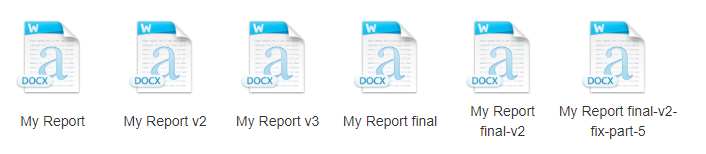
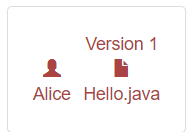
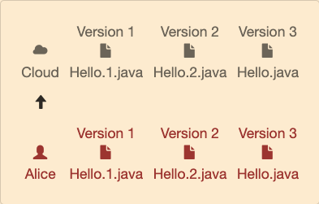
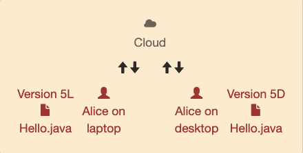
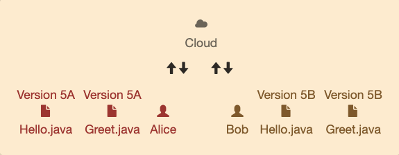
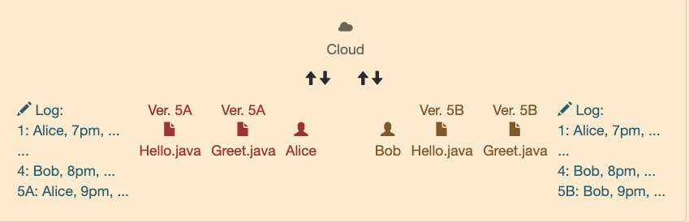
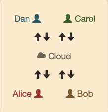

# [Reading 5: Version Control](https://web.mit.edu/6.031/www/sp21/classes/05-version-control/)

**Software in 6.031**

| Safe from bugs                                   | Easy to understand                                           | Ready for change                                  |
| :----------------------------------------------- | :----------------------------------------------------------- | :------------------------------------------------ |
| Correct today and correct in the unknown future. | Communicating clearly with future programmers, including future you. | Designed to accommodate change without rewriting. |

**Objectives**

- Know what version control is and why we use it
- Understand how Git stores version history as a graph
- Practice reading, creating, and using version history

---

## Introduction

[Version control systems](http://en.wikipedia.org/wiki/Revision_control) are essential tools of the software engineering world. More or less every project — serious or hobby, open source or proprietary — uses version control. Without version control, coordinating a team of programmers all editing the same project’s code will reach pull-out-your-hair levels of aggravation.

---

### Version control systems you’ve already used

- Dropbox
- [Undo/redo buffer](http://en.wikipedia.org/wiki/Undo)
- Keeping multiple copies of files with version numbers



---

## Inventing version control

Suppose [Alice](http://en.wikipedia.org/wiki/Alice_and_Bob) is working on a problem set by herself.

She starts with（从...开始） one file `Hello.java` in her pset, which she works on for several days.



At the last minute before she needs to hand in her pset to be graded, she realizes she has made a change that breaks everything. 

If only（如果...就好了） she could go back in time and retrieve（找回） a past version!

A simple discipline of saving backup files would get the job done.

Alice uses her judgment to decide when she has reached some milestone that justifies saving the code. She saves the versions of `Hello.java` as `Hello.1.java`, `Hello.2.java`, and `Hello.java`. She follows the convention that the most recent version is just `Hello.java` to avoid confusing Eclipse. We will call the most recent version the **head**.


Now when Alice realizes that version 3 is fatally（不幸地） flawed, she can just copy version 2 back into the location for her current code. Disaster averted（避免）! But what if version 3 included some changes that were good and some that were bad? Alice can compare the files manually to find the changes, and sort them into good and bad changes. Then she can copy the good changes into version 2.

This is a lot of work, and it’s easy for the human eye to miss changes. 

Luckily, there are standard software tools for comparing text; 

in the UNIX world, one such tool is [`diff`](http://en.wikipedia.org/wiki/Diff). 

A better version control system will make diffs easy to generate.

Alice also wants to be prepared in case her laptop gets run over by a bus, so she saves a backup of her work in the cloud, uploading the contents of her working directory whenever she’s satisfied with its contents.

If her laptop ever gets flattened（被摧毁）, Alice can retrieve the backup and resume work on the pset on a fresh machine, retaining（保留） the ability to time-travel back to old versions **at will**（任意）.



Furthermore, she can develop her pset on multiple machines, using the cloud provider as a common interchange point. 

Alice makes some changes on her laptop and uploads them to the cloud. 

Then she downloads onto her desktop machine at home, does some more work, and uploads the improved code (complete with old file versions) back to the cloud.

If Alice isn’t careful, though, she can run into trouble with this approach. 

Imagine that she starts editing `Hello.java` to create “version 5” on her laptop. 

Then she gets distracted and forgets about her changes. 

Later, she starts working on a new “version 5” on her desktop machine, including *different* improvements. 

We’ll call these versions “5L” and “5D,” for “laptop” and “desktop.”



When it comes time to upload changes to the cloud, there is an opportunity for a mishap（灾祸）! 

Alice might copy all her local files into the cloud, causing it to contain version 5D only. 

Later Alice syncs from the cloud to her laptop, potentially overwriting version 5L, losing the worthwhile changes. 

What Alice really wants here is a *merge*, to create a new version based on the two version 5’s.

At this point, considering just the scenario of one programmer working alone, we already have a list of operations that should be supported by a version control scheme:

- **reverting** to a past version
- **comparing** two different versions
- *pushing* full version history to another location
- *pulling* history back from that location
- **merging** versions that are offshoots（分支） of the same earlier version

---

### Multiple developers

Now let’s add into the picture Bob, another developer. The picture isn’t too different from what we were just thinking about.



Alice and Bob here are like the two Alices working on different computers. 

They no longer share a brain, which makes it even more important to follow a strict discipline in pushing to and pulling from the shared cloud server. 

The two programmers must coordinate on a scheme for coming up with version numbers. 

Ideally, the scheme allows us to assign clear names to **whole sets of files**, not just individual files. (Files depend on other files, so thinking about them in isolation allows inconsistencies.)

Merely uploading new source files is not a very good way to communicate to others the high-level idea of a set of changes. 

So let’s add a log that records for each version **who** wrote it, **when** it was finalized, and **what** the changes were, in the form of a short **human-authored**（人类创作的） message.



Pushing another version now gets a bit more complicated, as we need to merge the logs. 

This is easier to do than for Java files, since logs have a simpler structure – but without tool support, Alice and Bob will need to do it manually! 

We also want to enforce consistency between the logs and the actual sets of available files: for each log entry, it should be easy to extract the complete set of files that were current at the time the entry was made.

But with logs, all sorts of useful operations are enabled. 

We can look at the log for just a particular file: a view of the log restricted to those changes that involved modifying some file. 

We can also use the log to figure out which change contributed each line of code, or, even better, which person contributed each line, so we know who to complain to when the code doesn’t work. 

This sort of operation would be tedious（冗长的） to do manually; 

the automated operation in version control systems is called **annotate** (or, unfortunately, **blame**).

---

### Multiple branches

It sometimes makes sense for a subset of the developers to go off and work on a *branch*, a parallel code universe for, say, experimenting with a new feature. 

The other developers don’t want to pull in the new feature until it is done, even if several coordinated versions are created in the meantime. 

Even a single developer can find it useful to create a branch, for the same reasons that Alice was originally using the cloud server despite working alone.

In general, it will be useful to have many shared places for exchanging project state. 

There may be multiple branch locations at once, each shared by several programmers. 

With the right set-up, any programmer can pull from or push to any location, creating serious flexibility in cooperation patterns.

---

### The shocking conclusion

Of course, it turns out we haven’t invented anything here: [Git](http://git-scm.com/) does all these things for you, and so do many other version control systems.

---

### Distributed vs. centralized

Traditional *centralized* version control systems like [CVS](https://www.nongnu.org/cvs/) and [Subversion](http://subversion.apache.org/) do a subset of the things we’ve imagined above. 

They support a collaboration graph – who’s sharing what changes with whom – with one primary server, and copies that only communicate with the primary server.

In a centralized system, everyone must share their work to and from the primary repository. 

Changes are safely stored **in version control** if they are *in the primary repository*, because that’s the only repository.



In contrast, **distributed** version control systems like [Git](http://git-scm.com/) and [Mercurial](https://www.mercurial-scm.org/) allow all sorts of different collaboration graphs, where teams and subsets of teams can experiment easily with alternate versions of code and history, merging versions together as they are determined to be good ideas.

In a distributed system, all repositories are created equal, and it’s up to users to assign them different roles. 

Different users might share their work to and from different repos, and the team must decide what it means for a change to be *in version control*. 

Does a change in one programmer’s repo need to be shared with a **designated**（指定的） collaborator（合作者） or server before the rest of the team considers it official?


### 阅读练习

#### More equal

In 6.031, which of these problem set repos has a special role?

- [ ] The repository in `6031-sp21` on github.mit.edu
- [ ] The repository on Didit
- [ ] The repository on your laptop
- [ ] The repository on your desktop

> The repository on github.mit.edu has a special role: work you push there can be graded.
> The Didit system makes a temporary clone of your github.mit.edu repo in order to build and test your code, then it throws the temporary clone away.
> The repositories (we’ll usually call them clones to emphasize how they were created) on your laptop or desktop are great, but you must remember to push your commits to github.mit.edu.

---

### Version control terminology

- **Repository**: a local or remote store of the versions in our project
- **Working copy**: a local, editable copy of our project that we can work on
- **File**: a single file in our project
- **Version** or **revision**: a record of the contents of our project at a point in time
- **Change** or **diff**: the difference between two versions
- **Head**: the current version

---

### Features of a version control system

- **Reliable**: keep versions around for as long as we need them; allow backups
- **Multiple files**: track versions of a project, not single files
- **Meaningful versions**: what were the changes, why were they made?
- **Revert**: restore old versions, in whole or in part
- **Compare versions**: to see what changed
- **Review history**: for the whole project or individual files
- **Not just for code**: prose, images, …

It should **allow multiple people to work together**:

- **Merge**: combine versions that diverged from a common previous version
- **Track responsibility**: who made that change, who touched that line of code?
- **Work in parallel**: allow one programmer to work on their own for a while (without giving up version control)
- **Work in progress**: allow multiple programmers to share unfinished work (without disrupting others, without giving up version control)

---

## Git


The version control system we’ll use in 6.031 is [Git](http://git-scm.com/). It’s powerful and worth learning. But Git’s user interface can be terribly frustrating. What is Git’s user interface?

- **In 6.031, we will use Git on the command line.** The command line is a fact of life, ubiquitous because it is so powerful.
- The command line can make it very difficult to see what is going on in your repositories. You may find [SourceTree](http://www.sourcetreeapp.com/) (shown on the right) for Mac & Windows useful. On any platform, [gitk](http://git-scm.com/docs/gitk) can give you a basic Git GUI. Ask Google for other suggestions.

An important note about tools for Git:

- Eclipse has built-in support for Git. If you follow the [problem set instructions](https://web.mit.edu/6.031/www/sp21/psets/ps0/), Eclipse will know your project is in Git and will show you helpful icons. However, we do **not** recommend using the Eclipse Git UI to make changes, commit, etc., and course staff may not be able to help you with problems.
- [GitHub](http://github.com/) makes desktop apps for Mac and Windows. Because the GitHub app changes how some Git operations work, if you use the GitHub app, course staff will not be able to help you.

### Getting started with Git

On the [Git](http://git-scm.com/) website, you can find two particularly useful resources:

- [*Pro Git*](http://git-scm.com/book) documents everything you might need to know about Git.
- The [Git command reference](http://git-scm.com/docs) can help with the syntax of Git commands.

You’ve already completed **[PS0](https://web.mit.edu/6.031/www/sp21/psets/ps0/#clone)** and the **[Getting Started intro to Git](https://web.mit.edu/6.031/www/sp21/getting-started/#git)**.

### The Git object graph

Read: [*Pro Git* 1.3: What is Git?](https://git-scm.com/book/en/v2/Getting-Started-What-is-Git%3F)

That reading introduces the three pieces of a Git repo: `.git` directory, working directory, and staging area.

All of the operations we do with Git — clone, add, commit, push, log, merge, … — are operations on a graph data structure that stores all of the versions of files in our project, and all the log entries describing those changes. The **Git object graph** is stored in the `.git` directory of your local repository. Another copy of the graph, e.g. for PS0, is on github.mit.edu, stored in an IS&T data center somewhere and served up under [`6031-sp21`](https://github.mit.edu/6031-sp21/) in `ps0-«your username»`.

## Copy an object graph with `git clone`

How do you get the object graph from github.mit.edu (or any other remote storage) to your local machine in order to start working on the problem set? **`git clone`** copies the graph.

Suppose your username is `bitdiddle`:

```
git clone ssh://github.mit.edu/.../ps0-bitdiddle.git ps0
```

Hover or tap on each step to update the diagram below:

1. Create an empty local directory `ps0`, and `ps0/.git`.
2. Connect to github.mit.edu and copy the object graph from `ps0-bitdiddle.git` into `ps0/.git`.
3. **Check out** the current version of the **`main` branch**.

Diagram for highlighted step:


We still haven’t explained what’s in the object graph. But before we do that, let’s understand step 3 of `git clone`: check out the current version of the `main` branch.

The object graph is stored on disk in a convenient and efficient structure for performing Git operations, but not in a format we can easily use. In [Alice’s invented version control scheme](https://web.mit.edu/6.031/www/sp21/classes/05-version-control/#inventing_version_control), the current version of `Hello.java` was just called `Hello.java` because she needed to be able to edit it normally. In Git, we obtain normal copies of our files by *checking them out* from the object graph. These are the files we see and edit in Eclipse.

We also decided above that it might be useful to support [multiple *branches* in the version history](https://web.mit.edu/6.031/www/sp21/classes/05-version-control/#multiple_branches). Multiple branches are essential for large teams working on long-term projects. To keep things simple in 6.031, we will not use branches and we don’t recommend that you create any. Every 6.031 Git repo comes with a default branch called `main`, and all of our work will be on the `main` branch. (The default branch used to be called `master` by convention. If you see that in online Git tutorials or Stack Overflow answers, just replace it with `main` instead.)

So step 2 of `git clone` gets us an object graph, and step 3 gets us a **working directory** full of files we can edit, starting from the current version of the project.

Let’s finally dive into that object graph!

Clone an example repo: **`https://github.com/6031/ex05-hello-git`**

Using commands from [Getting Started](https://web.mit.edu/6.031/www/sp21/getting-started/#git) or [*Pro Git* 2.3: Viewing the Commit History](http://git-scm.com/book/en/v2/Git-Basics-Viewing-the-Commit-History), or by using a tool like [SourceTree](http://www.sourcetreeapp.com/), explain the history of this little project to yourself.

Here’s the output of [`git lol`](https://web.mit.edu/6.031/www/sp21/getting-started/#git-lol) for this example repository:

```
* b0b54b3 (HEAD, origin/main, origin/HEAD, main) Greeting in Java
*   3e62e60 Merge
|\  
| * 6400936 Greeting in Scheme
* | 82e049e Greeting in Ruby
|/  
* 1255f4e Change the greeting
* 41c4b8f Initial commit
```

The history of a Git project is a [**directed acyclic graph**](http://en.wikipedia.org/wiki/Directed_acyclic_graph) (DAG). The history graph is the backbone of the full object graph stored in `.git`, so let’s focus on it for a minute.


Each node in the history graph is a **commit** a.k.a. **version** a.k.a. **revision** of the project: a complete snapshot of all the files in the project at that point in time. You may recall from our [earlier reading](https://web.mit.edu/6.031/www/sp21/getting-started/#getting_the_history_of_the_repository) that each commit is identified by a unique ID, displayed as a hexadecimal number.

Except for the initial commit, each commit has a pointer to a **parent** commit. For example, commit `1255f4e` has parent `41c4b8f`: this means `41c4b8f` happened first, then `1255f4e`.

Some commits have the same parent. They are versions that diverged from a common previous version, for example because two developers were working independently.

And a commit can have two parents. This is a version that ties divergent histories back together, for example because those developers then merged their work together again.

A branch — remember `main` will be our only branch for now — is just a name that points to a commit.

Finally, HEAD points to our current commit — almost. We also need to remember which branch we’re working on. So HEAD points to the current branch, which points to the current commit.

Using commands from [Getting Started](https://web.mit.edu/6.031/www/sp21/getting-started/#git) and [*Pro Git*](http://git-scm.com/book/en/v2/Git-Basics-Viewing-the-Commit-History) or a tool like SourceTree, check your understanding of the example repo…

#### READING EXERCISES

HEAD count

First impression

Graph-ical

Around and around

## What else is in the object graph?

The history graph is the backbone of the full object graph. What else is in there?


Each commit is a snapshot of our entire project, which Git represents with a **tree** node. For a project of any reasonable size, most of the files *won’t* change in any given revision. Storing redundant copies of the files would be wasteful, so Git doesn’t do that.

Instead, the Git object graph stores each version of an individual file *once*, and allows multiple commits to *share* that one copy. To the left is a more complete rendering of the Git object graph for our example.

Keep this picture in the back of your mind, because it’s a wonderful example of the sharing enabled by *immutable data types*, which we’re going to discuss a few classes from now.

Each commit also has log data — who, when, short log message, etc. — not shown in the diagram.

## Add to the object graph with `git commit`

How do we add new commits to the history graph? **`git commit`** creates a new commit.

In some alternate universe, `git commit` might create a new commit based on the current contents of your working directory. So if you edited `Hello.java` and then did `git commit`, the snapshot would include your changes.

We’re not in that universe; in our universe, Git uses that third and final piece of the repository: the **staging area** (a.k.a. the **index**, which is only a useful name to know because sometimes it shows up in documentation).

The staging area is like a proto-commit, a commit-in-progress. Here’s how we use the staging area and **`git add`** to build up a new snapshot, which we then cast in stone using **`git commit`**:

Modify `hello.txt`, `git add hello.txt`, `git commit`

Hover or tap on each step to update the diagram, and to see the output of `git status` at each step:

1. If we haven’t made any changes yet, then the working directory, staging area, and HEAD commit are all identical.
2. Make a change to a file. For example, let’s edit `hello.txt`.
   Other changes might be creating a new file, or deleting a file.
3. **Stage** those changes using `git add`.
4. Create a new commit out of all the staged changes using `git commit`.


```
$ git status
On branch main
Your branch is up-to-date with 'origin/main'.

nothing to commit, working directory clean
```

Use **`git status`** frequently to keep track of whether you have no changes, unstaged changes, or staged changes; and whether you have new commits in your local repository that haven’t been pushed.

#### READING EXERCISES

Classy

Take the stage

Upstaged

Downplayed

Please report your status

Status green

Clear the board

### Sequences, trees, and graphs

When you’re working independently, on a single machine, the DAG of your version history will usually look like a sequence: commit 1 is the parent of commit 2 is the parent of commit 3…

There are three programmers involved in the history of our example repository. Two of them – Alyssa and Ben – made changes “at the same time.” In this case, “at the same time” doesn’t mean precisely contemporaneous. Instead, it means they made two different *new* versions based on the same *previous* version, just as [Alice made version 5L and 5D on her laptop and desktop](https://web.mit.edu/6.031/www/sp21/classes/05-version-control/#version_5L_5D).

When multiple commits share the same parent commit, our history DAG changes from a sequence to a tree: it branches apart. Notice that a branch in the history of the project doesn’t require anyone to create a new Git branch, merely that we start from the same commit and work in parallel on different copies of the repository:

```
⋮
*   commit 82e049e248c63289b8a935ce71b130a74dc04152
|   Author: Ben Bitdiddle <ben.bitdiddle@example.com>
|   Greeting in Ruby
|     
| * commit 64009369c5ab93492931ad07962ee81bda921ded
|/  Author: Alyssa P. Hacker <alyssa.p.hacker@example.com>
|   Greeting in Scheme
|  
* commit 1255f4e4a5836501c022deb337fda3f8800b02e4
| Author: Max Goldman <maxg@mit.edu>
| Change the greeting
⋮
```

Finally, the history DAG changes from tree- to graph-shaped when the branching changes are merged together:

```
⋮
*   commit 3e62e60a7b4a0c262cd8eb4308ac3e5a1e94d839
|\  Author: Max Goldman <maxg@mit.edu>
| | Merge
| |   
* | commit 82e049e248c63289b8a935ce71b130a74dc04152
| | Author: Ben Bitdiddle <ben.bitdiddle@example.com>
| | Greeting in Ruby
| |   
| * commit 64009369c5ab93492931ad07962ee81bda921ded
|/  Author: Alyssa P. Hacker <alyssa.p.hacker@example.com>
|   Greeting in Scheme
|  
* commit 1255f4e4a5836501c022deb337fda3f8800b02e4
| Author: Max Goldman <maxg@mit.edu>
| Change the greeting
⋮
```

How is it that changes are merged together? First we’ll need to understand how history is shared between different users and repositories.

## Send & receive object graphs with `git push` & `git pull`

We can send new commits to a remote repository using **`git push`**:

```
git push origin main
```

Hover or tap on each step to update the diagram:

1. When we clone a repository, we obtain a copy of the history graph.
   Git remembers where we cloned from as a **remote repository** called **`origin`**.
2. Using `git commit`, we add new commits to the local history on the `main` branch.
3. To send those changes back to the `origin` remote, use `git push origin main`.


And we receive new commits using **`git pull`**. In addition to fetching new parts of the object graph, `git pull` also updates the working copy by checking out the latest version (just like `git clone` checked out a working copy to start with). If the remote repository and the local repository have both changed, `git pull` will try to merge those changes together.

## Merging

Let’s examine what happens when changes occur in parallel:

Create and commit `hello.scm` and `hello.rb` in parallel

Hover or tap on each step to update the diagram:

1. Both Alyssa and Ben **clone** the repository with two commits (`41c4b8f` and `1255f4e`).
2. Alyssa creates `hello.scm` and **commits** her change as `6400936`.
3. At the same time, Ben creates `hello.rb` and **commits** his change as `82e049e`.
   At this point, both of their changes only exist in their local repositories. In each repo, `main` now points to a different commit.
4. Let’s suppose Alyssa is the first to **push** her change up to the remote.
5. What happens if Ben tries to push now? The push will be rejected: if the server updates `main` to point to Ben’s commit, Alyssa’s commit will disappear from the project history!
6. Ben must **merge** his changes with Alyssa’s.
   To perform the merge, he **pulls** her commit from the remote, which does two things:
   (a) Downloads new commits into Ben’s repository’s object graph
7. (b) Merges Ben’s history with Alyssa’s, creating a new commit (`3e62e60`) that joins together the two histories. This commit is a snapshot like any other: a snapshot of the repository with both of their changes applied.
8. Now Ben can `git push`, because no history will go missing when he does.
9. And Alyssa can `git pull` to obtain Ben’s work.


In this example, Git was able to merge Alyssa’s and Ben’s changes automatically, because they each modified different files. If both of them had edited the *same parts of the same files*, Git would report a **merge conflict**. Ben would have to manually weave their changes together before committing the merge. All of this is discussed in the [Getting Started section on merges, merging, and merge conflicts](https://web.mit.edu/6.031/www/sp21/getting-started/#merges).

#### READING EXERCISES

Merge

Dangerous Merge Ahead

Continue Merging

## Why do commits look like diffs?

We’ve defined a commit as a snapshot of our entire project, but if you ask Git, it doesn’t seem to see things that way:

```
$ git show 1255f4e
commit 1255f4e4a5836501c022deb337fda3f8800b02e4
Author: Max Goldman <maxg@mit.edu>
Date:   Mon Sep 14 14:58:40 2015 -0400

    Change the greeting

diff --git a/hello.txt b/hello.txt
index c1106ab..3462165 100644
--- a/hello.txt
+++ b/hello.txt
@@ -1 +1 @@
-Hello, version control!
+Hello again, version control!
```

Git is assuming that most of our project does not change in any given commit, so showing only the differences will be more useful. Almost all the time, that’s true.

But we can ask Git to show us what was in the repo at a particular commit:

```
$ git show 3e62e60:
tree 3e62e60:

hello.rb
hello.scm
hello.txt
```

Yes, the addition of a `:` completely changes the meaning of that command.

We can also see what was in a particular file in that commit:

```
$ git show 3e62e60:hello.scm
(display "Hello, version control!")
```

This is one of the simplest ways you can use Git to recover from a disaster: ask it to `git show` you the contents of a now-broken file at some earlier version when the file was OK.

We’ll practice some disaster recovery commands in class.

## Version control and the big three

How does version control relate to the three big ideas of 6.031?

- Safe from bugs

  find when and where something broke look for other, similar mistakes gain confidence that code hasn’t changed accidentally

- Easy to understand

  why was a change made? what else was changed at the same time? who can I ask about this code?

- Ready for change

  all about managing and organizing changes accept and integrate changes from other developers isolate speculative work on branches

## More practice

If you would like to get more practice with the concepts covered in this reading, you can visit the [question bank](<https://qable.mit.edu:8001/practice.html#Version> Control). The questions in this bank were written in previous semesters by students and staff, and are provided for review purposes only – doing them will not affect your classwork grades.

Collaboratively authored with contributions from: Saman Amarasinghe, Adam Chlipala, Srini Devadas, Michael Ernst, Max Goldman, John Guttag, Daniel Jackson, Rob Miller, Martin Rinard, and Armando Solar-Lezama. This work is licensed under [CC BY-SA 4.0](http://creativecommons.org/licenses/by-sa/4.0/).

MIT EECS

  spring 2021 course site archive  |  latest site at [mit.edu/6.031](http://web.mit.edu/6.031/)  |  [accessibility](http://accessibility.mit.edu/)
