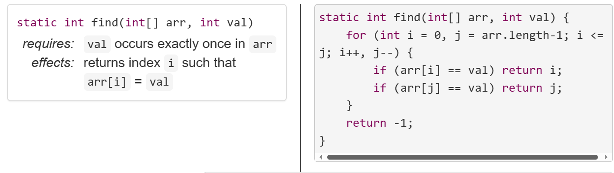
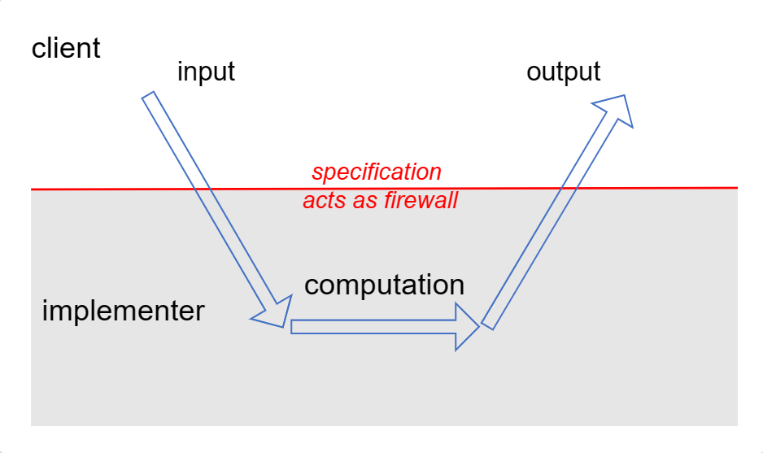
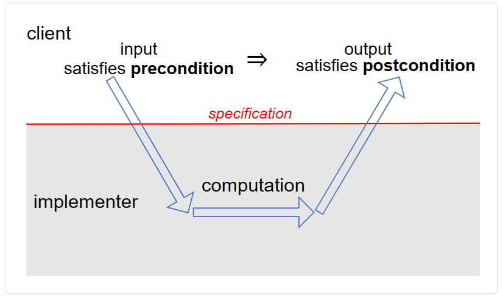
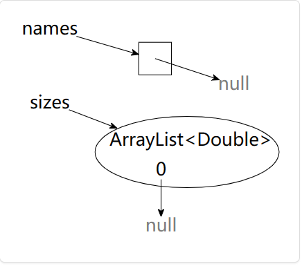

# [Reading 6: Specifications](https://web.mit.edu/6.031/www/sp21/classes/06-specifications/)

**Software in 6.031**

| Safe from bugs                                   | Easy to understand                                           | Ready for change                                  |
| :----------------------------------------------- | :----------------------------------------------------------- | :------------------------------------------------ |
| Correct today and correct in the unknown future. | Communicating clearly with future programmers, including future you. | Designed to accommodate change without rewriting. |

**Objectives**

- Understand preconditions and postconditions in method specifications, and be able to write correct specifications

  了解方法规范中的前置条件和后置条件，并能够编写正确的规范

  ---

- Be able to write tests against a specification

  能够根据规范编写测试

  ---

- Know the difference between checked and unchecked exceptions in Java

  了解 Java 中已检查异常和未检查异常的区别

  ---

- Understand how to use exceptions for special results

  了解如何将异常用于特殊结果

  ---

## Introduction

Specifications are the **linchpin** of teamwork. It’s impossible to delegate responsibility for implementing a method without a specification. The specification acts as a contract: the implementer is responsible for meeting the contract, and a client that uses the method can rely on the contract. In fact, we’ll see that like real legal contracts, specifications place demands on both parties: when the specification has a precondition, the client has responsibilities too.

规范是团队合作的纽带。在没有规范的情况下，不可能委派实现一个方法的责任。规范的作用类似于“合同”：实现者负责履行合同，使用方法的客户可以依赖该合同。实际上，我们会看到，就像真正的法律合同一样，规范对双方都提出了约束：当规范具有前置条件时，客户也有责任。

---

In this reading we’ll look at the role played by specifications of methods. We’ll discuss what preconditions and postconditions are, and what they mean for the implementer and the client of a method. We’ll also talk about how to use exceptions, an important language feature found in Java, Python, and many other modern languages, which allows us to make a method’s interface safer from bugs and easier to understand.

在本文中，我们将了解方法规范所扮演的角色。我们将讨论方法的前置条件和后置条件是什么，以及它们对方法的实现者和调用者的含义。我们还将讨论如何使用异常，这是 Java、Python 等许多现代编程语言的一项重要的语言特性，它使方法的接口更加不易出错并更易于理解。

---

Before we dive into the structure and meaning of specifications…

在我们深入研究规范的结构和含义之前，需要先了解相关的 Java 知识...

---

## Java needed for this reading

Read these pages in the Java Tutorials.

- [What is an Exception?](https://docs.oracle.com/javase/tutorial/essential/exceptions/definition.html)
- [The Catch or Specify Requirement](https://docs.oracle.com/javase/tutorial/essential/exceptions/catchOrDeclare.html)
- [The `try` block](https://docs.oracle.com/javase/tutorial/essential/exceptions/try.html)
- [The `catch` block](https://docs.oracle.com/javase/tutorial/essential/exceptions/catch.html)
- [Specifying the Exceptions Thrown by a Method](https://docs.oracle.com/javase/tutorial/essential/exceptions/declaring.html)
- [How to Throw Exceptions](https://docs.oracle.com/javase/tutorial/essential/exceptions/throwing.html)
- [Unchecked Exceptions – the Controversy](https://docs.oracle.com/javase/tutorial/essential/exceptions/runtime.html)
- [Advantages of Exceptions](https://docs.oracle.com/javase/tutorial/essential/exceptions/advantages.html)

---

## Behavioral equivalence（[行为等效性](https://chat.openai.com/c/4597739f-6c0d-4588-bee1-16a274453a97)）

Suppose you are working on a program containing this method, which finds the index of an integer in an array:

假设我们正在开发一个名为 `find` 的方法，该方法用于查找一个整数在数组中的索引： 

---

```java
Explainstatic int find(int[] arr, int val) {
    for (int i = 0; i < arr.length; i++) {
        if (arr[i] == val) return i;
    }
    return -1;
}
```

This `find` method has many *clients* in the program (places where the method is called). Now you’ve realized that frequently in this program, when `find` is called with a large array, the value it finds is likely to be either close to the start of the array (which is very fast to find), or close to the end (which is very slow, because it requires checking almost the entire array). So you have the clever idea to speed things up by searching from both ends of the array at the same time:

此方法有许多客户端（指调用该方法的地方）。当数组很大时，找到的索引很有可能接近数组的开头，这意味着查找速度非常快；也可能接近数组的末尾，这意味着查找速度会很慢，因为需要遍历几乎整个数组。所以一个聪明的做法是同时从数组的两端开始查找：

---

```java
Explainstatic int find(int[] arr, int val) {
    for (int i = 0, j = arr.length-1; i <= j; i++, j--) {
        if (arr[i] == val) return i;
        if (arr[j] == val) return j;
    }
    return -1;
}
```

Is it safe to replace `find` with this new implementation? Can we make this change without introducing bugs? To determine *behavioral equivalence*, our question is whether we could substitute one implementation for the other.

问题在于用这个新的 `find` 方法替换老的 `find` 方法安全吗？能否在不引入 bug 的情况下进行替换呢？换句话说，这两个方法的行为是否等价——即我们能否用一个实现安全地替换另一个实现？

---

Not only do these implementations have different performance characteristics, they actually have different behavior. If `val` happens to appear *more than once* in the array, the original `find` always returns the lowest index at which it occurs. But the new `find` might return the lowest index or the highest index, whichever it finds first.

实际上，这两个方法实现不仅具有不同的性能，而且还具有不同的行为。具体地说，如果 `val` 在数组中出现了多次，那么旧的 `find` 方法总是返回最低处的索引值；但新的 `find` 方法既可能返回最低处的索引值，也可能返回最高处的索引值，这取决于哪个索引值先被找到。

---

But when `val` occurs at exactly one index of the array, the two implementations behave the same: they both return that index. It may be that the clients never rely on the behavior outside of that case. Whenever they call the method, they will be passing in an array with exactly one element matching `val`. For such clients, these two versions of `find` are the same, and we could switch from one implementation to the other without issue.

但是当 `val` 仅在数组中出现一次时，这两个方法实现的行为是等价的：它们都返回被找到的那个唯一索引。客户端可能永远不会依赖于该情况之外的行为。每当他们调用 `find` 方法（无论新旧）时，他们将传入一个数组，其中恰好有一个元素与 val 匹配。对于此类客户端，这两个 `find` 方法的实现是相同的，可以安全地用新的实现替换旧的实现。

---

The notion of behavioral equivalence is in the eye of the beholder — that is, the client. In order to make it possible to substitute one implementation for another, and to know when this is acceptable, we need a specification that states exactly what the client depends on.

行为等价的概念是从观察者（即客户端）的角度来看的。为了能够用一种实现替换另一种实现，并知晓何时能够进行替换，我们需要一个规范来明确地说明客户端依赖的东西。

---

In this case, a specification that would allow these two implementations to be behaviorally equivalent might be:

在这样的情况下，能够让两 `find` 方法实现行为等价的规范可能是这样的：

```java
static int find(int[] arr, int val)
```

- requires: `val` occurs exactly once in `arr`

  要求：`val` 仅在 `arr` 中出现一次

- effects: returns index `i` such that `arr[i]` = `val`

  作用：返回使得 `arr[i] = val` 的索引 `i`

---

## Why specifications? 为什么需要规范？

Our `find` example showed how a specification can help make a program both ready for change and safe from bugs. Many of the nastiest bugs in programs arise because of misunderstandings about behavior at the interface between two pieces of code. Although every programmer has specifications in mind, not all programmers write them down. As a result, different programmers on a team have *different* specifications in mind. When the program fails, it’s hard to determine where the error is. Precise specifications in the code let you apportion blame (to code fragments, not people!), and can spare you the agony of puzzling over where a bug fix should go.

上述关于 `find` 方法的例子展示了规范如何使得程序既 ready for change 又 safe from bugs。程序中很多的 bug 都是由于人们误解了两个代码段间的接口的行为而引起的。虽然每位程序员心中都有规范，但并非所有程序员都会将它们写下来。由于每个人心中的规范是不同的，所以如果不写下规范，那么当错误发生时将很难确定错误发生在何处。良好的规范能够帮助我们定位到有 bug 的代码，从而免除我们苦苦思索 bug 在何处的痛苦。

---

Specifications are good for the client of a module because they help make the module easier to understand. Having a specification lets you understand what the module does without having to read the module’s code. If you’re not convinced that reading a spec is easier than reading code, compare our spec for `find` on the left, with its tricky implementation on the right:

规范对模块的客户端来说是有益的，因为规范可以使模块更易于理解。有了规范，就可以在不阅读源码的情况下了解到模块的作用。如果你不相信阅读规范比阅读源码更容易，请比较下列关于 `find` 方法的规范和实现：

                                                      |

---

Specifications are good for the implementer of a method because they give the implementer freedom to change the implementation without telling clients. Specifications can make code faster, too. We’ll see that a specification can rule out certain states in which a method might be called. This restriction on the inputs might allow the implementer to skip an expensive check that is no longer necessary and use a more efficient implementation.


---



The contract acts as a *firewall* between client and implementer. It shields the client from the details of the *workings* of the module: as a client, you don’t need to read the source code of the module if you have its specification. And it shields the implementer from the details of the *usage* of the module: as an implementer, you don’t have to ask every client how they plan to use the module. This firewall results in *decoupling*, allowing the code of the module and the code of a client to be changed independently, so long as the changes respect the specification — each obeying its obligation.

## Specification structure

Abstractly speaking, a *specification* of a method has several parts:

- a method signature, giving the name, parameter types, return type, and exceptions thrown
- a *requires* clause, describing additional restrictions on the parameters
- an *effects* clause, describing the return value, exceptions, and other effects of the method

Taken together, these parts form the *precondition* and the *postcondition* of the method.

The precondition is an obligation on the client (the caller of the method). It is a condition over the state in which the method is invoked. **One aspect of the precondition is the number and types of the parameters in the method signature. Additional conditions are written down in the *requires* clause, for example:**

- narrowing a parameter type (e.g. `x >= 0` to say that an `int` parameter x must actually be a nonnegative `int`)
- interactions between parameters (e.g., `val` occurs exactly once in `arr`)



The postcondition is an obligation on the implementer of the method. It includes the parts that Java can statically check: the return type and declared checked exceptions. Additional conditions are written down in the *effects* clause, including:

- how the return value relates to the inputs
- which exceptions are thrown, and when
- whether and how objects are mutated

In general, the postcondition is a condition on the state of the program *after* the method is invoked, assuming the precondition was true *before*.

The overall structure is a logical implication: *if* the precondition holds when the method is called, *then* the postcondition must hold when the method completes.

If the precondition does *not* hold when the method is called, the implementation is *not* bound by the postcondition. It is free to do anything, including never returning, throwing an exception, returning arbitrary results, making arbitrary mutations, etc.

READING EXERCISES

---

## Specifications in Java

Some languages (notably [Eiffel](http://en.wikipedia.org/wiki/Eiffel_(programming_language))) incorporate preconditions and postconditions as a fundamental part of the language, as expressions that the runtime system (or even the compiler) can automatically check to enforce the contracts between clients and implementers.

Java does not go quite so far, but its static type declarations *are* effectively part of the precondition and postcondition of a method, a part that is automatically checked and enforced by the compiler. The rest of the contract — the parts that we can’t write as types — must be described in a comment preceding the method, and generally depends on human beings to check it and guarantee it.

Java has a convention for documentation comments called [Javadoc](http://en.wikipedia.org/wiki/Javadoc), in which parameters are described by `@param` clauses and results are described by `@return` clauses. You should put the preconditions into `@param` where possible, and postconditions into `@return`. So a specification like this:

```java
static int find(int[] arr, int val)
```

- requires: `val` occurs exactly once in `arr`

- effects: returns index `i` such that `arr[i]` = `val`

… might be rendered in Java like this:

```java
/**
 * Find a value in an array.
 * @param arr array to search, requires that val occurs exactly once
 *            in arr
 * @param val value to search for
 * @return index i such that arr[i] = val
 */
static int find(int[] arr, int val)
```

The [Java API documentation](https://docs.oracle.com/en/java/javase/15/docs/api/) is produced from Javadoc comments in the [Java standard library source code](http://hg.openjdk.java.net/jdk/jdk15/file/tip/src/java.base/share/classes/java). Documenting your specifications in Javadoc allows Eclipse to show you (and clients of your code) useful information, and allows you to [produce HTML documentation](http://help.eclipse.org/?topic=%2Forg.eclipse.jdt.doc.user%2Freference%2Fref-export-javadoc.htm) in the same format as the Java API docs.

> Read: **[Javadoc](https://en.wikipedia.org/wiki/Javadoc)**.

READING EXERCISES

Javadoc

Concise Javadoc specs

Back to Python


### What a specification may talk about

A specification of a method can talk about the parameters and return value of the method, but it should never talk about local variables of the method or private fields of the method’s class. You should consider the implementation invisible to the reader of the spec. It’s behind the firewall as far as clients are concerned.

In Java, the source code of the method is often unavailable to the reader of your spec, because the Javadoc tool only extracts the spec comments from your code and renders them as HTML.

---

## Do not allow null references

In Java, references to objects and arrays can also take on the special value `null`, which means that the reference doesn’t point to an object. Null values are an unfortunate hole in Java’s type system.

Primitives cannot be `null`:

```java
int size = null;     // illegal
double depth = null; // illegal
```

and the compiler will reject such attempts with static errors.

On the other hand, we can assign `null` to any non-primitive variable:

```java
String name = null;
int[] points = null;
```

and the compiler happily accepts this code at compile time. But you’ll get errors at runtime because you can’t call any methods or use any fields with one of these references:

```java
name.length()   // throws NullPointerException  
points.length   // throws NullPointerException
```

Note, in particular, that `null` is not the same as an empty string `""` or an empty array. On an empty string or empty array, you *can* call methods and access fields. The length of an empty array or an empty string is 0. The length of a string variable that points to `null` isn’t anything: calling `length()` throws a `NullPointer­Exception`.

Also note that arrays of non-primitives and collections like `List` might be non-null but contain `null` as a value:



```java
String[] names = new String[] { null };
List<Double> sizes = new ArrayList<>();
sizes.add(null);
```

These `null`s are likely to cause errors as soon as someone tries to use the contents of the collection.

Null values are troublesome and unsafe, so much so that most methods simply avoid them entirely. As a general convention, **null values are disallowed in parameters and return values** unless the spec explicitly says otherwise. So every method has a precondition on the object and array types in its parameters that they be non-null – including elements of collections like arrays, sets, lists, and maps. Every method that can return object or array types implicitly has a postcondition that their values are non-null, again including elements of collection types.

If a method allows null values in a parameter, it needs to explicitly state it, or if it might return a null value in a result, it should explicitly state it. But these are in general not good ideas. **Avoid `null`**.

There are extensions to Java that allow you to forbid `null` directly in the type declaration, e.g.:

```java
static boolean addAll(@NonNull List<T> list1, @NonNull List<T> list2)
```

where it can be [checked automatically](http://types.cs.washington.edu/checker-framework/) at compile time or runtime.

Google has their own [discussion of `null` in Guava, the company’s core Java libraries](https://github.com/google/guava/wiki/UsingAndAvoidingNullExplained). The project explains:

> Careless use of `null` can cause a staggering variety of bugs. Studying the Google code base, we found that something like 95% of collections weren’t supposed to have any null values in them, and having those **fail fast*** rather than silently accept `null` would have been helpful to developers.
>
> Additionally, `null` is unpleasantly ambiguous. It’s rarely obvious what a `null` return value is supposed to mean — for example, `Map.get(key)` can return `null` either because the value in the map is `null`, or the value is not in the map. Null can mean failure, can mean success, can mean almost anything. Using something other than `null` **makes your meaning clear**.

(*Boldface added for emphasis.)

If you avoid using `null`, there is still sometimes a need for a parameter or return value to indicate that a value is missing. For example, what should [`Map.get(key)`](http://docs.oracle.com/en/java/javase/15/docs/api/java.base/java/util/Map.html#get(java.lang.Object)) return when the key is not found in the map? One good tool for this problem is [`Optional`](http://docs.oracle.com/en/java/javase/15/docs/api/java.base/java/util/Optional.html). You can think of `Optional<T>` like a very constrained `List<T>` of length at most 1. It either contains just one element of type `T`, or it is empty. The `isPresent()` method tests whether or not it is empty, and `get()` and `getOrElse()` unpack the value if present. The key advantage of `Optional<T>` is that it can be used *sparingly*, only in places where it’s sensible for the spec to allow for a missing value, and it clearly expresses the intention of the spec in those cases.

**READING EXERCISES**

NullPointerException accessing exercise.name()

There are null exercises remaining

Null preconditions and postconditions

---

## Include emptiness

Make sure to understand the difference between `null` and emptiness.

Recall that in Python, `None` is not the same as the empty string `""`, the empty list `[ ]`, or the empty dictionary `{ }`. These empty objects like these are *valid objects* that simply happen to contain no elements. But you can use them with all the usual operations allowed by the type. For example, `len("")` returns 0, and `"" + "a"` returns `"a"`. That’s not true of `None` – `len(None)` and `None + "a"` both produce errors.

The same idea translates to Java. The `null` reference is not a valid string, or list, or map, or any other object. But the empty string `""` is a valid `String` value, and the empty list `List.of()` is a valid list value.

The upshot of this is that **empty values are always allowed as parameter or return values**, unless a spec explicitly disallows them.

#### READING EXERCISES

Vacuous statements

---

## Testing and specifications

In testing, we talk about *black box tests* that are chosen with only the specification in mind, and *glass box tests* that are chosen with knowledge of the actual implementation ([*Testing*](https://web.mit.edu/6.031/www/sp21/classes/03-testing/#black_box_and_glass_box_testing)). But it’s important to note that **even glass box tests must follow the specification**. Your implementation may provide stronger guarantees than the specification calls for, or it may have specific behavior where the specification is undefined. But your test cases should not count on that behavior. Test cases must be [correct](https://web.mit.edu/6.031/www/sp21/classes/03-testing/#systematic_testing), obeying the contract just like every other client.

For example, suppose you are testing this specification of `find`, slightly different from the one we’ve used so far:

>  static int find(int[] arr, int val)
>
> requires: `val` occurs in `arr`
>
> effects: returns index `i` such that `arr[i]` = `val`

This spec has a strong precondition in the sense that `val` is required to be found; and it has a fairly weak postcondition in the sense that if `val` appears more than once in the array, this specification says nothing about which particular index of `val` is returned. Even if you implemented `find` so that it always returns the lowest index, your test case can’t assume that specific behavior:

```java
int[] array = new int[] { 7, 7, 7 };
int i = find(array, 7);
assertEquals(0, i);  // bad test case: assumes too much, more than the postcondition promises
assertEquals(7, array[i]);  // correct
```

Similarly, even if you implemented `find` so that it (sensibly) throws an exception when `val` isn’t found, instead of returning some arbitrary misleading index, your test case can’t assume that behavior, because it can’t call `find()` in a way that violates the precondition.

So what does glass box testing mean, if it can’t go beyond the spec? It means you are trying to find new test cases that exercise different parts of the implementation, but still checking those test cases in an implementation-independent way, following the spec.

### Testing units

Recall the [search engine example from *Testing*](https://web.mit.edu/6.031/www/sp21/classes/03-testing/#unit_and_integration_testing) with these methods:

```java
Explain/** 
 * @return the contents of the file
 */
public static String load(File file) { ... }

/**
 * @return the words in string s, in the order they appear, 
 *         where a word is a contiguous sequence of 
 *         non-whitespace and non-punctuation characters
 */
public static List<String> extract(String s) { ... }

/**
 * @return an index mapping a word to the set of files
 *         containing that word, for all files in the input set
 */
public static Map<String, Set<File>> index(Set<File> files) { 
    ... calls load() and extract() ...
} 
```

We talked then about *unit testing*, the idea that we should write tests of each module of our program in isolation. A good unit test is focused on just a single specification. Our tests will nearly always rely on the specs of Java library methods, but a unit test for one method we’ve written shouldn’t fail if a *different* method fails to satisfy its spec. As we saw in the example, a test for `extract()` shouldn’t fail if `load()` doesn’t satisfy its postcondition.

Good *integration tests*, tests that use a combination of modules, will make sure that our different methods have compatible specifications: callers and implementers of different methods are passing and returning values as the other expects. Integration tests cannot replace systematically-designed unit tests. From the example, if we only ever test `extract` by calling `index`, we will only test it on a potentially small part of its input space: inputs that are possible outputs of `load`. In doing so, we’ve left a place for bugs to hide, ready to jump out when we use `extract` for a different purpose elsewhere in our program, or when `load` starts returning documents written in a new format, etc.

#### READING EXERCISES

gcd 1

gcd 2

## Specifications for mutating methods

We discussed mutable vs. immutable objects in an earlier reading ([*Basic Java*](https://web.mit.edu/6.031/www/sp21/classes/02-basic-java/#mutating_values_vs_reassigning_variables)). But our specification examples thus far haven’t illustrated how to describe *side-effects* — changes to mutable objects — in the postcondition.

So here’s a specification that describes a method that mutates an object:

```java
static boolean addAll(List<T> list1, List<T> list2)
```

- requires:

  `list1` != `list2`

- effects:

  modifies `list1` by adding the elements of `list2` to the end of it, and returns true if `list1` changed as a result of call

We’ve taken this, slightly simplified, from the Java [`List`](http://docs.oracle.com/en/java/javase/15/docs/api/java.base/java/util/List.html) interface. First, look at the postcondition. It gives two constraints: the first telling us how `list1` is modified, and the second telling us how the return value is determined.


------


------


Second, look at the precondition. It tells us that `list1` cannot be the same object as `list2`. The behavior of the method if you attempt to add the elements of a list to itself is undefined. You can easily imagine why the implementer of the method would want to impose this constraint: it’s not likely to rule out any useful applications of the method, and it makes it easier to implement. The specification allows a simple implementation in which you take an element from `list2` and add it to `list1`, then go on to the next element of `list2` until you get to the end.

If `list1` and `list2` are the same list, this simple algorithm will not terminate, as shown in the sequence of snapshot diagrams on the right — or practically speaking it will throw a memory error when the list object has grown so large that it consumes all available memory. Either outcome, infinite loop or crash, is permitted by the specification because of its precondition.

Remember also [the implicit precondition](https://web.mit.edu/6.031/www/sp21/classes/06-specifications/#do_not_allow_null_references) that `list1` and `list2` must be valid objects, rather than `null`. We omit saying this because it’s virtually always required of object references.

Here is another example of a mutating method:

```java
static void sort(List<String> list)
```

- requires:

  nothing

- effects:

  puts `list` in sorted order, *i.e.* `list[i]` ≤ `list[j]` for all 0 ≤ `i` < `j` < `list.size()`

And an example of a method that does not mutate its argument:

```java
static List<String> toLowerCase(List<String> list)
```

- requires:

  nothing

- effects:

  returns a new list `t`, same length as `list`, where `t[i]` = `list[i].toLowerCase()` for all valid indices `i`

Just as `null` is implicitly disallowed unless stated otherwise, programmers also assume that **mutation is disallowed unless stated otherwise**. The spec of `to­Lower­Case` could explicitly state as an *effect* that “list is not modified”, but in the absence of a postcondition describing mutation, we demand no mutation of the inputs.

## Exceptions

Now that we’re writing specifications and thinking about how clients will use our methods, let’s discuss how to handle *exceptional* cases in a way that is safe from bugs and easy to understand.

A method’s *signature* — its name, parameter types, return type — is a core part of its specification, and the signature may also include *exceptions* that the method may trigger.

### Exceptions for signaling bugs

You’ve probably already seen some exceptions in your Java programming so far, such as [`Index­OutOfBounds­Exception`](http://docs.oracle.com/en/java/javase/15/docs/api/java.base/java/lang/IndexOutOfBoundsException.html) (thrown when a list index `foo.get(i)` is outside the valid range for the list `foo`) or [`Null­Pointer­Exception`](http://docs.oracle.com/en/java/javase/15/docs/api/java.base/java/lang/NullPointerException.html) (thrown when trying to call a method on a `null` object reference). These exceptions generally indicate **bugs** in your code, and the information displayed by Java when the exception is thrown can help you find and fix the bug.

`Index­OutOfBounds` and `Null­Pointer­Exception` are probably the most common exceptions of this sort. Other examples include:

- [`ArithmeticException`](http://docs.oracle.com/en/java/javase/15/docs/api/java.base/java/lang/ArithmeticException.html), thrown for arithmetic errors like integer division by zero.
- [`NumberFormatException`](http://docs.oracle.com/en/java/javase/15/docs/api/java.base/java/lang/NumberFormatException.html), thrown by methods like `Integer.parseInt` if you pass in a string that cannot be parsed into an integer.

### Exceptions for special results

Exceptions are not just for signaling bugs. They can be used to improve the structure of code that involves functions with special results.

An unfortunately common way to handle special results is to return special values. Lookup operations in the Java library are often designed like this: you get an index of -1 when expecting a positive integer, or a `null` reference when expecting an object. This approach is OK if used sparingly, but it has two problems. First, it’s tedious to check the return value. Second, it’s easy to forget to do it. (We’ll see that by using exceptions you can get help from the compiler in this.)

Also, it’s not always easy to find a ‘special value’. Suppose we have a `BirthdayBook` class with a lookup method. Here’s one possible method signature:

```java
class BirthdayBook {
    LocalDate lookup(String name) { ... }
}
```

([`LocalDate`](http://docs.oracle.com/en/java/javase/15/docs/api/java.base/java/time/LocalDate.html) is part of the Java API.)

What should the method do if the birthday book doesn’t have an entry for the person whose name is given? Well, we could return some special date that is not going to be used as a real date. Bad programmers have been doing this for decades; they would return 9/9/99, for example, since it was *obvious* that no program written in 1960 would still be running at the end of the century. ([They were wrong, by the way.](http://en.wikipedia.org/wiki/Year_2000_problem))

Here’s a better approach. The method throws an exception:

```java
LocalDate lookup(String name) throws NotFoundException {
    ...
    if ( ...not found... )
        throw new NotFoundException();
    ...
```

and the caller handles the exception with a `catch` clause. For example:

```java
ExplainBirthdayBook birthdays = ...
try {
    LocalDate birthdate = birthdays.lookup("Alyssa");
    // we know Alyssa's birthday
} catch (NotFoundException nfe) {
    // her birthday was not in the birthday book
}
```

Now there’s no need for any special value, nor the checking associated with it.

#### READING EXERCISES

1st birthday

2nd birthday

3rd birthday

4th birthday

## Checked and unchecked exceptions

We’ve seen two different purposes for exceptions: special results and bug detection. As a general rule, you’ll want to use checked exceptions to signal special results, and unchecked exceptions to signal bugs.

Some terminology: *checked* exceptions are called that because they are checked by the compiler:

- If a method might throw a checked exception, the possibility must be declared in its signature. `Not­Found­Exception` would be a checked exception, and that’s why the signature ends with `throws Not­Found­Exception`.
- If a method calls another method that may throw a checked exception, it must either handle it, or declare the exception itself, since if it isn’t caught locally it will be propagated up to callers.

So if you call `BirthdayBook`’s `lookup` method and forget to handle the `Not­Found­Exception`, the compiler will reject your code. This is very useful, because it ensures that exceptions that are expected to occur will be handled.

*Unchecked* exceptions, in contrast, are used to signal bugs. These exceptions are not expected to be handled by the code except perhaps at the top level. We wouldn’t want every method up the call chain to have to declare that it (might) throw all the kinds of bug-related exceptions that can happen at lower call levels: index out of bounds, null values, illegal arguments, assertion failures, etc.

As a result, for an unchecked exception the compiler will not check for `try`-`catch` or a `throws` declaration. Java still allows you to write a `throws` clause for an unchecked exception as part of a method signature, but this has no effect, and is thus a bit funny, and we don’t recommend doing it.

All exceptions may have a message associated with them. If not provided in the constructor (*e.g.*, [as described for `Runtime­Exception`](http://docs.oracle.com/en/java/javase/15/docs/api/java.base/java/lang/RuntimeException.html#(java.lang.String))), the reference to the message string is `null`. This can result in confusing stack traces that start, for example:

```text
birthday.NotFoundException: null
at birthday.BirthdayBook.lookup(BirthdayBook.java:42)
```

The “null” is misleading: in this case, it tells you the `NotFoundException` had no message string, not that a `null` value was responsible for the exception.

### Exception hierarchy


To understand how Java decides whether an exception is checked or unchecked, let’s look at the class hierarchy for Java exceptions.

[`Exception`](http://docs.oracle.com/en/java/javase/15/docs/api/java.base/java/lang/Exception.html) is the normal base class of **checked** exceptions. The compiler applies static checking to methods using these exceptions. A checked exception must either be caught or declared when it’s possible for it to be thrown.

However, [`RuntimeException`](http://docs.oracle.com/en/java/javase/15/docs/api/java.base/java/lang/RuntimeException.html) and its subclasses are **unchecked** exceptions. `RuntimeException` and its subclasses don’t have to be declared in the `throws` clause of a method that throws them, and doesn’t have to be caught or declared by a caller of such a method.

In addition, [`Error`](http://docs.oracle.com/en/java/javase/15/docs/api/java.base/java/lang/Error.html) and its subclasses are **unchecked** exceptions. This part of the hierarchy is reserved for errors produced by the Java runtime system, such as [`StackOverflow­Error`](http://docs.oracle.com/en/java/javase/15/docs/api/java.base/java/lang/StackOverflowError.html) and [`OutOfMemory­Error`](http://docs.oracle.com/en/java/javase/15/docs/api/java.base/java/lang/OutOfMemoryError.html). For some reason [`Assertion­Error`](http://docs.oracle.com/en/java/javase/15/docs/api/java.base/java/lang/AssertionError.html) also extends `Error`, even though it indicates a bug in user code, not in the runtime. Errors should be considered unrecoverable, and should *not* be caught by your code.

When you define your own exceptions, you should either subclass `Exception` (to make it a checked exception) or `RuntimeException` (to make it unchecked). Don’t subclass `Error`, because these kinds of exceptions are reserved by Java itself.

When you catch an exception with a `try-catch` statement, you should catch the most specific exception class possible. If you are expecting a `FileNotFoundException`, that’s what your `catch` statement should use. Catching a broad class of exceptions, like `Exception` or `RuntimeException` or `Error`, is not safe from bugs or ready for change, because it catches every possible subclass of these exceptions, which may interfere with static checking and hide bugs.

One of the confusing aspects of the Java exception hierarchy is that `RuntimeException` is itself a subclass of `Exception`. So the whole `Exception` family includes both checked exceptions (its direct descendents) and unchecked exceptions (the `RuntimeException` branch of the family) But `Error` is *not* a subclass of `Exception`, so all the unchecked `Error`-like exceptions are outside the `Exception` family.

#### READING EXERCISES

Get to the point

Don’t point that thing at me

Gotta catch ‘em all

Catch me if you can

The design pattern in the last exercise above – changing a low-level exception like `PathNotFoundException` into a higher-level exception like `RobotStuckException` – is called *exception translation*. Exception translation allows a module to be more ready for change by hiding its implementation, in this case the fact that it currently happens to use `findPath`.

### How to declare exceptions in a specification

Since an exception is a possible output from a method, it may have to be described in the postcondition for the method. The Java way of documenting an exception as a postcondition is a `@throws` clause in the Javadoc comment. Java may also require the exception to be included in the method signature, using a `throws` declaration. This section discusses when to use each of these ways of indicating the possibility of an exception, and when not to.

**Exceptions that signal a special result** are always documented with a Javadoc `@throws` clause, specifying the conditions under which that special result occurs.

- For a *checked* exception, Java also requires the exception to be mentioned in a `throws` declaration in the method signature. For example, suppose `NotPerfectSquareException` were a checked exception. You would need to mention it in both `@throws` in the Javadoc and `throws` in the method signature, like this:

  ```java
  Explain/**
  * Compute the integer square root.
  * @param x value to take square root of
  * @return square root of x
  * @throws NotPerfectSquareException if x is not a perfect square
  */
  int integerSquareRoot(int x) throws NotPerfectSquareException
  ```

- For an *unchecked* exception that signals a special result, Java allows but doesn’t require the `throws` clause. But it is better to omit the exception from the `throws` clause in this case, to avoid misleading a human programmer into thinking that the exception is checked. For example, suppose you defined `EmptyQueueException` as an unchecked exception. Then you should document it with `@throws`, but not include it in the method signature:

  ```java
  Explain/**
  * Pops a value from this queue.
  * @return next value in the queue, and removes the value from the queue
  * @throws EmptyQueueException if this queue is empty
  */
  int pop()
  ```

**Exceptions that signal unexpected failures** – bugs in either the client or the implementation – are not part of the postcondition of a method, so they should not appear in either `@throws` or `throws`. For example, `NullPointerException` need never be mentioned in a spec. An implicit precondition already disallows null values, which means that a valid implementation is free to throw it without any warning if a client ever passes a null value. So this spec, for example, never mentions `NullPointerException`:

```java
/**
 * @param list list of strings to convert to lower case
 * @return new list t, same length as list, 
 *         where t[i] is list[i] converted to lowercase for all valid indices i
 */
static List<String> toLowerCase(List<String> list)
```

#### READING EXERCISES

Throw all the things!

A terrible thing

## Summary

Before we wrap up, check your understanding with one last example:

#### READING EXERCISES

Scrabble 1

Scrabble 2

A specification acts as a crucial firewall between the implementer of a module and its client. It makes separate development possible: the client is free to write code that uses the module without seeing its source code, and the implementer is free to write the code that implements the module without knowing how it will be used.

Let’s review how specifications help with the main goals of this course:

- **Safe from bugs**. A good specification clearly documents the mutual assumptions that a client and implementer are relying on. Bugs often come from disagreements at the interfaces, and the presence of a specification reduces that. Using machine-checked language features in your spec, like static typing and exceptions rather than just a human-readable comment, can reduce bugs still more.
- **Easy to understand**. A short, simple spec is easier to understand than the implementation itself, and saves other people from having to read the code.
- **Ready for change**. Specs establish contracts between different parts of your code, allowing those parts to change independently as long as they continue to satisfy the requirements of the contract.

## More practice

If you would like to get more practice with the concepts covered in this reading, you can visit the [question bank](https://qable.mit.edu:8001/practice.html#Specs). The questions in this bank were written in previous semesters by students and staff, and are provided for review purposes only – doing them will not affect your classwork grades.

Collaboratively authored with contributions from: Saman Amarasinghe, Adam Chlipala, Srini Devadas, Michael Ernst, Max Goldman, John Guttag, Daniel Jackson, Rob Miller, Martin Rinard, and Armando Solar-Lezama. This work is licensed under [CC BY-SA 4.0](http://creativecommons.org/licenses/by-sa/4.0/).

MIT EECS

  spring 2021 course site archive  |  latest site at [mit.edu/6.031](http://web.mit.edu/6.031/)  |  [accessibility](http://accessibility.mit.edu/)