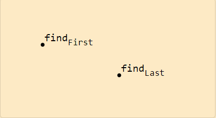
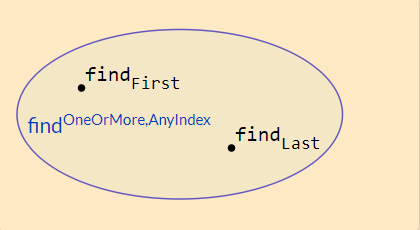
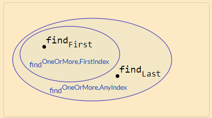
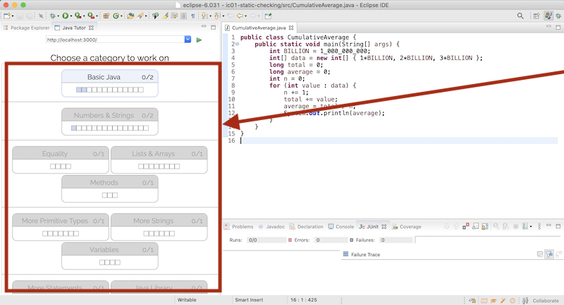

# Reading 7: Designing Specifications

You may want to read through this reading first, especially the section [About Access Control](https://web.mit.edu/6.031/www/sp21/classes/07-designing-specs/#about_access_control).

**Software in 6.031**

| Safe from bugs                                   | Easy to understand                                           | Ready for change                                  |
| :----------------------------------------------- | :----------------------------------------------------------- | :------------------------------------------------ |
| Correct today and correct in the unknown future. | Communicating clearly with future programmers, including future you. | Designed to accommodate change without rewriting. |

**Objectives**

- Understand underdetermined specs, and be able to identify and assess specs that are not deterministic
- Understand declarative vs. operational specs, and be able to write declarative specs
- Understand strength of preconditions, postconditions, and specs, and be able to compare spec strength
- Be able to write coherent, useful specifications of appropriate strength

## Introduction

In this reading we’ll look at different specs for similar behaviors, and talk about the tradeoffs between them. We’ll look at three dimensions for comparing specs:

- How **deterministic** it is. Does the spec define only a single possible output for a given input, or does it allow the implementor to choose from a set of legal outputs?
- How **declarative** it is. Does the spec just characterize *what* the output should be, or does it explicitly say *how* to compute the output?
- How **strong** it is. Does the spec have a small set of legal implementations, or a large set?

Not all specifications we might choose for a module are equally useful, and we’ll explore what makes some specifications better than others.

## Deterministic vs. underdetermined specs

Consider these two implementations of `find`:

```java
static int findFirst(int[] arr, int val) {
    for (int i = 0; i < arr.length; i++) {
        if (arr[i] == val) return i;
    }
    return arr.length;
}
```

---

```java

static int findLast(int[] arr, int val) {
    for (int i = arr.length - 1 ; i >= 0; i--) {
        if (arr[i] == val) return i;
    }
    return -1;
}
```

The subscripts `First` and `Last` are not actual Java syntax. We’re using them here to distinguish the two implementations for the sake of discussion. In the actual code, both implementations should be Java methods called `find`.

Since we’ll be talking about multiple specifications of `find` too, we’ll identify each specification with a superscript, like `ExactlyOne`:

```java
static int findExactlyOne(int[] arr, int val)
```

- requires:

  `val` occurs **exactly once** in `arr`

- effects:

  returns index `i` such that `arr[i]` = `val`

The `findExactlyOne` specification is **deterministic**: when presented with a state satisfying the precondition, the outcome is completely determined. Only one return value and one final state is possible. There are no valid inputs for which there is more than one valid output.

Both the `findFirst` and `findLast` implementations satisfy the specification, so if this is the specification on which the clients relied, the two implementations are substitutable for one another.

Here is a slightly different specification:

```java
static int findOneOrMore,AnyIndex(int[] arr, int val)
```

- requires:

  `val` occurs in `arr`

- effects:

  returns index `i` such that `arr[i]` = `val`

This specification is not deterministic. It doesn’t say which index is returned if `val` occurs more than once. It simply says that if you look up the entry at the index given by the returned value, you’ll find `val`. This specification allows multiple valid outputs for the same input.

Note that this is different from *nondeterministic* in the usual sense of that word. Nondeterministic code sometimes behaves one way and sometimes another, even if called in the same program with the same inputs. This can happen, for example, when the code’s behavior depends on a random number, or when it depends on the timing of concurrent processes. But a specification which is not deterministic doesn’t have to have a nondeterministic implementation. It can be satisfied by a fully deterministic implementation.

To avoid the confusion, we’ll refer to specifications that are not deterministic as **underdetermined**.

This underdetermined `findOneOrMore,AnyIndex` spec is again satisfied by both `findFirst` and `findLast`, each resolving the underdeterminedness in its own (fully deterministic) way. A client of this spec can’t rely on which index will be returned if `val` appears more than once. The spec would be satisfied by a nondeterministic implementation, too — for example, one that tosses a coin to decide whether to start searching from the beginning or the end of the array. But in almost all cases we’ll encounter, underdeterminism in specifications offers a choice that is made by the implementor at implementation time. An underdetermined spec is typically implemented by a fully-deterministic implementation.

#### READING EXERCISES

Distinguished

Over/under

## Declarative vs. operational specs

For this dimension of comparison, there are two kinds of specifications. *Operational* specifications give a series of steps that the method performs; pseudocode descriptions are operational. *Declarative* specifications don’t give details of intermediate steps. Instead, they just give properties of the final outcome, and how it’s related to the initial state.

Almost always, declarative specifications are preferable. They’re usually shorter, easier to understand, and most importantly, they don’t inadvertently expose implementation details that a client may rely on (and then find no longer hold when the implementation is changed). For example, if we want to allow either implementation of `find`, we would *not* want to say in the spec that the method “goes down the array until it finds `val`,” since aside from being rather vague, this spec suggests that the search proceeds from lower to higher indices and that the lowest will be returned, which perhaps the specifier did not intend.

One reason programmers sometimes lapse into operational specifications is because they’re using the spec comment to explain the implementation for a maintainer. Don’t do that. When it’s necessary, use comments within the body of the method, not in the spec comment.

For a given specification, there may be many ways to express it declaratively:

```java
static boolean startsWith(String str, String prefix)
```

- effects:

  returns true if and only if there exists String `suffix` such that `prefix` + `suffix` = `str`

```java
static boolean startsWith(String str, String prefix)
```

- effects:

  returns true if and only if there exists integer `i` such that `str.substring(0, i)` = `prefix`

```java
static boolean startsWith(String str, String prefix)
```

- effects:

  returns true if and only if the first `prefix.length()` characters of `str` are the characters of `prefix`

It’s up to us to choose the clearest specification for clients and maintainers of the code.

Note that these `startsWith` specs have no preconditions, so we can omit *requires: nothing* for the sake of brevity.

#### READING EXERCISES

Joint declaration

## Stronger vs. weaker specs

We discussed in the last reading ([*Specifications*](https://web.mit.edu/6.031/www/sp21/classes/06-specifications/#behavioral_equivalence)) how the presence of a spec allows you to replace one implementation with another safely, as long as both implementations satisfy the spec. But suppose you need to change not only the implementation but also the *specification itself*? Assume there are already clients that depend on the method’s current specification. How do you compare the behaviors of two specifications to decide whether it’s safe to replace the old spec with the new spec?

To answer that question, we compare the strength of the two specs. A specification S2 is *stronger* than a specification S1 if the set of implementations that satisfy S2 is a strict subset of those that match S1.

This notion of stronger and weaker comes from predicate logic. A predicate P is stronger than a predicate Q (and Q is *weaker* than P) if the set of states that match P is a strict subset of those that match Q. Since a specification is a predicate over implementations, making a specification stronger means shrinking the set of implementations that satisfy it. It may help to think of “stronger” as more constrained, or tighter, while “weaker” is less constrained, looser.

Note that it is also possible for predicates P and Q to be *incomparable* – neither stronger nor weaker – if neither is a subset of the other.

To decide whether one specification is stronger or weaker than another, we compare the strengths of their preconditions and postconditions. A precondition is a predicate over the state of the input, so making a precondition stronger means shrinking the set of legal inputs. Similarly, a postcondition is a predicate over the state of the output, so a stronger postcondition shrinks the set of allowed outputs and effects.

We can now state the rule:

> A specification S2 is stronger than or equal to a specification S1 if and only if
>
> - S2’s precondition is weaker than or equal to S1’s,
>   and
> - S2’s postcondition is stronger than or equal to S1’s, for the states that satisfy S1’s precondition.

If this is the case, then an implementation that satisfies S2 can be used to satisfy S1 as well, and it’s safe to replace S1 with S2 in your program.

This rule embodies several ideas. It tells you that you can always weaken the precondition, because placing fewer demands on a client will never upset them. And you can always strengthen the postcondition, which means making more promises to the client.

For example, this spec for `find`:

```java
static int findExactlyOne(int[] a, int val)
```

- requires:

  `val` occurs **exactly once** in `a`

- effects:

  returns index `i` such that `a[i]` = `val`

can be replaced with:

```java
static int findOneOrMore,AnyIndex(int[] a, int val)
```

- requires:

  `val` occurs **at least once** in `a`

- effects:

  returns index `i` such that `a[i]` = `val`

which is stronger because it has a weaker precondition. This in turn can be replaced with:

```java
static int findOneOrMore,FirstIndex(int[] a, int val)
```

- requires:

  `val` occurs **at least once** in `a`

- effects:

  returns **lowest** index `i` such that `a[i]` = `val`

which is stronger because it has a stronger postcondition.

What about this specification:

```java
static int findCanBeMissing(int[] a, int val)
```

- requires:

  **nothing**

- effects:

  returns index `i` such that `a[i]` = `val`, **or -1 if no such `i`**

Let’s compare to `findOneOrMore,FirstIndex`. Again the precondition is weaker, but for inputs that satisfy `findOneOrMore,FirstIndex`’s precondition, the postcondition is *also* weaker: the requirement for *lowest* index has been removed. Neither of these two specifications is stronger than the other: they are incomparable.

We’ll come back to `findCanBeMissing` in the exercises and compare it to our other specifications.

## Diagramming specifications

Imagine (very abstractly) the space of all possible Java methods.

Each point in this space represents a method implementation.

First we’ll diagram `findFirst` and `findLast` defined [above](https://web.mit.edu/6.031/www/sp21/classes/07-designing-specs/#deterministic_vs_underdetermined_specs). Look back at the code and see that `findFirst` and `findLast` are *not specs*. They are implementations, with method bodies that implement their actual behavior. So we denote them as points in the space.



A specification defines a *region* in the space of all possible implementations. A given implementation either behaves according to the spec, satisfying the precondition-implies-postcondition contract (it is inside the region), or it does not (outside the region).

Both `findFirst` and `findLast` satisfy `findOneOrMore,AnyIndex`, so they are inside the region defined by that spec.



We can imagine clients looking in on this space: the specification acts as a firewall.

- Implementors have the freedom to move around inside the spec, changing their code without fear of upsetting a client. This is crucial in order for the implementor to be able to improve the performance of their algorithm, the clarity of their code, or to change their approach when they discover a bug, etc.
- Clients don’t know which implementation they will get. They must respect the spec, but also have the freedom to change how they’re using the implementation without fear that it will suddenly break.

How will similar specifications relate to one another? Suppose we start with specification S1 and use it to create a new specification S2.

If S2 is stronger than S1, how will these specs appear in our diagram?

- Let’s start by **strengthening the postcondition**. If S2’s postcondition is now stronger than S1’s postcondition, then S2 is the stronger specification.

  Think about what strengthening the postcondition means for implementors: it means they have less freedom, the requirements on their output are stronger. Perhaps they previously satisfied `findOneOrMore,AnyIndex` by returning any index `i`, but now the spec demands the *lowest* index `i`. So there are now implementations *inside* `findOneOrMore,AnyIndex` but *outside* `findOneOrMore,FirstIndex`.

  Could there be implementations *inside* `findOneOrMore,FirstIndex` but *outside* `findOneOrMore,AnyIndex`? No. All of those implementations satisfy a stronger postcondition than what `findOneOrMore,AnyIndex` demands.

- Think through what happens if we **weaken the precondition**, which will again make S2 a stronger specification. Implementations will have to handle new inputs that were previously excluded by the spec. If they behaved badly on those inputs before, we wouldn’t have noticed, but now their bad behavior is exposed.

We see that when S2 is stronger than S1, it defines a *smaller* region in this diagram; a weaker specification defines a larger region.

In our figure, since `findLast` iterates from the end of the array `arr`, it does not satisfy `find^OneOrMore,FirstIndex` and is outside that region.

Another specification S3 that is neither stronger nor weaker than S1 might overlap (such that there exist implementations that satisfy only S1, only S3, and both S1 and S3) or might be disjoint. In both cases, S1 and S3 are incomparable.



#### READING EXERCISES

Bulking up

Strength is truth

Finding findExactlyOne

Finding findCanBeMissing

Found

## Designing good specifications

What makes a good method? Designing a method means primarily writing a specification.

About the form of the specification: it should obviously be succinct, clear, and well-structured, so that it’s easy to read.

The content of the specification, however, is harder to prescribe. There are no infallible rules, but there are some useful guidelines.

### The specification should be coherent

A coherent spec makes sense to its clients as a single, complete unit. The spec shouldn’t have lots of different cases. Long argument lists, boolean flags that enable or disable behavior, and intricate logic, are all signs of trouble. Consider this specification:

>static int sumFind(int[] a, int[] b, int val)
>
>- effects:
>
>  returns the sum of all indices in arrays `a` and `b` at which `val` appears

Is this a well-designed function? Probably not: it’s incoherent, since it does several things (finding in two arrays and summing the indexes) that are not really related. It would be better to split it into two separate functions, one that finds the indexes, and the other that sums them.

Here’s another example, [the `countLongWords` method from *Code Review*](https://web.mit.edu/6.031/www/sp21/classes/04-code-review/#countLongWords):

```java
public static int LONG_WORD_LENGTH = 5;
public static String longestWord;

/**
 * Update longestWord to be the longest element of words, and print
 * the number of elements with length > LONG_WORD_LENGTH to the console.
 * @param text     text to search for long words
 */
public static void countLongWords(String text)
```

In addition to [terrible use of global variables](https://web.mit.edu/6.031/www/sp21/classes/04-code-review/#dont_use_global_variables), [printing instead of returning](https://web.mit.edu/6.031/www/sp21/classes/04-code-review/#methods_should_return_results_not_print_them), and [mentioning a local variable (`words`)](https://web.mit.edu/6.031/www/sp21/classes/06-specifications/#what_a_specification_may_talk_about), the specification is not coherent. It does two different things: counting words and finding the longest word. Separating those two responsibilities into two different methods will make them simpler (easy to understand) and more useful in other contexts (ready for change).

### The results of a call should be informative

Consider the specification of a method that puts a value in a map, where keys are of some type `K` and values are of some type `V`:

```java
static V put(Map<K,V> map, K key, V val)
```

- requires:

  `val` may be `null`, and `map` may contain null values

- effects:

  inserts `(key, val)` into the mapping, overriding any existing mapping for `key`, and returns old value for `key`, unless none, in which case it returns `null`

Note that the precondition explicitly permits null values, so the map can store `null`s. But the postcondition uses `null` as a special return value for a missing key. This means that if `null` is returned, you can’t tell whether the key was not bound previously, or whether it was in fact bound to `null`. This is not a very good design, because the return value is useless unless you know for sure that you didn’t insert `null`s.

### The specification should be strong enough

Of course the spec should give clients a strong enough guarantee in the general case — it needs to satisfy their basic requirements. We must use extra care when specifying the special cases, to make sure they don’t undermine what would otherwise be a useful method.

For example, consider this spec:

```java
static void addAll(List<T> list1, List<T> list2)
```

- effects:

  appends the elements from `list2` to `list1` in order, unless it encounters a null element in `list2`, at which point it throws a `NullPointerException`

This spec is written in an inappropriately operational style, but let’s focus on a different problem. This spec is stronger than one that doesn’t mention null elements at all (because then nulls would be [implicitly disallowed](https://web.mit.edu/6.031/www/sp21/classes/06-specifications/#do_not_allow_null_references)). But it’s not strong enough to be useful to a client, because it allows an arbitrary amount of mutation to happen before the `NullPointerException` exception is thrown. If the exception is caught by the client, the client is left wondering which elements of `list2` actually made it to `list1`.

We could improve the specification by strengthening it further, e.g.:

```java
static void addAll(List<T> list1, List<T> list2)
```

- effects:

  appends the elements from `list2` to `list1` in order. If `list2` contains null elements, it throws a `NullPointerException` and no elements are appended to `list1`.

### The specification should also be weak enough

Consider this specification for a method that opens a file:

```java
static File open(String filename)
```

- effects:

  opens a file named `filename`

This is a bad specification. It lacks important details: is the file opened for reading or writing? Does it already exist or is it created? And it’s too strong, since there’s no way it can guarantee to open a file. The process in which it runs may lack permission to open a file, or there might be some problem with the file system beyond the control of the program. Instead, the specification should say something much weaker: that it attempts to open a file, and if it succeeds, the file has certain properties.

### The specification should use *abstract types* where possible

We saw early on in the [Java Collections section of *Basic Java*](https://web.mit.edu/6.031/www/sp21/classes/02-basic-java/#arraylists_and_linkedlists_creating_lists) that we can distinguish between more abstract notions like a `List` or `Set` and particular implementations like `ArrayList` or `HashSet`.

Writing our specification with *abstract types* gives more freedom to both the client and the implementor. In Java, this often means using an interface type, like `Map` or `Reader`, instead of specific implementation types like `HashMap` or `FileReader`. Consider this specification:

```java
static ArrayList<T> reverse(ArrayList<T> list)
```

- effects:

  returns a new list which is the reversal of `list`, *i.e.* `newList[i]` = `list[n-i-1]` for all 0 ≤ `i` < `n`, where `n` = `list.size()`

This forces the client to pass in an `ArrayList`, and forces the implementor to return an `ArrayList`, even if there might be alternative `List` implementations that they would rather use. Since the behavior of the specification doesn’t depend on anything specific about `ArrayList`, it would be better to write this spec in terms of the more abstract `List`.

## Precondition or postcondition?

Another design issue is whether to use a precondition, and if so, whether the method code should attempt to make sure the precondition has been met before proceeding. In fact, the most common use of preconditions is to demand a property precisely because it would be hard or expensive for the method to check it.

As mentioned above, a non-trivial precondition inconveniences clients, because they have to ensure that they don’t call the method in a bad state (that violates the precondition); if they do, there is no predictable way to recover from the error. So users of methods don’t like preconditions. That’s why the Java API classes, for example, tend to specify as a postcondition that they throw unchecked exceptions when arguments are inappropriate. This approach makes it easier to find the bug or incorrect assumption in the caller code that led to passing bad arguments. (Note that when the Java API docs state a requirement as if it were a precondition, but then also guarantee a particular error when the requirement is violated, that’s a postcondition, not a precondition.)

In general, it’s better to **fail fast**, as close as possible to the site of the bug, rather than let bad values propagate through a program far from their original cause. Even if, for example, `atan(y, x)` requires as a precondition that its input not be (0,0), it would still be helpful for it to check for that mistake and throw an exception with a clear error message, rather than returning a garbage value or a misleading exception.

Sometimes, it’s not feasible to check a condition without making a method unacceptably slow, and a precondition is often necessary in this case. If we wanted to implement the `find` method using binary search, we would have to require as a precondition that the array be sorted. Forcing the method to actually *check* that the array is sorted would defeat the entire purpose of the binary search: to obtain a result in logarithmic and not linear time.

The decision of whether to use a precondition is an engineering judgment. The key factors are the cost of the check (in writing and executing code), and the scope of the method. If it’s only called locally in a class, the precondition can be discharged by carefully checking all the sites that call the method. But if the method is public, and used by other developers, it would be less wise to use a precondition. Instead, like the Java API classes, you should throw an exception as a postcondition.

## About access control

Read: **[Packages](http://docs.oracle.com/javase/tutorial/java/package/index.html)** (7 short pages) in the Java Tutorials.

Read: **[Controlling Access](http://docs.oracle.com/javase/tutorial/java/javaOO/accesscontrol.html)** (1 page) in the Java Tutorials.

Remember to complete this category in the Java Tutor:

 

**✓**Access1/1

 

 

We have been using *public* for almost all of our methods, without really thinking about it. The decision to make a method public or private is actually a decision about the contract of the class. Public methods are freely accessible to other parts of the program. Making a method public advertises it as a service that your class is willing to provide. If you make all your methods public — including helper methods that are really meant only for local use within the class — then other parts of the program may come to depend on them, which will make it harder for you to change the internal implementation of the class in the future. Your code won’t be as **ready for change**.

Making internal helper methods public will also add clutter to the visible interface your class offers. Keeping internal things *private* makes your class’s public interface smaller and more coherent (meaning that it does one thing and does it well). Your code will be **easier to understand**.

We will see even stronger reasons to use *private* in the next few classes, when we start to write classes with persistent internal state. Protecting this state will help keep the program **safe from bugs**.

## About static vs. instance methods

Read: **[the `static` keyword](http://www.codeguru.com/java/tij/tij0037.shtml#Heading79)** on CodeGuru.

We have also been using *static* for almost all of our methods, again without much discussion. *Static methods* are not associated with any particular instance of a class, while *instance* methods (declared without the `static` keyword) must be called on a particular object.

Specifications for instance methods are written just the same way as specifications for static methods, but they will often refer to properties of the instance on which they were called.

For example, by now we’re very familiar with this specification:

```
static int find(int[] arr, int val)
```

- requires:

  `val` occurs in `arr`

- effects:

  returns index `i` such that `arr[i]` = `val`

Instead of using an `int[]`, what if we had a class `IntArray` designed for storing arrays of integers? The `IntArray` class might provide an instance method with the specification:

```
int find(int val)
```

- requires:

  `val` occurs in **this array**

- effects:

  returns index `i` such that **the value at index `i` in this array** is `val`

We’ll have much more to say about specifications for instance methods in future classes!

#### READING EXERCISES

Show me a sign

That’s an odd way of looking at it

Behavioral oddities

Odd doc

## Summary

A specification acts as a crucial firewall between implementor and client — both between people (or the same person at different times) and between code. [As we saw last time](https://web.mit.edu/6.031/www/sp21/classes/06-specifications/#why_specifications), it makes separate development possible: the client is free to write code that uses a module without seeing its source code, and the implementor is free to write the implementation code without knowing how it will be used.

Declarative specifications are the most useful in practice. Preconditions (which weaken the specification) make life harder for the client, but applied judiciously they are a vital tool in the software designer’s repertoire, allowing the implementor to make necessary assumptions.

As always, our goal is to design specifications that make our software:

- **Safe from bugs**. Without specifications, even the tiniest change to any part of our program could be the tipped domino that knocks the whole thing over. Well-structured, coherent specifications minimize misunderstandings and maximize our ability to write correct code with the help of static checking, careful reasoning, testing, and code review.
- **Easy to understand**. A well-written declarative specification means the client doesn’t have to read or understand the code. You’ve probably never read the code for, say, [Python `dict.update`](https://hg.python.org/cpython/file/7ae156f07a90/Objects/dictobject.c#l1990), and doing so isn’t nearly as useful to the Python programmer as [reading the declarative spec](https://docs.python.org/3/library/stdtypes.html#dict.update).
- **Ready for change**. An appropriately weak specification gives freedom to the implementor, and an appropriately strong specification gives freedom to the client. We can even change the specs themselves, without having to revisit every place they’re used, as long as we’re only strengthening them: weakening preconditions and strengthening postconditions.

## More practice

If you would like to get more practice with the concepts covered in this reading, you can visit the [question bank](https://qable.mit.edu:8001/practice.html#Designing Specs). The questions in this bank were written in previous semesters by students and staff, and are provided for review purposes only – doing them will not affect your classwork grades.

Collaboratively authored with contributions from: Saman Amarasinghe, Adam Chlipala, Srini Devadas, Michael Ernst, Max Goldman, John Guttag, Daniel Jackson, Rob Miller, Martin Rinard, and Armando Solar-Lezama. This work is licensed under [CC BY-SA 4.0](http://creativecommons.org/licenses/by-sa/4.0/).

MIT EECS

  spring 2021 course site archive  |  latest site at [mit.edu/6.031](http://web.mit.edu/6.031/)  |  [accessibility](http://accessibility.mit.edu/)