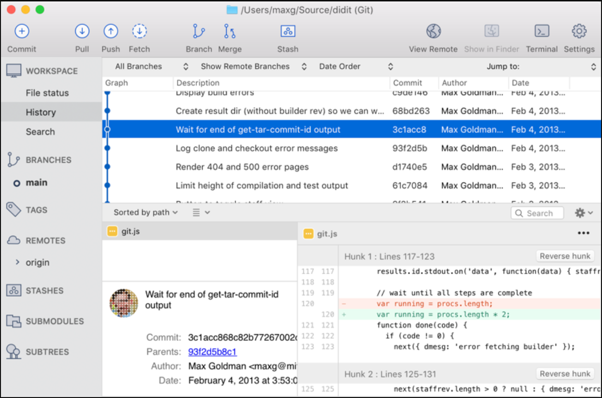

我们在6.031中使用的版本控制系统是Git。 The version control system we’ll use in 6.031 is Git. 它很强大，值得学习。  It’s powerful and worth learning. 但是Git的用户界面可能非常令人沮丧。  But Git’s user interface can be terribly frustrating. 什么是Git的用户界面?
  What is Git’s user interface?

在6.031中，我们将在命令行中使用Git。 In 6.031, we will use Git on the command line. 命令行是一种生活，无处不在，因为它非常强大。
  The command line is a fact of life, ubiquitous because it is so powerful.

命令行可能会使查看仓库中发生的事情变得非常困难。 The command line can make it very difficult to see what is going on in your repositories. 

你可能会发现SourceTree(如右图所示)对Mac和Windows都很有用。  You may find SourceTree (shown on the right) for Mac & Windows useful. 

在任何平台上，gitk都可以为您提供基本的Git GUI。  On any platform, gitk can give you a basic Git GUI. 

向谷歌咨询其他建议。

Ask Google for other suggestions.

关于Git工具的一个重要注意事项:
 An important note about tools for Git:

Eclipse内置了对Git的支持。 Eclipse has built-in support for Git. 

如果您遵循问题集的说明，Eclipse将知道您的项目是在Git中，并向您显示有用的图标。  If you follow the problem set instructions, Eclipse will know your project is in Git and will show you helpful icons. 

但是，我们不建议使用Eclipse Git UI进行更改、提交等，课程工作人员可能无法帮助您解决问题。

However, we do not recommend using the Eclipse Git UI to make changes, commit, etc., and course staff may not be able to help you with problems.

GitHub为Mac和Windows开发桌面应用。 GitHub makes desktop apps for Mac and Windows. 

因为GitHub应用程序改变了一些Git操作的工作方式，如果你使用GitHub应用程序，课程工作人员将无法帮助你。

Because the GitHub app changes how some Git operations work, if you use the GitHub app, course staff will not be able to help you.