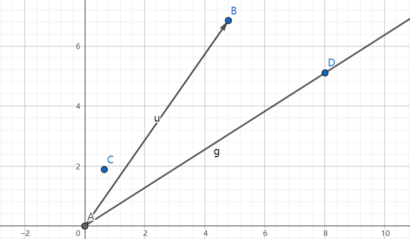

# 6.031-问题集一

- 第一部分不是很重要。
- 不是标准答案，如果读者发现了错误欢迎指正。

## Part II

### 乌龟图和 Logo 语言

实现以下两个方法控制乌龟的前进和转向：

- `forward(units)` 将乌龟在当前方向上移动 units 步，其中 units 是一个整数。根据 Logo 语言的惯例，乌龟的初始方向朝上。

- `turn(degrees)` 将乌龟的移动方向向右转 degress 角度（顺时针），其中 degress 是一个双精度浮点数。

两个方法的具体定义在 `Turtle.java`。**在接下来的方法中不要使用除了 `forward` 和 `turn` 以外的任何 turtle 包中的命令。**

#### Problem 4: drawSquare

查看 `turtle` 包下的 `TurtleSoup.java`，然后使用以上的 `forward` 和 `turn` 方法实现 `drawSquare(Turtle turtle, int sideLength)`。实现完毕之后运行 TurtleSoup.java 中的 main 方法绘制乌龟图。

朴素想法：利用 forward 和 turn 方法画出一个正方形。乌龟一开始面是朝上的，我思考觉得这句话的意思是乌龟处在正方形的下边，这里我从左下角开始绘制图形，步骤如下：

1. 在当前方向行进边长距离然后停止
2. 向右转 90°
3. 在当前方向行进边长距离然后停止
4. 向右转 90°
5. 在当前方向行进边长距离然后停止
6. 向右转 90°
7. 在当前方向行进边长距离然后停止
8. 绘制完成

```java
    double degree = 90.00;
    for (int i = 0; i < 4; i++) {
        turtle.forward(sideLength);
        turtle.turn(degree);
    }
```

### Problems 5—10: Polygons and headings

问题的具体要求查看对应 Java 文件的方法规范。注意整数和浮点数混在一起时的运算。此外，不要修改代码的方法声明。

#### 绘制多边形

##### 计算多边形内角度数

- Implement `calculateRegularPolygonAngle`
- Run the JUnit tests in `TurtleSoupTest`
  The method that tests `calculateRegularPolygonAngle `should now pass and show green instead of red.

If `testAssertionsEnabled `fails, you did not follow the instructions in the Getting Started guide. [Getting Started step 2 ](https://ocw.mit.edu/ans7870/6/6.005/s16/getting-started/#config-eclipse)has setup you must perform before using Eclipse.

我没记错的话这应该是一个小学或者初中的数学知识，不过对大学生来说还是有点超前😊。我一怒之下强行推导了出来，还好不算难。

具体地说，一个正多边形其内角度数为内角和除以边数，而内角和为 180 * （边长 - 2）。用 Java 语言表达一下这个数学式子就可以了。不过要注意的是由于语言的缺陷，要进行一个强制类型转换，从而使得调用的是浮点数的除法，这样才可以得到正确的结果。

```java
    public static double calculateRegularPolygonAngle(int sides) {
        //throw new RuntimeException("implement me!");
        
        int inside_angle_sum = (180 * (sides - 2));
        return inside_angle_sum / (double)sides;
    }
```

---

#### 计算多边形边数

- Implement `calculatePolygonSidesFromAngle`

This does the inverse of the last function; again, use the simple formula. However, **make sure you correctly round** to the nearest integer. Instead of implementing your own rounding, look at Java’s [`java.lang.Math `](https://docs.oracle.com/javase/8/docs/api/?java/lang/Math.html)class for the proper function to use.

和上一个问题相反，现在已知了正多边形的内角度数，要求其边数。将上一个问题的公式继续转化一下就可以了。最后计算的结果要调用库函数进行正确的舍入。

```java
    public static int calculatePolygonSidesFromAngle(double angle) {
        //throw new RuntimeException("implement me!");
        double tmp = 180 - angle;
        return (int) Math.round(360 / tmp);
        
    }
```

---

#### 绘制正多边形

- Implement `drawRegularPolygon` Use your implementation of `calculateRegularPolygonAngle`. To test this, change the `main`method to call `drawRegularPolygon `and verify that you see what you expect.

做到这里才发现前面绘制正方形的代码确实很朴素，仅对正方形的情况有效。如何绘制一个任意边数的正多边形呢？

我的做法就是画图，分析一下角度关系，然后得到了一个我觉得还可以的结果。

```java
    public static void drawRegularPolygon(Turtle turtle, int sides, int sideLength) {
        //throw new RuntimeException("implement me!");
        double internal_angles = TurtleSoup.calculateRegularPolygonAngle(sides);
        for (int i = 0; i < sides; i++) {
           
                if (i == 0) {
                    turtle.turn(360.00 - internal_angles + 90.00);
                }
                else {
                    turtle.turn((double)180 - internal_angles);
                }
                turtle.forward(sideLength);
        }
    }
```

### Calculating headings

- Implement `calculateHeadingToPoint` This function calculates the parameter to `turn` required to get from a current point to a target point, with the current direction as an additional parameter. For example, if the turtle is at (0,1) facing 30 degrees, and must get to (0,0), it must turn an additional 150 degrees, so `calculateHeadingToPoint(30, 0, 1, 0, 0)`would return `150.0`.

- 实现 calculateHeadingToPoint 函数，该函数计算从当前坐标到目的坐标需要转动的角度。举个例子，如果乌龟位于 (0,1) 且面向 30 度角，并且想要去到 (0,0)，那么乌龟必须转动 150 度，所以 `calculateHeadingToPoint(30, 0, 1, 0, 0)` 会返回 150.0。

<!-- 思考：已知了初始方向，我们只需要把目的方向求出来，然后两方向（直线）的夹角就是所求的角度了。为了求目的方向，需要连接起点和终点

k 是连接两点形成的直线的斜率和 x 轴 的夹角

1. 正北方：360 - CA （）
2. 正南方：180 - CA
3. 正西方：270 - CA
4. 正东方：90 - CA
5. 西北方：270 - CA + k
6. 东北方：90 - CA - k
7. 西南方：180 - CA  + k
8. 东南方：90 - CA + k 或者 180 - CA - k -->


给出的两个坐标是相对于某个初始原点来说的，这里我想出的解决方案是以起点为坐标原点，然后连接终点，构造一个平面直角坐标系。大概是这样子：



这里 A 是起点，B 是变化后的终点。AD 是 90 - currentHeading 斜率对应的直线，AB 是终点直线，我们希望将 AD 直线转动到和 AB 直线重合为止。可以根据 AD 在 AB 的上方、下方、重合三种情况来计算偏转角度。

AB 和 x 轴正方向的夹角可以用 atan2 函数计算，不过该函数得到的是弧度制的角度，要转成平常的度数。


#### 实现 calculateHeadings 方法

- Implement `calculateHeadings`
Make sure to use your `calculateHeadingToPoint ` implementation here. For information on how to use Java’s `List `interface and classes implementing it, look up [`java.util.List `](https://docs.oracle.com/javase/8/docs/api/?java/util/List.html)in the Java library documentation. Note that for a list of *n* points, you will return *n-1* heading adjustments; this list of adjustments could be used to guide the turtle to each point in the list. For example, if the input lists consisted of `xCoords=[0,0,1,1] `and `yCoords=[1,0,0,1] `(representing points (0,1), (0,0), (1,0), and (1,1)), the returned list would consist of `[180.0, 270.0, 270.0] `.

